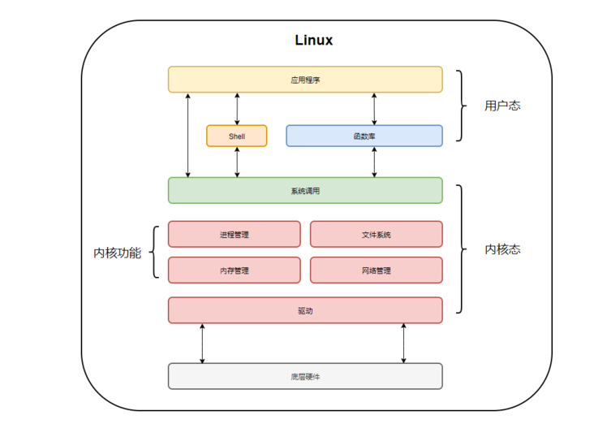
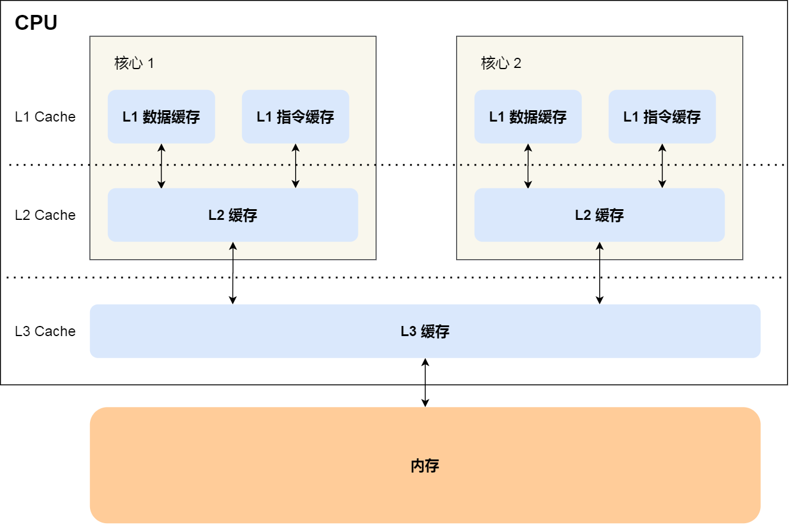
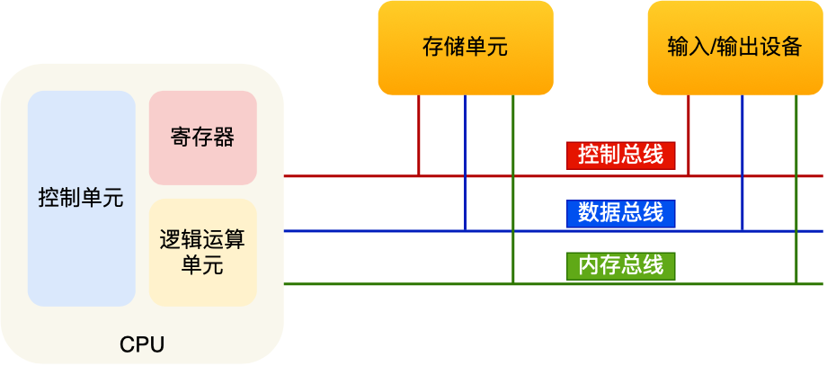

<head>
    <script src="https://cdn.mathjax.org/mathjax/latest/MathJax.js?config=TeX-AMS-MML_HTMLorMML" type="text/javascript"></script>
    <script type="text/x-mathjax-config">
        MathJax.Hub.Config({
            tex2jax: {
            skipTags: ['script', 'noscript', 'style', 'textarea', 'pre'],
            inlineMath: [['$','$']]
            }
        });
    </script>
</head>

## `2022-10-10`

> linux: `/dev/null`

`/dev/null` 是 Linux 中的一个空设备文件，这个文件的大小是 0 字节，所有人都有读写权限，没有执行权限。

写入到 `/dev/null` 的内容会全部丢失，读取 `/dev/null` 会返回 `EOF` 。可以将标准输出或标准错误重定向到 `/dev/null` ，用于禁止输出。

> shell: `stat`

`stat` 命令用于显示文件的状态信息，比 `ls` 命令的输出信息更详细，可以查看的信息包括：

- 文件名
- 文件大小
- 文件使用的数据块总数
- 文件类型
- 设备编号
- Inode 号
- 链接数
- 文件权限
- 文件所有权的 Gid 和 Uid
- 最近访问文件时间
- 最近修改文件内容时间
- 最近修改文件属性时间
- 文件创建时间
  

## `2022-09-30`

> SOCKS 和 http/https 网络代理

[Clash for Windows](https://github.com/Fndroid/clash_for_windows_pkg/releases) 提供 SOCKS 和 http/https 两种协议的代理，且默认共用端口。SOCKS 是会话层协议，http/https 是应用层协议，一般 SOCKS 代理更快。


非浏览器应用一般不会走系统代理，比如在终端里面，就需要自己配置代理。配置方法是设置 `http_proxy`、`https_proxy`、 `ftp_proxy`、 `no_proxy`、`all_proxy` 等环境变量。它们并不是标准环境变量，而是一种使用惯例。一些程序识别小写（如`http_proxy`），一些识别大写（如`HTTP_PROXY`），因此最好是同时设置这些变量的大小写形式。

配置 http/https 协议的代理：

```bash
export http_proxy=http://127.0.0.1:7890
export https_proxy=http://127.0.0.1:7890
```

配置 SOCKS 协议的代理：

```bash
export http_proxy=socks5://127.0.0.1:7890
export https_proxy=socks5://127.0.0.1:7890
```

如果 `http_proxy` 和 `https_proxy` 值一样，可以直接设置 `all_proxy=socks5://127.0.0.1:7890` 定义统一的代理。此外，一些环境例如 GNOME 是把 SOCKS 代理配置在 `all_proxy` 中，所以最好同时设置这些变量。如果这些变量同时设置了， `all_proxy` 的优先级最低。

取消代理：

```bash
unset http_proxy https_proxy all_proxy
```

可以通过 `curl` 或 `wget` 验证代理是否生效：

```bash
# 查看ip
curl cip.cc
curl https://icanhazip.com
# 获取网页html
curl www.google.com
wget www.google.com
```

可以写成函数的形式保存在 `~/.bashrc` ：
```bash
function proxy_on() {
    export http_proxy=http://127.0.0.1:7890
    export https_proxy=$http_proxy
    export all_proxy=socks5://127.0.0.1:7890
    echo -e "终端代理已开启。"
    curl cip.cc
}

function proxy_off(){
    unset http_proxy https_proxy all_proxy
    echo -e "终端代理已关闭。"
    curl cip.cc
}
```

用 `socks5h://` 代替 `socks5://` 可以避免 DNS 污染。
如果是 SOCKS 协议的代理，`curl www.google.com` 需要把前缀 `socks5` 改成 `socks5h`，形如 `curl -x socks5h://127.0.0.1:7890 www.google.com` 才会成功。因为 `socks5` 是在本地解析 `www.google.com`，无法得到正确的 IP 地址, 而 `socks5h` 是在远端解析域名。

python 代码验证（需要安装 pysocks ）：

```python
>>> import requests
>>> proxies = {'http':'socks5://127.0.0.1:7890', 'https':'socks5://127.0.0.1:7890'}
>>> url = 'https://icanhazip.com'
>>> res = requests.get(url, proxies=proxies)
>>> res.content
b'103.88.46.38\n'
```

此外，即使配置了代理，也是 `ping` 不通谷歌的，因为 `ping` 使用的是 **网络层** 的 `ICMP` 协议。

## `2022-09-25`

> vim 简单配置

vim 配置写在一般写在 `~/.vimrc` ，可以在命令模式输入 `:scriptnames` 查看配置文件生效顺序。其中 `/usr/share/vim/vimrc` 是系统配置 `/etc/vim/vimrc` 的软连接。vimrc 的注释使用引号 `"` 。

```
" 不必兼容 vi
set nocompatible  
" 启用鼠标
set mouse=a
" 显示行号  
set number    
" 显示标尺（光标所在行列）
set ruler   
" 显示命令 
set showcmd    
" 制表符宽度为 4
set tabstop=4    
" 自动缩进
set autoindent    
" 自动缩进的空格数为 4
set shiftwidth=4   
" 空格代替制表符 
set expandtab    
" 高亮显示配对的括号
set showmatch    
" 对搜索的词高亮
set hlsearch    
" 启用 256 色
set t_Co=256   
" 启用 industry 主题 
colorscheme industry
" 语法高亮
syntax on   
" 启动文件类型自动检测
filetype on    
" 允许对不同类型的文件设置不同的缩进格式
filetype indent on    
" 允许加载文件类型的插件
filetype plugin on    
```

有些 Linux 系统默认使用的 locale 系统编码为 POSIX，不支持中文，会导致 vim 中出现中文乱码，可以设置系统环境变量 `export LANG=C.UTF-8` 。`locale -a` 命令可以查看系统支持的字符集。

## `2022-09-14`

> Windows Internet Shortcut

下载网页到本地 html 文件可以使用 python 的 `requests` 包，但是如果只想将网页的 url 保存成一个快捷方式，可以用以下代码完成：

```python
>>> url = 'https://www.baidu.com'
>>> shortcut = 'baidu.url'
>>> with open(shortcut, mode='w', newline='\r\n') as fw:
...     fw.write(f'[InternetShortcut]\nURL={url}')
```

注意，Windows 系统下的换行符是 `\r\n` 。

## `2022-09-12`

> c++：[`std::tuple`](https://cplusplus.com/reference/tuple/)

`std::tuple` 用于打包（Pack）多个不同类型的对象。不同于 `std::pair` ，`std::tuple` 打包的对象的个数是不定的，可通过 `std::get` 按顺序访问对象。`std::get` 返回的是引用，具体类型（引用/右值引用、常量引用/非常量引用）由输入的元组类型决定。

`std::tie` 用于解压（Unpack）元组中的对象，可以忽略其中的某些对象。

```cpp
#include<iostream>
#include<vector>
#include<typeinfo>
#include<tuple>

int main()
{
  std::tuple<int, float, char> ta(1, 2.0f, 'a');
  auto tb = std::make_tuple("tp", 100, std::vector<int>{1,2,3});
  std::cout << typeid(tb).name() << std::endl;
  std::get<0>(ta) = std::get<1>(tb);
  int tint; std::vector<int> tvec;
  std::tie(std::ignore, tint, tvec) = tb;
  std::cout << std::get<0>(ta) << std::endl; // 100
  std::cout << tvec.size() << " " << tvec[2] << std::endl;
  return 0;
}
```

## `2022-07-25`

> 2.4GHz 频段

ISM 频段（Industrial Scientific Medical Band）是国际通信联盟无线电通信局定义的频段，主要开放给工业/科学/医学机构使用，无需许可证或费用，只需要遵守一定的发射功率（一般低于1W），并且不对其它频段造成干扰即可。ISM 频段在各国的规定并不统一，但是有一个共同的频段，那就是2.4GHz 频段（2.400 – 2.4835GHz）。无线局域网、蓝牙、ZigBee等无线网络均可工作在2.4GHz 频段上。

现在有不少路由器采用2.4G + 5G双频段设计。

{:.table}
|  | **优点** | **缺点** |
| --------- | ----- |----------- |
| `2.4G` | 频率低、波长长，在空气中传播时衰减较小，传播距离更远。 | 信号频宽较窄，家电、无线设备大多使用2.4G频段，无线环境更加拥挤，干扰较大。 |
| `5G` | 信号频宽较宽，无线环境比较干净，干扰少，网速稳定，支持更高的无线速率。 | 频率高、波长短，在空气中传播时衰减较大，覆盖范围更小。 |

传播相同的距离时，5G 信号相对 2.4G 信号较弱，这是由电磁波的物理特性决定的：波长越长，衰减越少，也更容易绕过障碍物继续传播。但是，网速不仅与信号强度有关，也与信道质量有很大的关系。5G 频段带宽更高，信道容量更大。

## `2022-07-21`

> python: 正则表达式

- 正则表达式需要用到反斜杠，反斜杠本身需要用反斜杠进行转义，所以 pattern 最好使用原始字符串（Raw String）来表示，避免反斜杠太多造成混淆。

  ```python
  >>> print('a\tb')
  a       b
  >>> print(r'a\tb')
  a\tb
  >>> print('a\\tb')
  a\tb
  >>> r'\t' == '\\t'
  True
  >>> import re
  >>> re.findall(r'\t', 'a\t') 
  ['\t']
  >>> re.findall('\\t', 'a\t') 
  ['\t']
  >>> re.findall(r'\\t', r'a\t') 
  ['\\t']
  >>> re.findall(r'\\t', 'a\\t') 
  ['\\t']
  >>> re.findall('\\\\t', r'a\t') 
  ['\\t']
  ```

- `\w` 用于匹配大小写字母、数字、下划线；`\b` 用于匹配 `\w` 类型和非 `\w` 类型之间的分界。比如 `abc--123` 可以理解为 `\ba\Bb\Bc\b--\b1\B2\B3\b` 。

## `2022-07-19`

> python: 默认参数与可变类型

默认参数是在函数定义的时候就被计算的，默认参数值存储在函数的 `__defaults__` 属性中，每次调用函数都是从这个属性中读取默认参数值。

当默认参数值是可变类型的时候，这个默认值可能会因为函数调用而改变。

```python
>>> def foo(n, l=[]):
...     l.append(n)
...     return l
...
>>> foo.__defaults__ 
([],)
>>> foo(1)
[1]
>>> foo(2)
[1, 2]
>>> foo.__defaults__
([1, 2],)
```

为了避免这种预期之外的结果，可以使用 `None` 作为默认参数值，在函数体中增加一个判断。

```python
>>> def bar(n, l=None):
...     if l is None: l = []
...     l.append(n)
...     return l
... 
>>> bar.__defaults__
(None,)
>>> bar(1)
[1]
>>> bar(2)
[2]
>>> bar.__defaults__
(None,)
```


## `2022-05-19`

> numpy: arg

- [`numpy.argmax`](https://numpy.org/doc/stable/reference/generated/numpy.argmax.html)：获取最大元素的索引。

  ```python
  numpy.argmax(a, axis=None, out=None, *, keepdims=<no value>)
  ```

  - 相关函数：`numpy.argmin`， `numpy.max`， `numpy.min`

- [`numpy.argwhere`](https://numpy.org/doc/stable/reference/generated/numpy.argwhere.html)：找出满足条件的元素对应的索引。

  ```python
  >>> arr = np.array([1, 2, 3, 4, 5, 6, 7, 8])
  >>> np.argwhere(arr % 2 != 0)
  array([[0],
        [2],
        [4],
        [6]], dtype=int64)
  >>> np.argwhere(arr % 2 != 0).flatten()
  array([0, 2, 4, 6], dtype=int64)
  ## 大于4的元素减10，否则乘10
  >>> np.where(arr > 4, arr - 10, arr * 10)
  array([10, 20, 30, 40, -5, -4, -3, -2])
  ```

  - 相关函数：`numpy.where`

- [`numpy.argsort`](https://numpy.org/doc/stable/reference/generated/numpy.argsort.html)：返回从小到大排序之后元素对应的索引。

  ```python
  numpy.argsort(a, axis=- 1, kind=None, order=None)
  ```

  ```python
  >>> arr = np.array([88, 79, 86, 97, 89, 95, 84])
  >>> np.sort(arr)
  array([79, 84, 86, 88, 89, 95, 97])
  >>> np.argsort(arr)
  array([1, 6, 2, 0, 4, 5, 3], dtype=int64)
  ## 两次调用可以得到元素排序之后对应的索引
  >>> arr.argsort().argsort()
  array([3, 0, 2, 6, 4, 5, 1], dtype=int64)
  ```

- [`numpy.argpartition`](https://numpy.org/doc/stable/reference/generated/numpy.argpartition.html)：返回局部排序之后的索引，最小的 $k+1$ 个元素排在前面，其余更大的元素排在后面（快排），前后两部分元素内部可以是无序的。

  ```python
  numpy.argpartition(a, kth, axis=-1, kind='introselect', order=None)
  ```
  
  ```python
  >>> arr = np.array([66, 15, 27, 33, 19, 13, 10])
  ## 根据第3+1小的元素（19）划分
  >>> np.partition(arr, 3)
  array([15, 13, 10, 19, 27, 33, 66])
  >>> np.argpartition(arr, 3)
  array([1, 5, 6, 4, 2, 3, 0], dtype=int64)
  ## 根据第2大的元素（33）划分
  >>> np.partition(arr, -2)   
  array([13, 10, 27, 15, 19, 33, 66])
  >>> np.argpartition(arr, -2) 
  array([5, 6, 2, 1, 4, 3, 0], dtype=int64)
  ```

  - 相关函数：`numpy.partition`

## `2022-05-07`

> sql: 顺序

- 表达式顺序

  1. `select` \<select_list\>
  2. `from` \<left_table\>
  3. \<join_type\> `join` \<right_table\>
  4. `on` \<join_condition\>
  5. `where` \<where_condition\>
  6. `group by` \<group_by_list\>
  7. `having` \<having_condition\>
  8. `order by` \<order_by_condition\>
  9. `limit` \<limit_number\>

- 解析顺序（优先级）

  1. `from` `join`
  2. `where`
  3. `group by`
  4. `having`
  5. `order by`
  6. `select`
  7. `distinct`
  8. `limit`


## `2021-12-27`

> numpy: indexing

- `None` ：在索引中使用，可以保持/扩展维度。

  ```python
  >>> a = np.array([[10, 30, 20], [60, 40, 50]])
  >>> a
  array([[10, 30, 20],
         [60, 40, 50]])
  >>> a[0]
  array([10, 30, 20])
  >>> a[0, None] 
  array([[10, 30, 20]])
  >>> a[0, None, None] 
  array([[[10, 30, 20]]])
  ```

- [`numpy.take`](https://numpy.org/doc/stable/reference/generated/numpy.take.html) ：按行/列索引取值。

  ```python
  numpy.take(a, indices, axis=None, out=None, mode='raise')
  ```

  + `axis=None` ：将数组平铺开再取值，输出维度与 `indices` 保持一致。

    ```python
    >>> np.take(a, [[0,1],[2,3]], axis=None)
    array([[10, 30], 
           [20, 60]])
    ```

  + `axis=0` ：按行取值。

    ```python
    >>> np.take(a, [0,1,0], axis=0) 
    array([[10, 30, 20],
           [60, 40, 50],
           [10, 30, 20]])
    >>> np.take(a, [[0],[1]], axis=0) 
    array([[[10, 30, 20]],

           [[60, 40, 50]]])
    ```

  + `axis=1` ：按列取值。

    ```python
    >>> np.take(a, [0,2], axis=1) 
    array([[10, 20], 
           [60, 50]])
    >>> np.take(a, [[0,1],[1,1]], axis=1) 
    array([[[10, 30],
            [30, 30]],

           [[60, 40],
            [40, 40]]])
    ```

- [`numpy.take_along_axis`](https://numpy.org/doc/stable/reference/generated/numpy.take_along_axis.html) ：沿某个维度按索引取值；除该维度之外， `indices` 需要与 `arr` 保持相同尺寸，否则会自动广播（Broadcast），广播失败会报 `shape mismatch` 错误；输出维度与 `indices` 相同（广播之后）；该函数功能与 pytorch 的 `gather` 相似。

  ```python
  numpy.take_along_axis(arr, indices, axis)
  ```

  ```python
  >>> a
  array([[10, 30, 20],
         [60, 40, 50]])
  >>> np.take_along_axis(a, np.array([[0,1,1]]), axis=0)         
  array([[10, 40, 50]])
  # arr[indices[0],0], arr[indices[1],1], arr[indices[2],2]
  >>> np.take_along_axis(a, np.array([[0,1,1]]), axis=1)
  array([[10, 30, 30],
         [60, 40, 40]])
  ## broadcast:
  # arr[0,indices[0]], arr[0,indices[1]], arr[0,indices[2]]
  # arr[1,indices[0]], arr[1,indices[1]], arr[1,indices[2]]
  >>> np.take_along_axis(a, np.array([[0,1,1,2],[1,0,2,0]]), axis=1) 
  array([[10, 30, 30, 20],
         [40, 60, 50, 60]])
  # arr[0,indices[0][0]], arr[0,indices[0][1]], arr[0,indices[0][2], arr[0,indices[0][3]]
  # arr[1,indices[1][0]], arr[1,indices[1][1]], arr[1,indices[1][2], arr[1,indices[1][3]]
  ```

## `2021-11-18`

> 最大公约数（Greatest Common Divisor）

设 $a \geq b$ 且均为正整数，其最大公约数性质如下：

- $\gcd(a, b) = \gcd(b, a)%$
- $\gcd(a, b) = \gcd(a\%b, b)$
- $\gcd(a, b) = \gcd(a-b, b)$
- 当 $a$ 和 $b$ 都是偶数时，$\gcd(a, b) = 2 \times \gcd(a/2, b/2)$
- 当 $a$ 是偶数、 $b$ 是奇数时，$\gcd(a, b) = \gcd(a/2, b)$
- 当 $a$ 是奇数、 $b$ 是偶数时，$\gcd(a, b) = \gcd(a, b/2)$

#### 辗转相除法《几何原本》

取模运算比较耗时。

```cpp
int gcd(int a, int b)
{
    if (a < b) swap(a, b);
    int r;
    while (r = a % b)
    {
        a = b;
        b = r;
    }
    return b;
}
```

#### 更相减损术 《九章算术》

当两个数相差较大时，递归比较深。

```cpp
int gcd(int a, int b)
{
    if(a == b) return a;
    if(a > b) return gcd(a-b, b);
    else return gcd(a, b-a);
}
```

#### Binary GCD Algorithm

使用移位运算和减法代替除法。

```cpp
int gcd(int a, int b)
{
    if(a == b) return a;
    if(!(a&1) && !(b&1)) return 2 * gcd(a>>1, b>>1);
    else if(!(a&1)) return gcd(a>>1, b);
    else if(!(b&1)) return gcd(a, b>>1);
    else return a > b? gcd(a-b, b): gcd(a, b-a);
}
```

## `2021-11-15`

> c++: 左值（lvalue）与右值（rvalue）

左值与右值的根本区别在于能否获取内存地址（`&`）。从一个左值中必定可以解析出对应对象的地址，除非该对象是位字段（Bit-field）或者被声明为寄存器存储类。

赋值运算符左边的操作数以及自增/自减运算符操作数，不仅应该是左值，还应该是可修改的左值。可修改的左值，其类型不可以被声明为 const，并且可修改的左值不能是数组类型。赋值运算符右边可以是左值。

右值引用产生的对象、临时对象是右值（当函数返回的是非引用类型时，函数会创建临时对象（Temporary Object），函数返回的就是这个临时对象）。

## `2021-10-21`

> shell: `md5sum`

MD5 全称是报文摘要算法（Message-Digest Algorithm 5），常常被用来验证网络文件传输的完整性，防止文件被篡改。此算法对任意长度的信息逐位进行计算，产生一个二进制长度为 128 位（十六进制长度为 32 位）的“数字指纹”（或称“报文摘要”），不同文件产生相同的报文摘要的可能性是非常小的（与文件名无关）。

```bash
$ md5sum xy.txt > xy.md5
$ cat xy.md5
0de7b78014b979c7e5f31bc62f4f7cf4  xy.txt
$ md5sum -c xy.md5
xy.txt: OK
$ echo "hello world" >> xy.txt
$ md5sum -c xy.md5
xy.txt: FAILED
md5sum: WARNING: 1 computed checksum did NOT match
```


## `2021-10-20`

> 轮盘赌选择方法

轮盘赌选择方法又称比例选择算子，其基本思想是：每个个体 $x_i$ 被选中的概率 $p(x_i)$ 与其适应度函数（Fitness Function）值大小 $f(x_i)$ 成正比，$p(x_i) = \frac{f(x_i)}{\sum_j f(x_i)}$。

轮盘赌选择法可用如下过程模拟：

 1. 计算累计概率（Cumulative Probability） $q(x_i) = \sum_{j=0}^i p(x_i)$；
 2. 在 $[0, 1]$ 范围内产生一个均匀分布的随机数 $r$；
 3. 若 $r \leq q(x_0)$，则 $x_0$被选中；
 4. 若 $q(x_{i-1}) < r \leq q(x_i)$，则 $x_i$ 被选中。

 ```cpp
int rouletteWheelSelection(vector<double>& prob)
{
    double r = rand() / (double)RAND_MAX; // 0. <= r <= 1.
    double cum_prob = 0.0;
    for(int i = 0; i < prob.size(); ++i)
    {
        cum_prob += prob[i];
        if(cum_prob > r) return i;
    }
}
 ```

## `2021-10-08`

> pytorch: pin_memory

在 pytorch 中把 tensor 放在 Pinned Memory（即 Page-locked Memory，锁页内存）中，可以大幅提高把 tensor 从 CPU 拷贝到 GPU 的速度。Pinned Memory 是在物理内存（RAM）中，不会被交换到虚拟内存的硬盘中，因此 CPU -> GPU 的效率更高。当 tensor 位于 Pinned Memory ，还可以异步地（Non-blocking）把 tensor 从 CPU 转换成 CUDA tensor。

此外，`DataLoader` 中也可以设置 `pin_memory=True` 。

```python
>>> x = torch.randn(2,3)
>>> x = x.pin_memory()
>>> cuda0 = torch.device('cuda:0')
>>> x = x.to(cuda0, non_blocking=True)
```

## `2021-09-23`

> 钩子编程（Hooking）

Hooking 指通过拦截软件模块间的函数调用、消息传递、事件传递来修改或扩展操作系统、应用程序或其他软件组件的程序执行流程。 其中，处理被拦截的函数调用、事件、消息的代码，被称为钩子（Hook）。

比如 C++ 的 MFC 程序中，要监听“鼠标左键按下”这个事件，MFC 提供了一个叫做 `onLeftKeyDown` 的钩子函数。
MFC 框架并没有实现该函数的具体操作，当我们需要的时候就去重写这个函数，把要执行的操作挂载在这个钩子里，如果我们不挂载，MFC 事件触发机制中执行的就是空的操作。

特点：
- Hook 函数是程序中预定义好的函数，这个函数处于原有程序流程当中（暴露一个钩子出来）。
- 需要把我们的实现挂接或者注册（Register）到钩子里，Hook 函数才对目标可用。
- 钩子只有被注册之后才会使用，如果在原有程序的流程中没有注册，那么执行的是空（即没有执行任何操作）。
- Hook 是一种编程机制，和具体的语言没有直接的关系。
- 从设计模式上看，Hook 模式是模板方法的扩展。

回调函数（Callback）是实现 Hooking 的一种方式。
在深度学习框架 Keras、Tensorflow 2 中可以通过 Callback 来定义钩子函数，Pytorch 可以借助 ignite 库的 Event 机制，用于在训练流程的不同阶段（比如每一个 batch/epoch 前后）实现 loss 记录、学习率衰减、模型保存、验证集评估等功能。

## `2021-09-14`

> 1000000007

编程题中常要求对大数输出对 $1000000007$ （$10^9 + 7$）取模之后的结果，这是一个非常有意思的素数：

- 所有不大于 $1000000007$ 且形似 $10...07$ 的数都是反素数（Emirp，素数翻转十进制高低位之后是另一个素数），比如：$17$ $107$ $10007$ $100000007$。

- $1000000007$ 是第一个大于十亿的素数。

- $1000000007$ 和 $7000000001$ 中间 $0$ 的个数是首尾数字的和（$1+7$）。

> 反转素数（Reversible Prime）

反转素数包括反素数（Emirp）和回文素数（Palindromic Prime）。回文素数是一个既是素数又是回文数的整数，比如 $2$ $3$ $11$ $919$ $11311$ 等。除了 $11$ 以外，所有的回文素数都有奇数个数字。

## `2021-08-26`
> base64 编码

base64 是一种用 64 个字符来表示任意二进制数据的方法，好处是编码后的文本数据可以在邮件正文、网页等直接显示，常用于在url、cookie、网页中传输少量二进制数据。

base64 的字符集包括：`a-z` `A-Z` `0-9` `+` `/` ，加上结尾 padding 的 `=` ，实际上有 65 个。

编码过程：
 1. 每 3 个字节（24 bit）分为一组；
 2. 将每组的 24 bit分为 4 组，每组有 6 bit；
 3. 每组前面补两个0，扩展成 32 bit，即 4 个字节；
 4. 查表得到每个字节对应的字符。

base64 编码会把 3 字节的二进制数据编码为 4 字节的文本数据，长度增加三分之一。

如果要编码的二进制数据字节数不是 3 的倍数：
- 若多出 1 个字节，则在二进制数据末尾补 4 个 0，得到 12 bit；划分成 2 组，每组 6 bit，每组高位再补 2 个 0；查表得到 2 个字符编码，末尾补 2 个 `=` 。
- 若多出 2 个字节，则在二进制数据末尾补 2 个 0，得到 18 bit；划分成 3 组，每组 6 bit，每组高位再补 2 个 0；查表得到 3 个字符编码，末尾补 1 个 `=` 。

标准的 base64 编码后可能出现字符 `+` 和 `/` ，在 url 中不能直接作为参数，所以又有一种“url safe”的 base64 编码，其实就是把字符 `+` 和 `/` 分别变成 `-` 和 `_` 。

此外，`=` 用在url、cookie里面会造成歧义，所以在一些场景 base64 编码后会把 `=` 去掉，等到译码的时候再补齐 `=` （编码长度是 4 的倍数）。

```python
>>> base64.b64encode(b'Man')
b'TWFu'
>>> base64.b64encode(b'ManM')
b'TWFuTQ=='
>>> base64.b64encode(b'ManMa')
b'TWFuTWE='
>>> base64.b64encode(b'\x0f\xff')
b'D/8='
>>> base64.urlsafe_b64encode(b'\x0f\xff')
b'D_8='
```

## `2021-08-11`
> 泰勒公式与开方估计

#### 泰勒公式

$$
f(x) = f(x_0) + {f}'(x_0)(x-x_0) + {f}''(x_0)\frac{(x-x_0)^2}{2!} + \cdots + f^{(n)}(x_0)\frac{(x-x_0)^n}{n!} + R_n(x)
$$

其中 $R_n(x)$ 是泰勒余项。

#### 开方估计

泰勒公式可以用来做粗略的开方估计：先找到最接近 $x$ 的一个完全平方数 $x_0$，再用一阶展开近似。

$$
\begin{align*}
f(x) &\approx f(x_0) + {f}'(x_0)(x-x_0) \\
\sqrt x &\approx \sqrt {x_0} + \frac{1}{2\sqrt{x_0}}(x-x_0) 
\end{align*}
$$

例如：

$$
\begin{align*}
\sqrt{200} &\approx \sqrt{196} + \frac{1}{2\sqrt{196}}(200 - 196) = 14 + \frac{4}{28} \approx 14.14 \\
\sqrt{3} &\approx \sqrt 4 + \frac{1}{2\sqrt4}(3 - 4) = 2 - \frac{1}{4} = 1.75
\end{align*} 
$$

## `2021-08-10`
> 闰年

**回归年** 是指太阳连续两次通过春分点的时间间隔，即太阳中心自西向东沿黄道从春分点到春分点所经历的时间，又称为太阳年。平均1回归年为365.242日（365天5小时48分46秒）。

**恒星年** 是地球绕太阳公转一周的时间。平均1恒星年为365.256天（365天6小时9分10秒）。

恒星年比回归年长约20分钟，这是由地球自转轴的**进动**导致的，而这个时间差异被称为**岁差**。地球的自转轴在惯性空间并不是固定不变的，在引力的作用下，地球自转轴会发生进动，被称为地轴进动。地球自转轴以大约26000年的周期在空间扫出一个圆锥。

由于一年（回归年/恒星年）并不是精确的365天，每过4年误差累计约为1天，因此出现了**闰年**。按照公历（格里高利历），闰年的简单计算方法是：四年一闰，百年不闰，四百年再闰（`(y%4==0 && y%100≠0) || y%400==0`）。如果每隔4年就多一天，按回归年计算，每400年我们会过快3天多，因此需要“百年不闰，四百年再闰”（比如，1900年为平年）。但是这样的计算方法也不是完全准确的，只要经历的时间足够长，再小的误差也会被放大得很大，比如能被3200整除的年份也是平年。

> 蔡勒公式

根据公历（格里高利历）日期（xxxx年xx月xx日）算星期数：

$$
\begin{align}
D &=\ \lfloor \frac{c}{4} \rfloor - 2c + y + \lfloor \frac{y}{4} \rfloor + \lfloor \frac{13(m+1)}{5} \rfloor + d - 1 \\
W &=\ D \bmod 7
\end{align}
$$

- $W$ : 星期（0-星期日，1-星期一，2-星期二，3-星期三，4-星期四，5-星期五，6-星期六）

- $c$ ：年份前两位

- $y$ ：年份后两位

- $m$ ：月（取值范围为3至14，即在蔡勒公式中，某年的1、2月要看作上一年的13、14月来计算，比如2003年1月1日要看作2002年的13月1日）

- $d$ ：日

- $\lfloor \cdot \rfloor$ ：向下取整

- $\bmod$ ：取模

注意：$D$ 可能是一个负数，$D \bmod 7$ 在不同编程环境下的结果可能不一样。

```python
def getWeekDay(year, month, day):
    m = month
    if month <= 2:
        year -= 1
        m += 12
    c = year // 100
    y = year % 100
    d = day
    D = c//4 - 2*c + y + y//4 + 13*(m+1)//5 + d - 1
    W = D % 7
    week = ['Sunday', 'Monday', 'Tuesday', 'Wednesday', 'Thursday', 'Friday', 'Saturday']
    return week[W]
```

## `2021-07-07`
> 虚拟内存（Virtual Memory）

虚拟内存的重要意义是：定义了一个连续的虚拟地址空间，并且把内存扩展到硬盘空间。

操作系统为每个进程分配独立的一套虚拟地址，使得进程认为它拥有连续的可用的内存（一个连续完整的地址空间），而实际上它通常是被分隔成多个物理内存碎片。
操作系统通过内存管理单元（MMU），将不同进程的虚拟地址和内存的物理地址映射起来。虚拟地址与物理地址的映射关系，可以有分段和分页的方式。
不同进程使用的虚拟地址彼此隔离，一个进程中的代码无法更改正在由另一进程或操作系统使用的物理内存。

如果内存空间不够，操作系统会把其他正在运行的进程中的最近没被使用的内存页面给释放掉，也就是暂时写在硬盘上，称为换出（Swap Out）。一旦需要的时候，再加载进来，称为换入（Swap In）。
Linux 系统里的 Swap 空间是从硬盘划分出来的，用于内存与硬盘的空间交换。

## `2021-06-28`
> 用户态与内核态

系统调用（System Call）将 Linux 体系分为用户态（User Mode）和内核态（Kernel Mode）。内核态与用户态是操作系统的两种运行级别。这种分级架构极大地提升了系统的稳定性、扩展性、兼容性。

内核是一种特殊的软件程序，它控制计算机的硬件资源（例如协调CPU资源、分配内存资源），提供稳定的环境供应用程序运行。内核态拥有最高等级的CPU指令集权限。

用户态就是应用程序运行的空间，只能受限地访问内存，且不允许访问外围设备，占用CPU的能力被剥夺，CPU资源可以被其他程序获取。为了使应用程序访问到内核管理的资源，内核必须提供一组通用的访问接口，这些接口就叫系统调用。

库函数是对系统调用的封装。Shell 就好像把内核包裹起来的外壳，它是一种特殊的应用程序，俗称命令行；通过Shell可以执行系统调用。



用户态切换到内核态有三种方式：
- 系统调用
- 异常
- 中断

> 中断

中断（Interrupt）通常被定义为一个事件，该事件改变处理器执行的指令顺序。这样的事件与CPU芯片内外部硬件电路产生的电信号相对应。中断信号提供了一种特殊的方式，使处理器转而去运行正常控制流之外的代码。

中断通常分为同步（Synchronous）中断和异步（Asynchronous）中断：

- 同步中断是在指令执行时由CPU控制单元产生的。之所以称为同步，是因为只有在一条指令终止执行后CPU才会发出中断（比如执行某条指令出错了）。

- 异步中断是由其他硬件设备依照CPU时钟信号产生的。

在Intel微处理器手册中，分别把同步中断和异步中断称为异常（Exception）和中断（Interrupt）。当然，有时我们也用术语“中断信号”同时指代这两种类型。

## `2021-06-23`
> 互斥锁、自旋锁、读写锁、悲观锁、乐观锁

互斥锁（Mutex）和自旋锁（Spin Lock）是最基本的锁。

- 互斥锁加锁失败时，会用「线程切换」来应对，从加锁失败到加锁成功这一过程会有两次线程上下文切换的成本，性能损耗比较大。

  - 当线程加锁失败时，内核会把线程的状态从「运行」状态设置为「睡眠」状态，然后把 CPU 切换给其他线程运行；
  
  - 当锁被释放时，之前「睡眠」状态的线程会变为「就绪」状态，然后内核会在合适的时间，把 CPU 切换给该线程运行。

- 自旋锁加锁失败时，并不会主动产生线程切换，而是一直忙等待（Busy Looping），循环判断直到锁可用。如果被锁住的代码执行时间很短，那这个忙等待的时间相对也很短（这种情况如果用互斥锁代价会比较大）。

读写锁（Read Write Lock）可以根据场景来选择上面两种锁中的一个进行实现。读写锁允许多个读线程同时持有读锁，提高了读的并发性。
公平读写锁是用队列将请求锁的读/写线程排队，基于先入先出的原则来对线程加锁，这样便保证了某种线程不会被饿死，通用性也更好点。

互斥锁、自旋锁、读写锁都属于悲观锁（Pessimistic Lock）。悲观锁认为并发访问共享资源时，冲突概率可能非常高，所以在访问共享资源前，都需要先加锁。

相反的，如果并发访问共享资源时冲突概率非常低的话，就可以使用乐观锁（Optimistic Lock）。
它的工作方式是：在访问共享资源时，不用先加锁；修改完共享资源后，再验证这段时间内有没有发生冲突，如果没有其他线程在修改同一个资源，那么操作完成；如果发现有其他线程已经修改过这个资源，就放弃本次操作。
典型应用：在线文档、Git、SVN。


## `2021-06-22`
> 协程（Coroutine）

协程是一组序列化的子过程，然后用户能调度它们实现交叉执行。
正如一个进程可以拥有多个线程一样，一个线程也可以拥有多个协程。
协程的应用场景主要在于 ：I/O 密集型任务。
有了协程，我们在函数的执行过程中，如果遇到了耗时的 I/O 操作，让出目前的协程调度，执行下一个任务，等 I/O 操作执行完毕以后再收回控制权。
协程的暂停完全由程序控制，发生在用户态上；而进程/线程的阻塞状态是由操作系统内核来进行切换，发生在内核态上。协程开销小，多进程/多线程的上下文切换（Context Switch）开销大。

**协程和子程序** 子程序调用是通过栈实现的，一个线程就是执行一个子程序。
子程序调用总是一个入口、一次返回，调用顺序是明确的。而协程的调用和子程序不同。
协程看上去也是子程序，但执行过程中，在子程序内部可中断，然后转而执行别的子程序，在适当的时候再返回来从上次的暂停点接着执行（协程会在函数被暂停运行时保存函数的运行状态，并可以从保存的状态中恢复并继续运行）。

协程无法利用多核资源。

> 回调（Callback）

Call 和 Callback 在计算机领域翻译成“调用”和“回调”。一个函数被作为参数传入另一个被调用的函数中进行调用就叫回调函数。

比如，A 调用 B 进行排序，B 会做排序，但排序需要知道怎样比较大小（Comparator），这点 B 自己不知道，就需要 A 告诉它。 
在C语言中设计成传递函数指针，这个函数指针是 A 传入 B 的信息，用于比较两个元素的大小。
这里本来是 A 调用 B ，但是 B 又调用了 A 定义的函数（也就是 Callback）。

## `2021-06-21`
> CPU Cache（高速缓存）

CPU Cache是一种又小又快的存储器，是SRAM（Static Random-Access Memory，静态随机存储器）。

缓存的出现主要是为了解决CPU运算速度与内存读写速度不匹配的矛盾，因为CPU运算速度要比内存读写速度快很多，这样会使CPU花费很长时间等待数据到来或把数据写入内存。

CPU Cache通常可以分为 L1、L2、L3三级缓存。级别越低的离CPU核心越近，访问速度也快，但是存储容量相对就会越小。在多核心的CPU里，每个核心都有各自的L1/L2 Cache，而L3 Cache是所有核心共享使用的。
如果你需要对同一批数据操作很多次，那么把数据放至离CPU更近的缓存，会给程序带来很大的速度提升。

L1 Cache通常分成指令缓存和数据缓存，大小在几十KB到几百KB不等。
L3 Cache作为核与核之间交换数据的高速缓存，通常大小在几MB到几十MB不等。
现在已经有CPU增加L4 Cache了，比如用于解决集成核显和CPU之间交换数据（eDRAM）。
如果CPU所要操作的数据在缓存中，则直接读取，这称为缓存命中（Cache Hit）。命中缓存会带来很大的性能提升。L1、L2 Cache命中率都在80%左右，等于说L1+L2的命中率达到了96%。

CPU访问存储器的速度：寄存器 > CPU Cache > 内存 > 固态硬盘（SSD）> 机械硬盘（HDD）。



现在CPU都是多核的，由于L1/L2 Cache是多个核心各自独有的，那么会带来多核心的缓存一致性（Cache Coherence）的问题：不同核心的Cache读写同一个数据时未及时同步导致的不一致问题。
要想实现缓存一致性，关键是要满足两点：
 1. 某个CPU核心里的Cache数据更新时，必须要传播到其他核心的Cache，这个称为写传播（Write Propagation）。
 2. 多个CPU核心对数据的操作顺序，必须在其他核心看起来顺序是一样的，这个称为事务的串行化（Transaction Serialization）。

[基于总线嗅探机制的MESI协议是保障缓存一致性的协议](https://www.cnblogs.com/xiaolincoding/p/13886559.html)。

## `2021-06-20`
> C/C++静态库与动态库

库是现有的、成熟的、可以复用的代码。本质上来说库是一种可执行代码的二进制形式，可以被操作系统载入内存执行。
C/C++库有两种：静态库（`.a` `.lib`）和动态库（`.so` `.dll`）。静态库和动态库区别来源于编译的链接阶段对库的处理方式不同。

回顾一下C/C++的编译过程：预编译、编译、汇编、链接。链接就是一个“打包”的过程，它将所有的目标文件以及系统组件（比如标准库）组合成一个可执行文件。

目标文件常常按照特定格式来组织，在Linux下是ELF格式（Executable Linkable Format，可执行可链接格式），而在Windows下是PE（Portable Executable，可移植可执行）。

通常目标文件有三种形式：
- 可执行目标文件。即可直接运行的二进制文件。
- 可重定位目标文件（静态库）。包含了二进制的代码和数据，可以与其他可重定位目标文件合并，并创建一个可执行目标文件。
- 共享目标文件（动态库）。它是一种在加载或者运行时进行链接的特殊可重定位目标文件。

**静态库**
在链接阶段，会将汇编生成的目标文件与引用到的库一起打包到可执行文件中。一个静态库可以简单看成是一组目标文件（`.a` `.lib`）的集合。
Linux下使用静态库，只需要在编译的时候指定静态库的搜索路径（`-L`）和静态库名（`-l`）。

**动态库**
并不是在链接时将所需库的二进制代码都“拷贝”到可执行文件中，而是仅仅“拷贝”一些重定位和符号表信息，利用这些信息可以在程序运行时完成真正的链接过程。动态库也称为共享库（Shared Object）。

两者区别：
- 扩展性。如果静态库更新了，所有使用它的应用程序都需要重新编译；动态库则只需要更新本身。
- 内存占用。如果有多个独立的程序执行，那么静态库会被复制多份，而动态库只需要有一份该共享库的实例。
- 可执行文件大小。静态链接的可执行文件要比动态链接的可执行文件大得多，因为它将需要用到的代码从二进制文件中“拷贝”了一份。
- 依赖。动态链接的可执行文件必须依赖动态库的存在（已安装在当前系统、路径可搜索到），而静态库已经打包进可执行文件了。
- 加载速度。对于同样的程序，静态库加载更快。

## `2021-06-19`
> 指令周期、CPU周期、时钟周期

- 指令周期

  现代大多数CPU都使用来流水线的方式来执行指令，所谓的流水线就是把一个任务拆分成多个小任务，一条指令通常分为4个阶段，称为4级流水线：
  1. `取指（Fetch）`：从程序计数寄存器（Program Counter Register）里找到对应的指令地址，根据指令地址从内存里把具体的指令，加载到指令寄存器中；然后程序计数寄存器自增，为执行下一条指令做准备。
  2. `译码（Decode）`：根据指令寄存器里面的指令，解析成不同的操作信号以及地址、操作数。
  3. `执行（Execute）`：算术逻辑单元（ALU）根据输入信号和数据执行运算，或者由控制器直接完成地址跳转。
  4. `数据回写（Store）`：将计算结果存回寄存器或者将寄存器的值存入内存。

  以上4个阶段称为指令周期（Instrution Cycle）。

- CPU周期

  CPU周期亦称机器周期（CPU/Machine Cycle），指完成一个基本操作（取指令、存储器读、存储器写等）所需要的时间。

- 时钟周期

  时钟周期（Clock Cycle）也称为振荡周期，定义为时钟频率（主频）的倒数。时钟周期是计算机中最基本的、最小的时间单位。在一个时钟周期内，CPU仅完成一个最基本的动作。

1个指令周期包含多个CPU周期，而1个CPU周期包含多个时钟周期。

`程序的CPU执行时间 = 指令数 x 每条指令的平均时钟周期数（Cycles Per Instruction，CPI） x 时钟周期时间`

## `2021-06-18`
> 32位和64位

在计算机概念中，提到32位和64位一般有两种情况：一种是指CPU字长，另一种是指程序指令长度（操作系统、应用软件）。

- CPU字长

  这里的32位和64位，通常称为CPU中“算术逻辑单元（Arithmetic and Logic Unit，ALU）”的宽度，代表的是CPU一次能并行处理的数据位数，也叫字长。数据总线通常与ALU具有相同的宽度。

  CPU字长决定能控制的总线根数。
    - 32位最大控制的总线为32根，一次能处理最大数据位数是32 bit = 4 byte，32位的CPU只有32位的寄存器。
    - 64位最大控制的总线为64根，一次能处理最大数据位数是64 bit = 8 byte。

  总线的根数决定寻址能力，`寻址范围 = 寻址单元大小 x 2^寻址字长`。CPU对内存的寻址单元大小是 1B，因此32位CPU对内存的最大寻址能力是 $2^{32} = 4$GB（给电脑加到8GB内存是没有用的）；64位CPU对内存最大寻址能力是$2^{64} = 256$TB。

  

- 指令（机器码）长度

  64位和32位软件，实际上是指程序 `指令` 是64位还是32位的。
  一般而言，32位指令在64位机器上可以兼容执行，但是64位指令在32位机器（CPU）上执行就比较困难，因为32位的寄存器存不下64位的指令。

  操作系统其实也是一种程序，我们也会看到操作系统会分成32位操作系统、64位操作系统，其代表意义就是操作系统中程序的指令是多少位。比如，64位操作系统的指令就是64位，不能装在32位机器上。

## `2021-05-04`
> HTTP 和 HTTPS

HTTP（HyperText Transfer Protocol，超文本传输协议）是一种应用层协议，提供发布和接收 HTML 页面的方法，被用于 Web 浏览器和网站服务器之间传递信息。

HTTP 一般存在如下问题：
- 请求信息明文传输，容易被窃听截取（比如账号密码被窃取）。
- 数据的完整性未校验，容易被篡改（比如网页被植入垃圾广告）。
- 没有验证对方身份，存在冒充危险（比如进入了仿冒的网站）。

HTTPS（Hypertext Transfer Protocol Secure，超文本传输安全协议）利用 SSL（Secure Socket Layer，安全套接字层）/TLS（Transport Layer Security，传输层安全） 来加密数据包，提供对网站服务器的身份认证，保护交换数据的隐私与完整性。HTTPS 并不是一项新的应用层协议，本质就是构建在 SSL/TLS 之上的 HTTP 协议。具体方法：
- 通过混合加密的方式保证信息的机密性，解决了窃听的风险。
    - 在通信建立前采用 **非对称加密** （公钥+私钥）的方式交换「会话秘钥」，后续就不再使用非对称加密。
    - 在通信过程中使用 **对称加密** （只有一个密钥）的「会话秘钥」来加密明文数据。
- 用摘要算法为数据生成独一无二的「指纹」，用于校验数据的完整性，解决了篡改的风险。
- 将服务器公钥放到数字证书中，解决了冒充的风险。

比较：
- HTTP 页面响应速度比 HTTPS 快，主要是因为 HTTP 仅使用 TCP 三次握手建立连接，而 HTTPS 除了 TCP 连接之外，还要建立会话秘钥。
- HTTP 和 HTTPS 使用的端口不一样，前者是 80，后者是 443。
- HTTPS 要比 HTTP 更耗费服务器资源。


## `2021-04-27`
> RPC（Remote Procedure Call，远程过程调用）

在分布式计算，远程过程调用是一个计算机通信协议。该协议允许运行于一台计算机的程序调用另一个地址空间的子程序，而程序员就像调用本地程序一样，无需额外地为这个交互作用编程。
RPC 是一种 `服务器-客户端` 模式，经典实现是一个通过 `发送请求-接受回应` 进行信息交互的系统。

[RPC 需要解决三个问题](https://www.zhihu.com/question/25536695/answer/221638079)：

- **Call ID 映射**。在本地调用中，函数体是直接通过函数指针来指定的。但是在远程调用中，函数指针行不通，因为两个进程的地址空间是完全不一样的。
在 RPC 中，所有的函数都必须有自己的 ID，这个ID 在所有进程中都是唯一确定的。客户端在做远程过程调用时，必须附上这个 ID，然后还需要在客户端和服务端分别维护一个 `函数 <--> Call ID` 的映射表（一般是哈希表）。两者的表不一定需要完全相同，但相同的函数对应的 Call ID 必须相同。当客户端需要进行远程调用时，它就查一下这个表，找出相应的 Call ID，然后把它传给服务端，服务端也通过查表，来确定客户端需要调用的函数，然后执行相应函数的代码。

- **序列化和反序列化**。客户端怎么把参数值传给远程的函数呢？在本地调用中，我们只需要把参数压到栈里，然后让函数去栈里读就行。
但是在远程过程调用时，客户端跟服务端是不同的进程，不能通过内存来传递参数。甚至有时候客户端和服务端使用的都不是同一种语言（比如服务端用 C++，客户端用 Java 或者 Python）。
这时候就需要客户端把参数先转成一个字节流，传给服务端后，再把字节流转成能读取的格式。这个过程叫序列化和反序列化。同理，从服务端返回的值也需要序列化反序列化的过程。可以使用 Protobuf 或者 FlatBuffers 之类的。

- **网络传输**。客户端和服务端往往是通过网络连接的。所有的数据都需要通过网络传输，因此就需要有一个网络传输层。网络传输层需要把 Call ID 和序列化后的参数字节流传给服务端，然后再把序列化后的调用结果传回客户端。只要能完成这两者的，都可以作为传输层使用。因此，它所使用的协议其实是不限的。尽管大部 RPC 框架都使用 TCP 协议，但其实 UDP 也可以，而 gRPC 干脆就用了 HTTP2 。


## `2021-04-20`
> python: [`numpy.savez`](https://numpy.org/doc/stable/reference/generated/numpy.savez.html)

```python
numpy.savez(file, *args, **kwds)
```

`numpy.save` 保存一个数组到一个二进制的文件中，保存格式是 `.npy`；`numpy.savez` 同样是保存数组到一个二进制的文件中，但是厉害的是：它可以保存多个数组到同一个文件中，保存格式是 `.npz` ，它其实就是多个`numpy.save` 保存 `.npy` 之后再通过打包（未压缩）的方式把这些文件归到一个文件上。

还可以给保存的数组自定义 key，方便导入和使用。

```python
>>> import numpy as np
>>> x = np.arange(10)
>>> y = np.sin(x)
>>> np.savez('xy.npz', x=x, y=y)
>>> xy = np.load('xy.npz')
>>> _x = xy['x']
>>> _y = xy['y']
```

相比之下，[h5py](https://stackoverflow.com/questions/27710245/is-there-an-analysis-speed-or-memory-usage-advantage-to-using-hdf5-for-large-arr) 有着更清晰的组织逻辑和更高的读写效率。

此外，[`numpy.savetxt`](https://numpy.org/doc/stable/reference/generated/numpy.savetxt.html) 可以直接将数据保存为 txt 文本。

> python: [`numpy.vectorize`](https://numpy.org/doc/stable/reference/generated/numpy.vectorize.html)

```python
class numpy.vectorize(pyfunc, otypes=None, doc=None, excluded=None, cache=False, signature=None)
```

`numpy.vectorize` 定义了一个矢量类，输入是嵌套化的对象序列或者是 numpy 数组，
输出是单个或元组的 numpy 数组；功能跟 map 很类似，将函数 `pyfunc` 作用在序列化的对象上；功能无特殊优化，本质上就是循环调用。

```python
>>> import numpy as np
>>> def foo(x):
...     return x**2
...
>>> vfoo = np.vectorize(foo)
>>> va = [1,2,3,4]
>>> vfoo(va)
array([ 1,  4,  9, 16])
```

## `2021-04-20`
> 定点数和浮点数

数字计算机只能处理离散数据，二进制的位数直接决定了它能表示的离散数据个数，也决定了它所能表示的信息量，对于 $n$ 位二进制数，它可以表示的信息量为 $2^n$。

精度问题：
```python
>>> 6.6 + 1.3
7.8999999999999995
>>> 6.6 + 1.3 == 7.9
False
```

实数有两种表示格式，分别是定点数和浮点数，定点数不一定是整数，浮点数不一定是小数。

#### 定点数（fixed point numbers）

定点数约定机器数中的小数点总是固定在某个特定的位置，整数部分和小数部分位长固定，当需要表示绝对值特大或者特小的数需要很大的存储空间。虽然理论上定点数的小数点的位置可以任意规定，但通常只会用定点数表示 **纯小数** 或 **整数**，计算处理比较方便。

金融/货币计算中，为了保证较高的精度，一般使用定点数据类型，如 NUMERIC、DECIMAL。有时候也直接用整型表示金额，比如将 0.01元实际表示为 1，1.00元表示为 100，整数计算效率高、存储小。

#### 浮点数（floating point numbers）

浮点数使用科学计数法存储数字（格式：符号位 + 指数 + 尾数），小数点的位置根据指数的大小而浮动。


- 符号位 S，即0和1，是整个数字正负的符号。

- 阶码 E，也有正负，并且不用真值来表示，通常会用阶码的真值加上一个偏移量，作为实际存储的偏移值。在短浮点数 float 中，这个偏移量为127，假设实际指数为3，则阶码表示为：127 + 3 = 130（二进制：1000 0010）。float 阶码将 1~254 映射到 -126~127 这 254 个有正有负的数上，因为浮点数不仅仅要表示很大的数，还希望表示很小的数，所以指数位也会有负数。0和255被预留出来表示特殊数：0、无穷大、无穷小、NaN。

- 尾数 M（mantissa），或称有效数字（significand），规定将原数尾数转化为 `1.xxxx` 的形式，以 1 为默认最高位，然后储存的时候并不储存最高位1（视其为隐藏的），只存储小数点后面的部分，这样可以使尾数表示的精度更高，即存储位数更多，比实际位数多一位。

IEEE 754 浮点数的一般格式如下： $N = (-1)^S \times 1.M \times 2^E$。


float 和 double 的精度是由尾数的位数来决定的，$2^{-23} \approx 1.2 \times 10^{-7} $，因此 float 的精度为6~7位，同理 double 的精度为15~16位。

不考虑符号的话，float 能够表示的最小的数为 $1 \times 2^{-126} \approx 1.175 \times 10^{-38}$ ，最大的数为 $(1.1111...)_2 \times 2^{127} \approx 3.4 \times 10^{38}$。

#### 定点数和浮点数的区别

- 表示范围：浮点数一部分位为指数，相同位长，浮点数格式所能表示的数值范围远远大于定点数格式。

- 精度大小：浮点数格式只有一部分位是有效数值位，相同位长（比如都用32 bit表示），浮点格式的精度比定点格式低。

- 运算复杂度：浮点数主要包括指数和尾数两部分，运算时需要对阶、尾数计算、规格化等步骤，浮点运算比定点运算复杂。

- 溢出：定点运算在数超过可表示数值范围即发生溢出；在浮点运算中，只有规格化后数值超过指数所能表示的范围才溢出。

<details>
  <summary>参考资料</summary>

  <https://juejin.cn/post/6860445359936798734>

  <https://segmentfault.com/a/1190000024485146>
    
  <https://blog.csdn.net/sinat_27143551/article/details/103033589>

  <https://justjavac.com/codepuzzle/2012/11/02/codepuzzle-float-from-surprised-to-ponder.html>

  <https://dev.mysql.com/doc/refman/5.6/en/fixed-point-types.html>

</details>

## `2021-04-03`
> c++: 表达式中的类型转换

```cpp
int a = 0x7fffffff; // INT_MAX
int b = 2;
double c = a * b; // signed int overflow
```

今天犯了一个低级错误，上例在计算 `a * b` 时会先将结果类型转成 `signed int`，从而产生溢出，正确做法是先对表达式中的操作数预先做强制类型转换：
```cpp
double c = double(a) * b; // or: (double)a * b
```

## `2021-02-23`
> python3: f-string

f-string，即格式化字符串常量（formatted string literals），是Python3.6新引入的一种字符串格式化方法。形式上是以`f`或`F`修饰的字符串（`f'xxx'`或`F'xxx'`），以大括号`{}`标明被替换的字段（大括号内外所用的引号不能冲突，可以分别使用单引号和双引号）。f-string在本质上并不是字符串常量，而是一个在运行时运算求值的表达式。

f-string可以解析str、int、字典、元组、列表、集合等类型，还可以解析函数。

```python
>>> var = 'hello'
>>> f'{var} world' 
'hello world'
>>> num = 24.578 
>>> f'{num:.2f}' 
'24.58'
>>> lt = [1,2,3,4]
>>> f'{sum(lt)}' 
'10'
>>> info = {'name': 'tom', 'age': '20'} 
>>> f'my name is {info["name"]}'
'my name is tom'
```

## `2021-02-22`
> python: 进制转换

`bin`、`oct`、`hex`分别将整数转换成二进制、八进制、十六进制的字符串（`str`）。

```python
>>> bin(0x0f) 
'0b1111'
>>> bin(100)
'0b1100100'
>>> oct(100)
'0o144'
>>> hex(100)
'0x64'
```

`int`可以将其他进制的整数/字符串转换成十进制整数。

```python
>>> 0xf
15
>>> int('0xf')
Traceback (most recent call last):
  File "<stdin>", line 1, in <module>
ValueError: invalid literal for int() with base 10: '0xf'
>>> int('0xf', base=16) 
15
```


## `2021-01-21`
> python2: 编解码错误（UnicodeEncodeError，UnicodeDecodeError）

python2的字符串有`str`和`unicode`两种类型：

```python
s = '关关雎鸠' # type(s): str
u = u'关关雎鸠' # type(u): unicode
```

类型转换：

```python
print s.decode('utf-8')
print u.encode('utf-8')
```

python2认为unicode才是字符的唯一内码，而字符集如gbk、utf8、ascii都是字符的二进制（字节）编码形式。encode：unicode -> gbk等，decode：gbk等 -> unicode。unicode需要**编码**成相应的字符串才能存储（文件）、输出（打印），字符串需要**解码**成unicode对象才能完成拼接（`s+u`）、格式化（`%s`）、求长（`len`）等操作；在进行同时包含`str`和`unicode`的运算时，python2将`str`解码成`unicode`再执行运算。

python2本身不知道`str`类型的编码方式，只能使用`sys.getdefaultencoding()`方式来解码，一般默认为`ascii`，因此对中文不支持。修改方式（全局）：

```python
import sys
reload(sys)
sys.setdefaultencoding('utf-8')
```

print默认将字符打印到标准输出流`sys.stdout`，python2会按照`sys.stdout.encoding`给`unicode`编码之后输出（如果`sys.stdout.encoding='ascii'`，则输出中文会有问题），至于`str`对象，则直接输出（由操作系统解决）。如果python2代码是通过管道/子进程方式运行，`sys.stdout.encoding`会失效为`None`。

使用`codecs`可以改变`sys.stdout.encoding`：

```python
import codecs
UTF8Writer = codecs.getwriter('utf-8')
sys.stdout = UTF8Writer(sys.stdout)
```

但是`codecs`与默认的`sys.stdout`行为相反，它会把`str`对象使用`sys.getdefaultencoding()`方式来解码成`unicode`再输出。

建议：永远使用`u`的形式定义中文字符串。也可通过导入`unicode_literals`包使得默认编码为`unicode`。
```python
>>> from __future__ import unicode_literals
>>> s = '中国'
>>> type(s)
<type 'unicode'>
>>> u = u'中国'
>>> type(u)
<type 'unicode'>
>>> s + u
u'\u4e2d\u56fd\u4e2d\u56fd'
```

另外，python的编译器是默认使用`ascii`解释代码文件，如果源程序中包含中文（字符串、注释等）就会报错。在代码文件的第一行加上`# -*- coding: utf-8 -*-`可指定编码类型以支持中文。

**note**：python2 的 `str` 和 `unicode` 分别对应 python3 的 `bytes` 和 `str`。

## `2021-01-20`
> 计算机字符集

- ASCII
  - 8个比特（1字节），128个标准 ASCII 码 + 128个扩充码
  - 为数字、标点、字母、一些符号编码
- GB2312
  - 对ASCII的中文扩展
  - 两个ASCII码大于127的字符连在一起表示一个汉字
  - 为ASCII中的字符都重新用两个字节编码，这就是“全角”字符
  - 原本在127以下的叫“半角”字符
- GBK
  - 对GB2312的扩展
  - 只要求第一个字符大于127，第二个不要求
- Unicode
  - 国际标准组织（ISO）整合了各个国家地区的编码，用16位（两个字节）表示所有字符
    - 半角字符高位补0
  - 一个字符就是两个字节
  - Unicode是一个符号集（character set），没有规定二进制如何存储（如何节省空间，如何让编解码高效）
- UTF
  - 满足计算机网络传输的编码格式
  - utf-8：每次传输8比特数据，还有utf-16、utf-32
  - utf是互联网最广泛使用的Unicode实现方式，是变长编码

例如，汉字“严”的Unicode编码是4e25（十六进制），UTF-8编码是e4b8a5。
```python
>>> u = u'\u4e25'
>>> print u
严
>>> s = u.encode('utf-8')
>>> s
'\xe4\xb8\xa5'
```

## `2020-11-20`
> shell: 批量结束进程

假如要结束`run_demo`指令产生的所有进程，方法如下：

- `ps -ef | grep run_demo | grep -v grep | awk '{print $2}' | xargs kill -9`

  - `ps -ef` 打印当前所有进程的信息

  - `grep run_demo` 筛选目标指令相关进程的信息，以行为单位

  - `grep -v grep` 反向选择，筛选字符串中不包括`grep`的行（`ps -ef`会打印出执行的命令）

  - `awk '{print $2}'` 按默认的空格符分割行，打印分割后的第2个域，即进程号PID

  - `xargs` 将上一个命令的标准输出转换成命令行参数

  - `kill -9 PID` 强制结束进程

- `ps -ef | grep run_demo | grep -v grep | awk '{print "kill -9 " $2}' | bash`

- `killall run_demo`

  - 按进程名结束进程

  - 使用参数`-i`结束前先询问

  - `killall run_*`结束所有以`run_`开头的进程

## `2020-10-26`
> shell: `jobs`

`ctrl+z`将前台正在执行的任务放到后台挂起（`Stopped`）。

`jobs`查看linux中后台任务列表和任务状态：

  - `jobs`命令执行的结果中，`[num]`是后台任务的编号，`+`表示最新的任务，`-`表示第二新的任务，其余没有符号。

  - `jobs -l`可显示任务的进程号pid。

  - 任务状态可以是`Running`、`Stopped`、`Terminated`。

`fg %num`将挂起的任务转为前台执行。

`bg %num`将挂起的任务从状态`Stopped`转为`Running`，仍在后台运行。

`kill %num`或`kill pid`终止后台进程，状态变成`Terminated`。

## `2020-10-09`
> shell: 重定向

shell中常用的文件描述符（file descriptor）有：

  - 0：标准输入（stdin）

  - 1：标准输出（stdout）

  - 2：标准错误（stderr）

标准输出和标准错误默认打印到终端，使用`>`可以进行重定向（覆盖写）：

  - `./run.sh 1> log.txt` 将标准输出重定向到文件log.txt，`1>`可缩写为`>`。

  - `./run.sh 2> err.txt` 将标准错误重定向到文件err.txt。

  - `./run.sh >& log.txt` 将标准输出和标准错误都重定向到文件log.txt。

    - 等价于`./run.sh &> log.txt`

    - 等价于`./run.sh > log.txt 2>&1`

`2>&1`表示将标准错误重定向到标准输出，这里的`&`类似于转义符。需要注意顺序，`./run.sh 2>&1 > log.txt`并不会把标准错误重定向到文件log.txt，因为将标准错误重定向到标准输出时是默认打印到终端的。

`>> log.txt`表示重定向追加到文件log.txt，会保留文件之前的内容；`1>>`和`2>>`同理。

**注** ：python 程序的 print 输出并不能及时打印到屏幕/文件，这是因为有输出缓存机制，加上参数 `-u` 可以不缓存直接输出避免延迟（force the stdout and stderr streams to be unbuffered）。
```python
python -u run.py
```

## `2020-09-07`
> shell: `nohup` `&` `&&` `|` `||`

- `nohup ./run.sh`

  - 提示：nohup: ignoring input and appending output to 'nohup.out'
  - run.sh的输出不会出现在前台
  - 响应SIGINT信号，Ctrl+C可以中止程序
  - 免疫SIGHUP信号，关闭session（终端窗口）不会杀死程序
  - 可以通过kill杀死程序：`killall run.sh`
  - 查看进程：`ps -ef | grep 'run.sh'`

- `./run.sh &`

  - 后台运行，会显示进程号；默认输出到屏幕
  - 通过`jobs`和`fg`切换到前台运行
  - 免疫SIGINT信号，Ctrl+C不可以中止程序
  - 响应SIGHUP信号，关闭session（终端窗口）可以杀死程序

- `nohup ./run.sh &`
  - 后台运行，会显示进程号，前台无输出
  - 同时免疫SIGINT信号和SIGHUP信号
  - 只能通过kill中止程序：`killall run.sh`
  - 重定向输出：`nohup ./run.sh > log.txt 2>&1 &`

- `&&`

  - 串联指令，前一条命令执行成功，才执行后一条

- `|`

  - 管道，上一条命令的输出作为下一条的输入

- `||`

  - 上一条命令执行失败，才执行下一条

## `2020-09-05`
> vi/vim快捷键

- 查找

  - `/term` 向（光标）后查找，`?term` 向前查找
    - `n` 下一个
    - `N` 上一个

- 替换

  - `:%s/old_term/new_term/g`

  - `:%s/term//gn` 匹配个数（`n`表示预览指令效果，不会实际执行）

- 复制粘贴

  - `Y` 或 `yy` 复制整行
  - `P` 粘贴至上行
  - `p` 粘贴至下行

- 删除

  - `D` 从光标删除至行尾
  - `dd` 剪切（删除）整行
  - `3dd` 向下删除3行

- 翻阅

  - `Ctrl+F` 后翻
  - `Ctrl+B` 前翻

- 行号

  - `:set number` 显示行号
  - `:set nonumber` 取消行号

**注** ：`Ctrl+S` 阻断向终端输出，`Ctrl+Q` 恢复向终端输出。


## `2020-08-19`
> python偏函数：`functools.partial`

```python
def partial(func, /, *args, **keywords):
    def newfunc(*fargs, **fkeywords):
        newkeywords = {**keywords, **fkeywords}
        return func(*args, *fargs, **newkeywords)
    newfunc.func = func
    newfunc.args = args
    newfunc.keywords = keywords
    return newfunc
```
`partial`的作用是部分使用某个函数，即冻结住某个函数的某些参数（\*args, **keywords），让它们保证为某个值，并生成一个可调用的新函数对象（newfunc），这样就能够直接调用该函数对象，并且仅使用很少的参数（\*fargs, **fkeywords）。
```python
>>> def foo(a, b, key=True):                    
...     if key: return a*b                        
...     else: return -1*a*b                          
...                                             
>>> pa = functools.partial(foo, b=-1, key=True) 
>>> list(map(pa, [1,2,3]))                      
[-1, -2, -3]                                       
```

被`partial`装饰的函数配合`map`使用（比如tensorflow的`map_fn`），只需要给定单一输入（例中为参数a）。

## `2020-08-11`
> 分卷压缩

- **rar**

  - 压缩，每个分卷最大为50MB。
    ```bash
    rar a -v50m out.rar oxf.mat
    ```

  - 解压
    ```bash
    unrar x out.part1.rar
    ```

- **zip**

  - 压缩，每个分卷最大为50MB。
    ```bash
    zip out.zip oxf.mat
    zip -s 50m out.zip --out partout
    ```

  - 解压
    ```bash
    cat partout.z* > partout_re.zip
    unzip partout_re.zip
    ```

- **tar** 

  - 压缩，每个分卷最大为50MB。
    ```bash
    tar czvf out.tar.gz oxf.mat
    split -d -b 50m out.tar.gz
    ```

  - 解压
    ```bash
    cat x* > out_x.tar.gz
    tar zxvf out_x.tar.gz
    ```

## `2020-08-08`
> python [`pickle`](https://docs.python.org/3/library/pickle.html)

pickle模块实现了用于序列化和反序列化Python对象结构的二进制协议。pickle模块只能在Python中使用，几乎所有的数据类型（列表、字典、集合、类等）都可以用pickle来序列化，以二进制的形式序列化后保存到文件中（.pkl），不能直接打开进行预览。

以下函数基于Python 3.8。

- `pickle.dump(obj, file, protocol=None, *, fix_imports=True, buffer_callback=None)`

  将数据序列化后存入文件（'wb'）。

- `pickle.load(file, *, fix_imports=True, encoding="ASCII", errors="strict", buffers=None)`

  将文件的内容反序列化读出（'rb'），此时要让Python能够找到数据对应的类的定义。

- `pickle.dumps(obj, protocol=None, *, fix_imports=True, buffer_callback=None)`

  将对象序列化为bytes形式，而不是存入文件。

- `pickle.loads(data, *, fix_imports=True, encoding="ASCII", errors="strict", buffers=None)`

  从bytes中读取序列化前的对象。

> python3 `bytes`

bytes以字节序列的形式（二进制形式）存储数据，不关心数据的具体形式（字符串、图像、视频）和内容。

通过encode和decode，bytes和字符串（`str`，unicode）可以相互转换。

在将字符串存入磁盘和从磁盘读取字符串的过程中，Python自动完成了编码和解码；使用bytes类型，则是自己指定编解码方式。

```python
>>> bytes("hello world", encoding="utf8")
b'hello world'
>>> "hello world".encode("utf8")
b'hello world'
>>> "hello world".encode("utf8").decode("utf8")
'hello world'

>>> a = bytes("hello world", encoding="utf8")
>>> a[0]         
104              
>>> a[1]         
101              
>>> len(a)       
11               
>>> a[:5]        
b'hello'             
>>> type(a)      
<class 'bytes'>  
```

> 协同过滤

协同过滤（Collaborative Filtering）是一种在推荐系统中广泛使用的技术。该技术通过分析**用户**或者**事物**之间的相似性（“协同”），来预测用户可能感兴趣的内容并将其推荐给用户。这里的相似性可以是人口特征（性别、年龄、居住地等）的相似性，也可以是历史浏览内容的相似性（比如都关注过和中餐相关的内容）等。比如，用户A和B都是居住在北京的年龄在20-30岁的女性，并且都关注过化妆品和衣物相关的内容，这种情况下，协同过滤可能会认为A和B相似程度很高，于是可能会把A关注但B没有关注的内容推荐给B，反之亦然。

- 基于存量（Memory-based）的协同过滤
  - 基于用户（User-based）的协同过滤

    - 收集用户信息。
    
    - 最近邻搜索(Nearest neighbor search, NNS)，计算用户之间的相似度。

    - 产生推荐结果。例如：透过对A用户的最近邻用户进行统计，选择出现频率高且在A用户的评分项目中不存在的推荐给A。

  - 基于项目（Item-based）的协同过滤
    
    基本假设：能够引起用户兴趣的项目，必定与其之前评分高的项目相似。

    - 收集用户信息。

    - 针对项目的最近邻搜索，计算项目之间的相似度。

    - 产生推荐结果。由于未考虑用户间的差别，所以精度比较差。但是却不需要用户的历史数据，或是进行用户识别。对于项目来讲，它们之间的相似性要稳定很多，因此可以离线完成工作量最大的相似性计算步骤，从而降低了在线计算量，提高推荐效率。

- 基于模型（Model-based）的协同过滤
  
  以存量为基础（Memory-based）的协同过滤的缺点是数据稀疏，难以处理大数据量，这会影响即时结果。以模型为基础的协同过滤是先用历史数据得到一个模型，再用此模型进行预测。

- 优点

  推荐个性化、自动化程度高，能够有效的利用其他相似用户的反馈信息，加快个性化学习的速度。

- 缺点

  新用户问题（New User Problem），系统开始时推荐质量较差；新项目问题（New Item Problem），质量取决于历史数据集；稀疏性问题（Sparsity）；系统扩展性问题（Scalability）。

## `2020-06-01`
> F12

在网页按F12，点击箭头可选择网页内容进行编辑，但是每次编辑都要用箭头重新选择。在console输入：`document.body.contentEditable="true"`就可以对任意内容进行编辑了。

F12可以用来查找网页中图片、视频的下载地址。

## `2020-03-19`
> python `isinstance`

`isinstance(object, classinfo)` 函数来判断一个对象是否是一个已知的类型，`classinfo`可以是元组。`isinstance()` 会认为子类是一种父类类型，考虑继承关系，而 `type()`不考虑继承。

```python
>>> a = 2
>>> isinstance(a, (int, str))
True
>>> class A(object):
...     pass
...
>>> class B(A):
...     pass
...
>>> b = B()
>>> isinstance(b, A)
True
>>> type(b) == A
False
```

> python `zip`

`zip([iterable, ...])` 将对象中对应的元素打包成一个个元组，然后返回由这些元组组成的列表。

利用`*`号操作符，可以将元组解压为列表。

```python
>>> a = [1,2,3]
>>> b = [5,6,7,8]
>>> zipped = zip(a, b)
>>> zipped
<zip object at 0x7fde6fa9f780>
>>> list(zipped)
[(1, 5), (2, 6), (3, 7)]
>>> list(zipped) ## 只能取一次值
[]
>>> unzipped = zip(*list(zipped))
>>> list(unzipped)
[(1, 2, 3), (5, 6, 7)]
```

## `2020-03-09`
> 进程和线程

`程序（program）`是指令、数据及其组织形式的描述，`进程（process）`是程序的真正运行实例。若干进程有可能与同一个程序相关系，且每个进程皆可以同步（循序）或异步（平行）的方式独立运行。进程是资源拥有的基本单位。

`线程（thread）`是操作系统能够进行运算调度的基本单位。大部分情况下，它被包含在进程之中，是进程中的实际运作单位。一条线程指的是进程中一个单一顺序的控制流，一个进程中可以并行/并发多个线程，每条线程执行不同的任务。

- 不同进程间数据很难共享。
- 同一进程下不同线程间数据很容易共享，多线程技术：每一个线程都代表一个进程内的一个独立执行上下文。
- 进程使用的内存地址可以上锁，即一个线程使用某些共享内存时，其他线程必须等它结束才能使用这一块内存。
- 进程间不会相互影响、更加安全稳定，而一个线程挂掉将导致整个进程挂掉。
- 多进程创建销毁、切换复杂速度慢，多线程可以进行快速创建和数据共享。这是因为每个进程都需要资源管理信息，而线程都是共享同一进程内的这些资源的。

**并行（parallel）**：在同一时刻，有多条指令在多个处理器上同时执行。无论从微观还是从宏观来看，二者都是一起执行的。

**并发（concurrency）**：在同一时刻，只能有一条指令执行，但多个进程指令被快速的轮换执行，使得在宏观上具有多个进程同时执行的效果，但在微观上并不是同时执行的，只是把时间分成若干段，使多个进程快速交替地执行（时间片轮转进程调度算法）。

多线程、多进程是并行还是并发取决于CPU核心数量。如果是单核CPU，多线程一定是并发；如果是多核CPU，多线程就可以并行了（如果资源不足，仍然是并发）。CPU多一个核心，就可以多并行处理一个线程。

Intel CPU的线程数是模拟出的CPU核心数，比如`单核双线程`是单核心的CPU被模拟成了一个类似双核心CPU的功能（利用超线程技术，一个核心可以同时并行两个线程）。CPU的线程数概念仅仅只针对Intel的CPU，AMD的CPU只有核心数的概念，没有线程数的概念。

## `2020-02-29`
> python `vars`

`vars`函数返回对象的属性和属性值对应的字典对象。

```python
class Info(object):
    def __init__(self, age, sex):
        self.age = age
        self.sex = sex

class User(object):
    def __init__(self, name, info):
        self.name = name
        self.info = info

info = Info(25, 'man')
print(vars(info))
print(vars(User('fong', info)))
print(vars(User('fong', vars(info))))
```

```
{'age': 25, 'sex': 'man'}
{'name': 'fong', 'info': <__main__.Info object at 0x000001987824A490>}
{'name': 'fong', 'info': {'age': 25, 'sex': 'man'}}
```

注意最后两行的差异。

## `2020-02-27`
> python [`h5py`](https://docs.h5py.org/en/stable/index.html)

h5py文件是存放两类对象的容器：dataset 和 group。dataset 是数据项；group 是像文件夹一样的容器，类似于字典，有键和值；group 中可以存放 dataset 或者其他 group 。

dataset 和 group 还可以设置属性 attrs。

```python
>>> import h5py
>>> import numpy as np
>>> fw = h5py.File("test.hdf5", 'w')
>>> g = fw.create_group("grp")
>>> d = fw.create_dataset("dst", data=np.random.random([3,5]))
>>> g_sub = g.create_group("grp-sub")
>>> g["grp-dst"] = 5
>>> fw.keys()
<KeysViewHDF5 ['dst', 'grp']>
>>> fw['dst'][()]
array([[0.71277767, 0.66396684, 0.01376168, 0.47915281, 0.5329076 ],
       [0.38888691, 0.78488278, 0.22909742, 0.0611211 , 0.37825911],
       [0.87039116, 0.15093241, 0.8224189 , 0.41678523, 0.5964381 ]])
>>> fw['dst'][0,2:5] ## slice
array([0.01376168, 0.47915281, 0.5329076 ])
>>> g['grp-sub'].name, g['grp-dst'].shape, g['grp-dst'].dtype, g["grp-dst"][()]
('/grp/grp-sub', (), dtype('int64'), 5)
>>> fw.attrs['task'] = 'image retrieval'
>>> list(fw.attrs.items())
[('task', 'image retrieval')]
>>> fw.close()
```

```
fw
├── dst
└── grp
    ├── grp-dst
    └── grp-sub
```

## `2020-02-27`
> python缓存装饰器：`functools.lru_cache`

LRU，即Least Recently Used，最近最少使用，是一种常用的页面置换算法，选择最近最久未使用的页面予以淘汰。

`lru_cache`根据参数缓存每次函数调用结果，对于相同参数的，无需重新函数计算，直接返回之前缓存的返回值。`maxsize`指定了缓存的长度，`typed=True`则不同类型的函数参数将单独缓存，例如，f(3)和f(3.0)将视为不同的调用。

```python
import functools

@functools.lru_cache(maxsize=128, typed=False)
def fibonacci(n:int) -> int:
    if n == 0: return 0
    elif n == 1: return 1
    elif n > 1: 
        return fibonacci(n-2) + fibonacci(n-1)
```

## `2020-01-14`
> `HSL`和`HSV`色彩空间

`HSL`和`HSV`都是一种将`RGB`色彩模型中的点描述在圆柱坐标系中的表示法。这两种表示法试图做到比基于笛卡尔坐标系的几何结构`RGB`更加**直观**。

这个圆柱的中心轴取值为自底部的黑色到顶部的白色而在它们中间的是灰色，绕这个轴的角度对应于“色相”，到这个轴的距离对应于“饱和度”，而沿着这个轴的高度对应于“亮度”或“明度”。

`HSL`即色相、饱和度、亮度（Hue, Saturation, Lightness），又称`HSI`（Hue, Saturation, Intensity）。这三个维度是相互独立的，而`RGB`三个维度不是独立的。

`HSV`即色相、饱和度、明度（Hue, Saturation, Value），又称`HSB`（Hue, Saturation, Brightness）。

- 色相（H）是色彩的基本属性，就是平常所说的颜色名称，如红色、黄色等。
- 饱和度（S）是指色彩的纯度，越高色彩越纯，低则逐渐变灰，取 0 - 100% 的数值。
- 明度（V）、亮度（L），取 0 - 100% 。


- `HSV` 的 V（明度）控制纯色中混入黑色的量，越往上，值越大，黑色越少，颜色明度越高。
- `HSV` 的 S（饱和度）控制纯色中混入白色的量，越往右，值越大，白色越少，颜色纯度越高。
- `HSL` 的 L（亮度），从下至上，混入的黑色逐渐减少，直到 50% 位置处完全没有黑色，也没有白色，纯度达到最高；继续往上，纯色混入的白色逐渐增加，到达最高点变为纯白色，明度最高。
- 两个表示法在数学上都是圆柱，但`HSV`在概念上可以被认为是颜色的倒圆锥体（黑点在下顶点，白色在上底面圆心），`HSL`在概念上可以被认为是一个双圆锥体或圆球体（白色在上顶点，黑色在下顶点，最大横切面的圆心是半程灰色）。注意：尽管在`HSL`和`HSV`中“色相”指称相同的性质，但是它们的“饱和度”的定义是明显不同的。
- Photoshop颜色选择器采用`HSV`；Windows操作系统颜色选择器采用`HSL`。

## `2020-01-09`
> HTTP协议常见代码

- `1xx` 临时响应，需要请求者继续执行操作
  - `100 Continue` 请求已被服务器接收，浏览器应继续发送请求的其余部分。
  
- `2xx` 请求被成功处理。
  - `200 Ok` 一切正常。

- `3xx` 重定向
  - `301 Permanently Moved` 请求的网页已永久移动到新位置，自动将请求者转到新位置。
  
- `4xx` 请求错误
  - `400 Bad Request` 请求出现语法错误。
  - `403 Forbidden` 资源不可用，服务器理解客户的需求，但是拒绝处理，通常由于服务器上文件或目录的权限设置问题。
  - `404 Not Found` 无法找到指定位置的资源。
  - `410 Gone` 请求的资源已永久删除。
  
- `5xx` 服务器错误
  - `500 Internal Server Error` 服务器遇到了意料不到的情况，不能完成客户的请求。
  - `502 Bad Gateway` 服务器作为网关或代理，从上游服务器收到无效响应。
  - `503 Service Unavilable` 服务器由于维护或者负载过重未能应答。
  - `504 Gateway Timeout` 作为代理或网关服务器使用，表示不能及时地从远程服务器获得应答。

## `2020-01-05`
> python `os.walk`

```python
os.walk(top, topdown=True, onerror=None, followlinks=False)
```

`os.walk`是目录树生成（directory tree generator）函数，通过在目录树中游走输出 `top` 目录下的所有目录及文件；返回一个生成器，每一个元素是一个三元组：(root, dirs, files)，类型是 (string, list, list)。

```
root
├── a.txt
├── b.txt
└── fa
    ├── aa.txt
    ├── ab.txt
    └── faa
        └── aaa.txt
```

以上目录树返回的结果转换成 list 之后是：
```
[('root', ['fa'], ['a.txt', 'b.txt']), 
('root/fa', ['faa'], ['aa.txt', 'ab.txt']), 
('root/fa/faa', [], ['aaa.txt'])]
```

## `2020-01-01`
> shell: `^M`

运行 shell 脚本文件报错，出现 `^M` 字样，是因为编辑脚本文件是在 Windows 系统下进行的，导致shell 脚本文件是 dos 格式，即每一行结尾以 `\r\n` 来标识，而 unix 格式的文件行尾则以 `\n` 来标识。

解决方案
- 使用 `dos2unix sh_file` 指令。

- 用 vim 打开该脚本文件；输入 `:set ff?`，若输出 `fileformat＝dos` 可以判定是格式问题；输入 `:set fileformat=unix` 即可。

## `2019-12-27`
> 欧拉数$e$

$$e = \sum_{n=0}^{+\infty} \frac{1}{n!} = \lim_{n \to +\infty} (1+\frac{1}{n})^n \approx 2.7183 $$

- 假设银行一年复利为$r$，一年按$n$次计算复利，每次利率为$\frac{r}{n}$，当$n \to +\infty$，一年的收益率为
  
  $$(1+\frac{r}{n})^n \approx e^r. $$

- 对含$n$个样本的数据进行$n$次有放回均匀采样，当$n \to +\infty$，有

  $$ (1-\frac{1}{n})^n \approx \frac{1}{e} \approx 36.8\% $$

  的样本从未被选中。