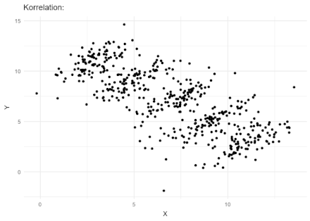

<head>
    <script src="https://cdn.mathjax.org/mathjax/latest/MathJax.js?config=TeX-AMS-MML_HTMLorMML" type="text/javascript"></script>
    <script type="text/x-mathjax-config">
        MathJax.Hub.Config({
            tex2jax: {
            skipTags: ['script', 'noscript', 'style', 'textarea', 'pre'],
            inlineMath: [['$','$']]
            }
        });
    </script>
</head>

## `2024-06-02`

> 制表符

制表符（Tab）不是可打印字符，因为它不是用于显示某个具体字符，更不代表固定长度的空白字符，而是用于控制文本的格式和布局。

假设在 HTML 的 \<pre\> 元素中插入这样一段源码：
```html
&#9;This line begins with a single tab.
Here&#9;are&#9;some&#9;more&#9;tab&#9;characters&#9;!
T.......T.......T.......T.......T.......T.......T.......T
```

网页中显示的效果如下（默认 tab-size 为 8）：
```html
        This line begins with a single tab.
Here    are     some    more    tab     characters      !
T.......T.......T.......T.......T.......T.......T.......T
```

使用文本编辑器时，按 Tab 键可以插入一个制表符，也可以插入固定长度的空格（一般默认为 4 个空格）。

## `2024-05-05`

> [北京时间](https://zh.wikipedia.org/wiki/%E5%8C%97%E4%BA%AC%E6%97%B6%E9%97%B4)

1912年中华民国建立后，位于北京的中央观象台将全国分为五个时区，自西向东分别为：

{:.table}
| **Time Zone** | **TZ Identifier** | **UTC Offset** | **Area** |
| --------- | ------- | ----- |----------- |
| 昆仑时区 | Asia/Kashgar | UTC+05:30 | 新疆西部与西藏西部 |
| 新藏时区 | Asia/Urumqi | UTC+06:00 | 新疆大部及西藏大部 |
| 陇蜀时区 | Asia/Chongqing | UTC+07:00 | 华西 |
| 中原标准时区 | Asia/Shanghai | UTC+08:00 | 华东 |
| 长白时区 | Asia/Harbin | UTC+08:30 | 东北 |

1949 年新中国成立后，UTC+08:00 时区正式命名为北京时间。新疆的部分地区同时使用 UTC+06:00 和 UTC+08:00 两种时间。

## `2024-04-28`

> shell: [`history`](https://www.man7.org/linux/man-pages/man3/history.3.html)

`history` 用于打印历史执行过的指令，

- `history -k` 打印最近的 k 条指令
- `!n` 执行历史第 n 条指令
- `!-n` 执行倒数第 n 条指令
- `!!` 执行上一条指令，等同于 `!-1` 
- `!abc` 执行最近一条以字符串 abc 开头的命令
  
`Ctrl + r` 也可以用于查找历史命令并执行。

## `2023-12-12`

> [辛普森悖论](https://en.wikipedia.org/wiki/Simpson%27s_paradox)

辛普森悖论（Simpson's Paradox）是概率和统计中的一种现象：几组数据呈现出相同的趋势，但是当这些数据被汇总后趋势消失或反转。

<div align=center>

</div>

例如，某学校 A 和 B 两个学院的女生录取率都高于男生，A 学院的录取率低于 B 学院，两个学院总体上却是男生录取率更高。这是因为女生主要集中在低录取率的 A 学院，而在 B 学院的男生比女生多得多。由此可见，性别并非是录取率高低的唯一因素，甚至可能是毫无影响的，至于在学院中出现的比率差，可能是随机事件。


## `2023-11-20`

> shell: [`cut`](https://man7.org/linux/man-pages/man1/cut.1.html)

```bash
cut OPTION... [FILE]...
```

`cut` 指令对输入文件的每一行进行剪切，打印到标准输出。
- `-b` 按字节剪切
- `-c` 按字符剪切
- `-d` 指定分割符
- `-f` 选择分割之后的字段（Fields），默认按空格分割
  
通过以下方式选择剪切之后需要输出的范围：
- `N` ：选择第 `N` 个字节/字符/字段
- `N1,N2,...` ：选择第 `N1` 和第 `N2` 个字节/字符/字段
- `N-` ：选择第 `N` 个字节/字符/字段起至结束的所有内容
- `N-M` ：选择第 `N` 到第 `M` 个字节/字符/字段
- `-M` ：选择第 1 到第 `M` 个字节/字符/字段

<details>
  <summary>参考资料</summary>

  https://www.geeksforgeeks.org/cut-command-linux-examples/

</details>

## `2023-06-13`

> 区间与从 0 开始的下标

左闭右开的整数区间表示法 $[a,\ b)$ 是普遍使用的，它有以下几个优点：
- $a=b$ 表示空区间。
- 下界元素 $a$ 在（非空）区间内。
- 区间的元素个数为 $b-a$，公式中没有冗余的加一/减一。
- 连续的区间 $[a,\ b)$ 和 $[b,\ c)$，前一个区间的上界 = 后一个区间的下界。

当需要表示一个长度为 $n$ 的序列，下标区间 $[0,\ n)$ 会比 $[1,\ n+1)$ 更加优雅：
- 没有多余的加一。
- 上界 $n$ 等于区间的长度。
- 任一下标 $i \in [0,\ n)$ 的含义是：相对于起点 $0$ 的**偏移量**。

Python 使用基于 $0$ 的索引方式，使得切片语法非常漂亮：
- 取前 $k$ 个元素：`arr[:k]`
- 从 $i$ 开始取 $k$ 个元素：`arr[i:i+k]`

## `2023-05-28`

> shell: `wc`

```bash
wc [OPTION]... [FILE]...
```

参数：
- `-c` 统计字节数
- `-m` 统计字符数
- `-w` 统计单词数，以空格分割
- `-l` 统计行数

**note**：如果文件最后一行末尾没有换行符 `\n` ，则命令 `wc -l FILE` 得到的行数比实际少一行；也可以使用命令 `grep -c "" FILE` 来统计行数。

## `2023-04-27`

> 整数各位相加

给定一个正整数 $n$，累加 $n$ 的各位数字，直到只剩下最后一个数字 $M$，如：

$$ 427 \rightarrow 4 + 2 + 7 = 13 \rightarrow 1 + 3 = 4.$$

假设 $n$ 是一个三位数：

$$
\begin{align*}
n &= \overline{ABC} \\
  &= 100A + 10B + C \\
  &= (A + B + C) + 9 \times (11A + B) \\
  &= \dots \\
  &= M + 9X
\end{align*}
$$

发现 $n \% 9 = (A + B + C) \%9$，不断重复累加过程，最终结果 $M$ 可由 $n$ 对 $9$ 取模得到：
当 $n \% 9 = 0,\ M = 9$；否则 $M = n \% 9$。

## `2023-03-05`

> shell: [`set`](https://www.gnu.org/software/bash/manual/html_node/The-Set-Builtin.html)

set 命令用来修改 shell 环境的运行参数。命令行下不带任何参数直接执行 ``set`` 会显示所有的环境变量（POSIX 模式下的 Bash）。

```bash
set [-abefhkmnptuvxBCEHPT] [-o option-name] [--] [-] [argument …]
set [+abefhkmnptuvxBCEHPT] [+o option-name] [--] [-] [argument …]
```

``-`` 表示开启选项， ``+`` 表示关闭选项。

- ``set -e``

  当指令返回非零状态值，立即终止脚本的执行。比如某条命令出错会立即退出。

- ``set +e``
  
  关闭 ``-e`` 选项。

- ``set -x``
  
  打印执行的指令。

- ``set +x``
  
  关闭 ``-x`` 选项。


## `2023-02-24`

> [Unix 时间戳](https://www.unixtimestamp.com/)

Unix 时间戳是从 UTC+0（即 GMT 时间）`1970-01-01 00:00:00`（对应北京时间 `1970-01-01 08:00:00` ）起至当前时刻的总秒数，不考虑闰秒。

```bash
$ date +%s
1677244559
$ date -u -d '2023-01-01' +%s
1672531200
$ date -u -d '1970-01-01' +%s
0
```

如果使用的 Unix 系统是 32 位的，那么会以 32 位有符号整数表示时间类型，可以表示约 136 年的秒数：1970 年以前的 68 年时间戳是负数，之后的 68 年是正数。这意味着到了 `2038-01-19` 就会产生溢出。解决方法是使用 64 位整型数。

## `2023-02-20`

> 软件开发：CI/CD

[CI/CD](https://about.gitlab.com/topics/ci-cd/) 是一种通过在应用开发阶段引入自动化来频繁向客户交付应用的方法。CI/CD 的核心概念是持续集成、持续交付和持续部署。

#### CI: Continuous Integration（持续集成）

持续集成是在源代码变更后自动检测、拉取、构建和（在大多数情况下）进行单元测试的过程。
开发人员会频繁地向主干提交代码，这些新提交的代码在最终合并到主干前，需要经过编译和自动化测试流进行验证。
如果集成较早并更加频繁，那么冲突将更容易解决且执行成本更低。

#### CD: Continuous Delivery（持续交付）

持续交付是在构建阶段之后将所有代码更改部署到暂存环境来扩展持续集成。暂存环境与生产环境相似/相同，只是它不是公开可用的。
持续交付的目标是拥有一个可随时部署到生产环境的代码库。

#### CD: Continuous Deployment（持续部署）

持续部署意味着所有的变更都会被自动部署到生产环境中。

## `2022-12-25`

> shell: [``sort``](https://man7.org/linux/man-pages/man1/sort.1.html)

文本排序，以行为单位。参数：
- ``-b`` 忽略开头的空格。
- ``-c`` 检查输入是否已经排好序。
- ``-f`` 将小写字母视为大写字母。
- ``-n`` 按数值大小排序（默认按字符串的字典序排序）。
- ``-u`` 输出去重之后的排序结果。
- ``-r`` 逆序。
- ``-t`` 指定列（字段）的分隔符，默认为空格。
- ``-k`` 指定排序的 key。
  - ``sort -k 2`` 按第 2 个字段排序。
  - ``sort -k 2,1`` 先按第 2 个字段排序，再按第 1 个字段排序。

> shell: [``uniq``](https://man7.org/linux/man-pages/man1/uniq.1.html)

过滤**相邻**的重复行，一般与 ``sort`` 配合使用。参数：
- ``-c`` 输出每行重复的次数。
- ``-i`` 忽略大小写。
- ``-d`` 打印重复的行，每组打印一次。
- ``-D`` 打印所有重复的行。
- ``-u`` 打印没有重复过的行。

## `2022-12-01`

> 反向代理和正向代理

#### 反向代理（Reverse Proxy）

代理服务器接收客户端发出的请求，然后将请求转发给内部网络上的服务器，并将服务器的响应返回给客户端，此时代理服务器对外就表现为一个反向代理服务器。
- 使用反向代理，可以对客户端隐藏服务器的 IP 地址。
- 反向代理服务器可以做负载均衡：根据所有真实服务器的负载情况，将客户端请求分发到不同的真实服务器上。
- 反向代理服务器可以对于静态内容及短时间内有大量访问请求的动态内容提供缓存服务，提高访问速度。
- 反向代理服务器可以作为应用层防火墙，为服务器提供安全保障。

#### 正向代理（Forward Proxy）

代理服务器位于客户端和目标服务器之间，为了从目标服务器取得内容，客户端向代理服务器发送一个请求并指定目标，然后代理服务器向目标服务器转发请求并将获得的响应返回给客户端。
- 代理服务器可以隐藏客户端的真实 IP。
- 通过代理服务器，可以突破自身 IP 访问限制和网络审查（防火长城），访问受限的网站。
- 代理服务器提供缓存，可以提高访问速度。


## `2022-11-30`

> python3：[`EOFError`](https://docs.python.org/3.10/library/exceptions.html#EOFError)

当 `input()` 函数遇到文件结束符（比如输入流结束，或者在终端输入时按 `Ctrl + z`（Windows） 或 `Ctrl + d`（Mac OS）），会抛出 `EOFError` 异常。

**note**：`io.IOBase.read()` 和 `io.IOBase.readline()` 读到文件末尾不会抛出异常，而是返回空字符串。

## `2022-11-20`

> Chrome 网页截图

打开网页，按 F12 或 `右键 - 检查` 打开开发者工具，使用快捷键 `Ctrl + Shift + p`（Windows）或 `Command + Shift + p`（Mac OS）打开命令面板，输入 `screen` ，在匹配结果中选择 `Capture full-size screenshot` 可以截全屏，选择 `Capture area screenshot` 可以进行区域截屏。

推荐使用截屏插件：[FireShot](https://chrome.google.com/webstore/detail/take-webpage-screenshots/mcbpblocgmgfnpjjppndjkmgjaogfceg)。

## `2022-11-18`

> 阴阳历

**纯阳历**是指历法中只保证一年的时间与地球绕日运行周期基本一致，不考虑月份，例如华夏二十四节气。

**纯阴历**是指历法中只保证一个月的时间与月亮运行周期基本一致，不考虑年长，例如伊斯兰历。

**阴阳历**既保证“多年的平均值”与地球绕日周期的一致，又保证“月”与月亮周期的一致。

华夏历法（农历/黄历/夏历）是一种阴阳历，大小月分别为 30 日和 29 日，平均每月为 29.53 日，与月亮运行周期一致（朔望月）；平年约 354 日，闰年约 384 日（多一个月），每十九年七闰，这个周期中平均每年为 365.247 日，与地球绕日运行周期一致（回归年）。比如，2020 年闰四月，2023 年将会闰二月。

我们平时说的阳历、公历是指格里高利历，是世界上大多数地方使用的历法。格里高利历是根据地球上呈现出的太阳直射点的周期性变化所制定的历法，一年 12 个月，但是这个“月”与朔望月无关，不符合月亮的月相周期。

## `2022-11-17`

> 天干地支纪年

<div align=center>

</div>

天干地支是十干与十二支的合称，通称为十天干十二地支，由两者经一定的组合方式搭配成六十对为一个周期（称为六十甲子），循环往复。

#### 干支纪年 → 西历

西历新年和华夏新年（农历）或干支历新年相差少于两个月；在西历新年后、华夏新年或干支历新年之前，例如西历 1 月 2 日，要续用上一年之干支。农历以正月初一为一年之始，而干支历则以立春为一年之始（属相的依据就是干支纪年法，十二生肖对应十二地支，因此新的生肖年应该从立春开始算起）。

$西历年份 = 6 \times 天干 - 5 \times地支 + 3 + 60n$

- 天干：甲=1, 乙=2, 丙=3,....., 癸=10或0
- 地支：子=1, 丑=2, 寅=3,....., 亥=12或0

**为何加 3 ？**

公元 4 年是甲子年，1 + 3 = 4。

公元 1984 年是距离现在最近的、已经过去的甲子年，因此公式中也可以把 3 替换成 1983。

#### 西历 → 干支纪年

$天干 = (\ 西历年份 - 3\ ) \mod 10$

$地支 = (\ 西历年份 - 3\ ) \mod 12$

比如，2022 年是壬寅年。

**note**：上面的西历年份都是指公元年份，公元前的历法换算规则不同。

## `2022-10-29`

> 字体：Times New Roman


Times New Roman 是经典的衬线体（Serif），常作为标准字体，广泛使用在图书、杂志、报告、公文、论文、广告等。1931 年在英国的《泰晤士报》（The Times）首次使用。

## `2022-10-12`

> [HTTP: GET 和 POST](https://www.zhihu.com/question/28586791/answer/767316172)

#### 浏览器的 GET 和 POST

HTTP 最早是被用作浏览器与服务器之间交互 HTML 和表单（Form）的通讯协议。

- **GET**

  读取资源。反复读取不应该对访问的数据有副作用，称为幂等（Idempotent)。浏览器可以对 GET 请求的数据做缓存。

  浏览器中，如果 GET 要在 URL 之外带一些参数就只能依靠 URL 附带 Query String，通过 & 进行参数分割。但是 HTTP 协议本身并没有这个限制，GET 也可以使用请求体（Body）。

- **POST**

  让服务器做一件事，这件事往往是有副作用的、不幂等的，意味着不能随意多次执行，因此也就不能缓存。

  浏览器的 POST 请求都来自表单提交。每次提交，表单的数据被浏览器编码到 HTTP 请求的 Body 里。
  
#### 接口中的 GET 和 POST

这里指通过浏览器的 Ajax API，或者 iOS/Android App 的 Http Client，或者 Java 的 commons-httpclient/okhttp ，亦或者 Curl、Postman 之类的工具发出来的 GET 和 POST 请求。此时 GET 和 POST 不光能用在前端和后端的交互中，还能用在后端各个子服务的调用中（即当一种 RPC 协议使用）。

- **GET**

  按照 REST 接口规范，GET 专用于获取资源或者资源列表。

- **POST**

  按照 REST 接口规范，POST 用于创建一个资源。Note：有些 API 是使用 PUT 作为创建资源的方法，PUT 的实际语义是 Replace，REST 规范里提到 PUT 的请求体应该是完整的资源，包括 ID 在内。POST 更适用于那些 ID 是服务器端自动生成的场景。

#### 安全性

无论是 GET 还是 POST 都不够安全，因为 HTTP 本身是明文协议，每个 HTTP 请求和返回的每个字节都会在网络上明文传播，不管是 URL、Header 还是 Body。为了避免传输中数据被窃取，必须做从客户端到服务器的端端加密，比如使用 HTTPS。

直观上，GET 请求的参数倾向于放在 URL 上，因此有更多机会被泄漏。

#### 浏览器的 POST 需要发两个请求吗

HTTP 请求可以大致分为请求头（Header）和请求体（Body）两个部分，大家会有一个约定：所有的“控制类”信息应该放在请求头中，具体的数据放在请求体里。于是服务器端在解析时，总是会先完全解析全部的请求头，希望了解请求的控制信息后，决定这个请求怎么进一步处理：是拒绝，还是根据 Content-type 调用相应的解析器处理数据，或者直接用 Zero Copy 转发。

为了在提高数据吞吐和降低带宽浪费上做一个折衷，客户端可以做一些优化，比如内部设定一次 POST 的数据超过 1KB 就先只发请求头，否则就一次性把请求体也发出去；或者统计发送成功率，如果成功率很高，就总是全部发等等。不同浏览器、不同的客户端（Curl、Postman）可以有各自不同的方案。

#### URL 长度

客户端/浏览器以及服务器端会对 URL 的长度进行限制，因为解析 URL 字符串需要分配内存。HTTP 协议本身对 URL 长度并没有做任何规定。


## `2022-10-10`

> linux: `/dev/null`

`/dev/null` 是 Linux 中的一个空设备文件，这个文件的大小是 0 字节，所有人都有读写权限，没有执行权限。

写入到 `/dev/null` 的内容会全部丢失，读取 `/dev/null` 会返回 `EOF` 。可以将标准输出或标准错误重定向到 `/dev/null` ，用于禁止输出。

> shell: `stat`

`stat` 命令用于显示文件的状态信息，比 `ls` 命令的输出信息更详细，可以查看的信息包括：

- 文件名
- 文件大小
- 文件使用的数据块总数
- 文件类型
- 设备编号
- Inode 号
- 链接数
- 文件权限
- 文件所有权的 Gid 和 Uid
- 最近访问文件时间
- 最近修改文件内容时间
- 最近修改文件属性时间
- 文件创建时间
  

## `2022-09-30`

> socks 和 http/https 网络代理

[Clash for Windows](https://github.com/Fndroid/clash_for_windows_pkg/releases) 提供 socks 和 http/https 两种协议的代理，且默认共用端口。socks 是会话层协议，http/https 是应用层协议，一般 socks 代理更快。

<div align=center>

</div>

非浏览器应用一般不会走系统代理，比如在终端里面，就需要自己配置代理。配置方法是设置 `http_proxy`、`https_proxy`、 `ftp_proxy`、 `no_proxy`、`all_proxy` 等环境变量。它们并不是标准环境变量，而是一种使用惯例。一些程序识别小写（如 `http_proxy` ），一些识别大写（如 `HTTP_PROXY` ），因此最好是同时设置这些变量的大小写形式。

配置 http/https 协议的代理：

```bash
export http_proxy=http://127.0.0.1:7890
export https_proxy=http://127.0.0.1:7890
```

配置 socks 协议的代理：

```bash
export http_proxy=socks5://127.0.0.1:7890
export https_proxy=socks5://127.0.0.1:7890
```

如果 `http_proxy` 和 `https_proxy` 值一样，可以直接设置 `all_proxy=socks5://127.0.0.1:7890` 定义统一的代理。此外，一些环境例如 GNOME 是把 socks 代理配置在 `all_proxy` 中，所以最好同时设置这些变量。如果这些变量同时设置了， `all_proxy` 的优先级最低。

取消代理：

```bash
unset http_proxy https_proxy all_proxy
```

可以通过 `curl` 或 `wget` 验证代理是否生效：

```bash
# 查看ip
curl cip.cc
curl https://icanhazip.com
curl ifconfig.me
# 获取网页html
curl www.google.com
wget www.google.com
```

可以写成函数的形式保存在 `~/.bashrc` ：
```bash
function proxy_on() {
    export http_proxy=http://127.0.0.1:7890
    export https_proxy=$http_proxy
    export all_proxy=socks5://127.0.0.1:7890
    echo -e "终端代理已开启。"
    curl cip.cc
}

function proxy_off(){
    unset http_proxy https_proxy all_proxy
    echo -e "终端代理已关闭。"
    curl cip.cc
}
```

用 `socks5h://` 代替 `socks5://` 可以避免 DNS 污染。
如果是 socks 协议的代理，`curl www.google.com` 需要把前缀 `socks5` 改成 `socks5h`，形如 `curl -x socks5h://127.0.0.1:7890 www.google.com` 才会成功。因为 `socks5` 是在本地解析 `www.google.com`，无法得到正确的 IP 地址, 而 `socks5h` 是在远端解析域名。

python 代码验证（需要安装 pysocks ）：

```python
>>> import requests
>>> proxies = {'http':'socks5://127.0.0.1:7890', 'https':'socks5://127.0.0.1:7890'}
>>> url = 'https://icanhazip.com'
>>> res = requests.get(url, proxies=proxies)
>>> res.content
b'103.88.46.38\n'
```

此外，即使配置了代理，也是 `ping` 不通谷歌的，因为 `ping` 使用的是 **网络层** 的 `ICMP` 协议。

## `2022-09-25`

> vim 简单配置

vim 配置写在一般写在 `~/.vimrc` ，可以在命令模式输入 `:scriptnames` 查看配置文件生效顺序。其中 `/usr/share/vim/vimrc` 是系统配置 `/etc/vim/vimrc` 的软连接。vimrc 的注释使用引号 `"` 。

```vim
" 不必兼容 vi
set nocompatible  
" 启用鼠标
set mouse=a
" 显示行号  
set number    
" 显示标尺（光标所在行列）
set ruler   
" 显示命令 
set showcmd    
" 制表符宽度为 4
set tabstop=4    
" 自动缩进
set autoindent    
" 自动缩进的空格数为 4
set shiftwidth=4   
" 空格代替制表符 
set expandtab    
" 高亮显示配对的括号
set showmatch    
" 对搜索的词高亮
set hlsearch    
" 启用 256 色
set t_Co=256   
" 启用 industry 主题 
colorscheme industry
" 语法高亮
syntax on   
" 启动文件类型自动检测
filetype on    
" 允许对不同类型的文件设置不同的缩进格式
filetype indent on    
" 允许加载文件类型的插件
filetype plugin on
" 设置终端显示用的编码方式
set encoding=utf-8
" 设置写入文件用的编码方式
set fileencoding=utf-8
```

有些 Linux 系统默认使用的 locale 系统编码为 POSIX，不支持中文，会导致 vim 中出现中文乱码，可以设置系统环境变量 `export LANG=C.UTF-8` 。`locale -a` 命令可以查看系统支持的字符集。

`file a.txt` 命令可以查看文件所用的编码方式。
`encoding` 是终端显示用的编码方式，vim 打开文件之后再设置是没有用的；如果打开已经是乱码（比如 vim 默认是 utf-8 编码，但是文件是 gbk 编码），可以键入 `:e ++enc=gbk` 以重新打开文件、修改终端编码方式。 `fileencoding` 是写入文件用的编码方式，可以在打开文件之后修改。

`cat` 打印 gbk 编码的文件可能是乱码，可使用 `iconv` 命令修改文件编码为 utf-8：`iconv -f gbk -t utf-8 a.txt > b.txt` 。

## `2022-09-14`

> Windows Internet Shortcut

下载网页到本地 html 文件可以使用 python 的 `requests` 包，但是如果只想将网页的 url 保存成一个快捷方式，可以用以下代码完成：

```python
>>> url = 'https://www.baidu.com'
>>> shortcut = 'baidu.url'
>>> with open(shortcut, mode='w', newline='\r\n') as fw:
...     fw.write(f'[InternetShortcut]\nURL={url}')
```

注意，Windows 系统下的换行符是 `\r\n` 。

## `2022-09-12`

> c++：[`std::tuple`](https://cplusplus.com/reference/tuple/)

`std::tuple` 用于打包（Pack）多个不同类型的对象。不同于 `std::pair` ，`std::tuple` 打包的对象的个数是不定的，可通过 `std::get` 按顺序访问对象。`std::get` 返回的是引用，具体类型（引用/右值引用、常量引用/非常量引用）由输入的元组类型决定。

`std::tie` 用于解压（Unpack）元组中的对象，可以忽略其中的某些对象。

```cpp
#include<iostream>
#include<vector>
#include<typeinfo>
#include<tuple>

int main()
{
    std::tuple<int, float, char> ta(1, 2.0f, 'a');
    auto tb = std::make_tuple("tp", 100, std::vector<int>{1,2,3});
    std::cout << typeid(tb).name() << std::endl;
    std::get<0>(ta) = std::get<1>(tb);
    int tint; std::vector<int> tvec;
    std::tie(std::ignore, tint, tvec) = tb;
    std::cout << std::get<0>(ta) << std::endl; // 100
    std::cout << tvec.size() << " " << tvec[2] << std::endl;
    return 0;
}
```

## `2022-07-25`

> 2.4GHz 频段

ISM 频段（Industrial Scientific Medical Band）是国际通信联盟无线电通信局定义的频段，主要开放给工业/科学/医学机构使用，无需许可证或费用，只需要遵守一定的发射功率（一般低于1W），并且不对其它频段造成干扰即可。ISM 频段在各国的规定并不统一，但是有一个共同的频段，那就是 2.4GHz 频段（2.400 – 2.4835GHz）。无线局域网、蓝牙、ZigBee等无线网络均可工作在 2.4GHz 频段上。

现在有不少路由器采用 2.4G + 5G 双频段设计。

{:.table}
|  | **优点** | **缺点** |
| --------- | ----- |----------- |
| `2.4G` | 频率低、波长长，在空气中传播时衰减较小，传播距离更远。 | 信号频宽较窄，家电、无线设备大多使用2.4G频段，无线环境更加拥挤，干扰较大。 |
| `5G` | 信号频宽较宽，无线环境比较干净，干扰少，网速稳定，支持更高的无线速率。 | 频率高、波长短，在空气中传播时衰减较大，覆盖范围更小。 |

传播相同的距离时，5G 信号相对 2.4G 信号较弱，这是由电磁波的物理特性决定的：波长越长，衰减越少，也更容易绕过障碍物继续传播。但是，网速不仅与信号强度有关，也与信道质量有很大的关系。5G 频段带宽更高，信道容量更大。

## `2022-07-21`

> python: 正则表达式

- 正则表达式需要用到反斜杠，反斜杠本身需要用反斜杠进行转义，所以 pattern 最好使用原始字符串（Raw String）来表示，避免反斜杠太多造成混淆。

  ```python
  >>> print('a\tb')
  a       b
  >>> print(r'a\tb')
  a\tb
  >>> print('a\\tb')
  a\tb
  >>> r'\t' == '\\t'
  True
  >>> import re
  >>> re.findall(r'\t', 'a\t') 
  ['\t']
  >>> re.findall('\\t', 'a\t') 
  ['\t']
  >>> re.findall(r'\\t', r'a\t') 
  ['\\t']
  >>> re.findall(r'\\t', 'a\\t') 
  ['\\t']
  >>> re.findall('\\\\t', r'a\t') 
  ['\\t']
  ```

- `\w` 用于匹配大小写字母、数字、下划线；`\b` 用于匹配 `\w` 类型和非 `\w` 类型之间的分界。比如 `abc--123` 可以理解为 `\ba\Bb\Bc\b--\b1\B2\B3\b` 。

## `2022-07-19`

> python: 默认参数与可变类型

默认参数是在函数定义的时候就被计算的，默认参数值存储在函数的 `__defaults__` 属性中，每次调用函数都是从这个属性中读取默认参数值。

当默认参数值是可变类型的时候，这个默认值可能会因为函数调用而改变。

```python
>>> def foo(n, l=[]):
...     l.append(n)
...     return l
...
>>> foo.__defaults__ 
([],)
>>> foo(1)
[1]
>>> foo(2)
[1, 2]
>>> foo.__defaults__
([1, 2],)
```

为了避免这种预期之外的结果，可以使用 `None` 作为默认参数值，在函数体中增加一个判断。

```python
>>> def bar(n, l=None):
...     if l is None: l = []
...     l.append(n)
...     return l
... 
>>> bar.__defaults__
(None,)
>>> bar(1)
[1]
>>> bar(2)
[2]
>>> bar.__defaults__
(None,)
```


## `2022-05-19`

> numpy: arg

- [`numpy.argmax`](https://numpy.org/doc/stable/reference/generated/numpy.argmax.html)：获取最大元素的索引。

  ```python
  numpy.argmax(a, axis=None, out=None, *, keepdims=<no value>)
  ```

  - 相关函数：`numpy.argmin`， `numpy.max`， `numpy.min`

- [`numpy.argwhere`](https://numpy.org/doc/stable/reference/generated/numpy.argwhere.html)：找出满足条件的元素对应的索引。

  ```python
  >>> arr = np.array([1, 2, 3, 4, 5, 6, 7, 8])
  >>> np.argwhere(arr % 2 != 0)
  array([[0],
        [2],
        [4],
        [6]], dtype=int64)
  >>> np.argwhere(arr % 2 != 0).flatten()
  array([0, 2, 4, 6], dtype=int64)
  ## 大于4的元素减10，否则乘10
  >>> np.where(arr > 4, arr - 10, arr * 10)
  array([10, 20, 30, 40, -5, -4, -3, -2])
  ```

  - 相关函数：`numpy.where`

- [`numpy.argsort`](https://numpy.org/doc/stable/reference/generated/numpy.argsort.html)：返回从小到大排序之后元素对应的索引。

  ```python
  numpy.argsort(a, axis=- 1, kind=None, order=None)
  ```

  ```python
  >>> arr = np.array([88, 79, 86, 97, 89, 95, 84])
  >>> np.sort(arr)
  array([79, 84, 86, 88, 89, 95, 97])
  >>> np.argsort(arr)
  array([1, 6, 2, 0, 4, 5, 3], dtype=int64)
  ## 两次调用可以得到元素排序之后对应的索引
  >>> arr.argsort().argsort()
  array([3, 0, 2, 6, 4, 5, 1], dtype=int64)
  ```

- [`numpy.argpartition`](https://numpy.org/doc/stable/reference/generated/numpy.argpartition.html)：返回局部排序之后的索引，最小的 $k+1$ 个元素排在前面，其余更大的元素排在后面（快排），前后两部分元素内部可以是无序的。

  ```python
  numpy.argpartition(a, kth, axis=-1, kind='introselect', order=None)
  ```
  
  ```python
  >>> arr = np.array([66, 15, 27, 33, 19, 13, 10])
  ## 根据第3+1小的元素（19）划分
  >>> np.partition(arr, 3)
  array([15, 13, 10, 19, 27, 33, 66])
  >>> np.argpartition(arr, 3)
  array([1, 5, 6, 4, 2, 3, 0], dtype=int64)
  ## 根据第2大的元素（33）划分
  >>> np.partition(arr, -2)   
  array([13, 10, 27, 15, 19, 33, 66])
  >>> np.argpartition(arr, -2) 
  array([5, 6, 2, 1, 4, 3, 0], dtype=int64)
  ```

  - 相关函数：`numpy.partition`

## `2022-05-07`

> sql: 顺序

- 表达式顺序

  1. `select` \<select_list\>
  2. `from` \<left_table\>
  3. \<join_type\> `join` \<right_table\>
  4. `on` \<join_condition\>
  5. `where` \<where_condition\>
  6. `group by` \<group_by_list\>
  7. `having` \<having_condition\>
  8. `order by` \<order_by_condition\>
  9. `limit` \<limit_number\>

- 解析顺序（优先级）

  1. `from` `join`
  2. `where`
  3. `group by`
  4. `having`
  5. `order by`
  6. `select`
  7. `distinct`
  8. `limit`


## `2021-12-27`

> numpy: indexing

- `None` ：在索引中使用，可以保持/扩展维度。

  ```python
  >>> a = np.array([[10, 30, 20], [60, 40, 50]])
  >>> a
  array([[10, 30, 20],
         [60, 40, 50]])
  >>> a[0]
  array([10, 30, 20])
  >>> a[0, None] 
  array([[10, 30, 20]])
  >>> a[0, None, None] 
  array([[[10, 30, 20]]])
  ```

- [`numpy.take`](https://numpy.org/doc/stable/reference/generated/numpy.take.html) ：按行/列索引取值。

  ```python
  numpy.take(a, indices, axis=None, out=None, mode='raise')
  ```

  + `axis=None` ：将数组平铺开再取值，输出维度与 `indices` 保持一致。

    ```python
    >>> np.take(a, [[0,1],[2,3]], axis=None)
    array([[10, 30], 
           [20, 60]])
    ```

  + `axis=0` ：按行取值。

    ```python
    >>> np.take(a, [0,1,0], axis=0) 
    array([[10, 30, 20],
           [60, 40, 50],
           [10, 30, 20]])
    >>> np.take(a, [[0],[1]], axis=0) 
    array([[[10, 30, 20]],

           [[60, 40, 50]]])
    ```

  + `axis=1` ：按列取值。

    ```python
    >>> np.take(a, [0,2], axis=1) 
    array([[10, 20], 
           [60, 50]])
    >>> np.take(a, [[0,1],[1,1]], axis=1) 
    array([[[10, 30],
            [30, 30]],

           [[60, 40],
            [40, 40]]])
    ```

- [`numpy.take_along_axis`](https://numpy.org/doc/stable/reference/generated/numpy.take_along_axis.html) ：沿某个维度按索引取值；除该维度之外， `indices` 需要与 `arr` 保持相同尺寸，否则会自动广播（Broadcast），广播失败会报 `shape mismatch` 错误；输出维度与 `indices` 相同（广播之后）；该函数功能与 pytorch 的 `gather` 相似。

  ```python
  numpy.take_along_axis(arr, indices, axis)
  ```

  ```python
  >>> a
  array([[10, 30, 20],
         [60, 40, 50]])
  >>> np.take_along_axis(a, np.array([[0,1,1]]), axis=0)         
  array([[10, 40, 50]])
  # arr[indices[0],0], arr[indices[1],1], arr[indices[2],2]
  >>> np.take_along_axis(a, np.array([[0,1,1]]), axis=1)
  array([[10, 30, 30],
         [60, 40, 40]])
  ## broadcast:
  # arr[0,indices[0]], arr[0,indices[1]], arr[0,indices[2]]
  # arr[1,indices[0]], arr[1,indices[1]], arr[1,indices[2]]
  >>> np.take_along_axis(a, np.array([[0,1,1,2],[1,0,2,0]]), axis=1) 
  array([[10, 30, 30, 20],
         [40, 60, 50, 60]])
  # arr[0,indices[0][0]], arr[0,indices[0][1]], arr[0,indices[0][2], arr[0,indices[0][3]]
  # arr[1,indices[1][0]], arr[1,indices[1][1]], arr[1,indices[1][2], arr[1,indices[1][3]]
  ```

## `2021-11-18`

> 最大公约数（Greatest Common Divisor）

设 $a \geq b$ 且均为正整数，其最大公约数性质如下：

- $\gcd(a, b) = \gcd(b, a)$
- $\gcd(a, b) = \gcd(a\%b, b)$
- $\gcd(a, b) = \gcd(a-b, b)$
- 当 $a$ 和 $b$ 都是偶数时，$\gcd(a, b) = 2 \times \gcd(a/2, b/2)$
- 当 $a$ 是偶数、 $b$ 是奇数时，$\gcd(a, b) = \gcd(a/2, b)$
- 当 $a$ 是奇数、 $b$ 是偶数时，$\gcd(a, b) = \gcd(a, b/2)$

#### 辗转相除法《几何原本》

取模运算比较耗时。

```cpp
int gcd(int a, int b)
{
    if (a < b) swap(a, b);
    int r;
    while (r = a % b)
    {
        a = b;
        b = r;
    }
    return b;
}
```

#### 更相减损术 《九章算术》

当两个数相差较大时，递归比较深。

```cpp
int gcd(int a, int b)
{
    if(a == b) return a;
    if(a > b) return gcd(a-b, b);
    else return gcd(a, b-a);
}
```

#### Binary GCD Algorithm

使用移位运算和减法代替除法。

```cpp
int gcd(int a, int b)
{
    if(a == b) return a;
    if(!(a&1) && !(b&1)) return 2 * gcd(a>>1, b>>1);
    else if(!(a&1)) return gcd(a>>1, b);
    else if(!(b&1)) return gcd(a, b>>1);
    else return a > b? gcd(a-b, b): gcd(a, b-a);
}
```

## `2021-11-15`

> c++: 左值（lvalue）与右值（rvalue）

左值与右值的根本区别在于能否获取内存地址（`&`）。从一个左值中必定可以解析出对应对象的地址，除非该对象是位字段（Bit-field）或者被声明为寄存器存储类。

赋值运算符左边的操作数以及自增/自减运算符操作数，不仅应该是左值，还应该是可修改的左值。可修改的左值，其类型不可以被声明为 const，并且可修改的左值不能是数组类型。赋值运算符右边可以是左值。

右值引用产生的对象、临时对象是右值（当函数返回的是非引用类型时，函数会创建临时对象（Temporary Object），函数返回的就是这个临时对象）。

## `2021-10-21`

> shell: `md5sum`

MD5 全称是报文摘要算法（Message-Digest Algorithm 5），常常被用来验证网络文件传输的完整性，防止文件被篡改。此算法对任意长度的信息逐位进行计算，产生一个二进制长度为 128 位（十六进制长度为 32 位）的“数字指纹”（或称“报文摘要”），不同文件产生相同的报文摘要的可能性是非常小的（与文件名无关）。

```bash
$ md5sum xy.txt > xy.md5
$ cat xy.md5
0de7b78014b979c7e5f31bc62f4f7cf4  xy.txt
$ md5sum -c xy.md5
xy.txt: OK
$ echo "hello world" >> xy.txt
$ md5sum -c xy.md5
xy.txt: FAILED
md5sum: WARNING: 1 computed checksum did NOT match
```

开源加密工具箱 OpenSSL 包含了 MD5、SHA256 等报文摘要算法以及 RSA 等加密算法。Linux 系统键入 ``openssl`` 即可进入其命令行模式，或者直接调用如 ``openssl md5 xy.txt``。

## `2021-10-20`

> 轮盘赌选择方法

轮盘赌选择方法又称比例选择算子，其基本思想是：每个个体 $x_i$ 被选中的概率 $p(x_i)$ 与其适应度函数（Fitness Function）值大小 $f(x_i)$ 成正比，$p(x_i) = \frac{f(x_i)}{\sum_j f(x_i)}$。

轮盘赌选择法可用如下过程模拟：

 1. 计算累计概率（Cumulative Probability） $q(x_i) = \sum_{j=0}^i p(x_i)$；
 2. 在 $[0, 1]$ 范围内产生一个均匀分布的随机数 $r$；
 3. 若 $r \leq q(x_0)$，则 $x_0$被选中；
 4. 若 $q(x_{i-1}) < r \leq q(x_i)$，则 $x_i$ 被选中。

 ```cpp
int rouletteWheelSelection(vector<double>& prob)
{
    double r = rand() / (double)RAND_MAX; // 0. <= r <= 1.
    double cum_prob = 0.0;
    for(int i = 0; i < prob.size(); ++i)
    {
        cum_prob += prob[i];
        if(cum_prob > r) return i;
    }
}
 ```

## `2021-10-08`

> pytorch: pin_memory

在 Pytorch 中把 Tensor 放在 Pinned Memory（即 Page-locked Memory，锁页内存）中，可以大幅提高把 Tensor 从 CPU 拷贝到 GPU 的速度。Pinned Memory 是在物理内存（RAM）中，不会被交换到虚拟内存的硬盘中，因此 CPU -> GPU 的效率更高。当 Tensor 位于 Pinned Memory ，还可以异步地（Non-blocking）把 Tensor 从 CPU 转换成 CUDA tensor。

此外，`DataLoader` 中也可以设置 `pin_memory=True` 。

```python
>>> x = torch.randn(2,3)
>>> x = x.pin_memory()
>>> cuda0 = torch.device('cuda:0')
>>> x = x.to(cuda0, non_blocking=True)
```

## `2021-09-23`

> 钩子编程（Hooking）

Hooking 指通过拦截软件模块间的函数调用、消息传递、事件传递来修改或扩展操作系统、应用程序或其他软件组件的程序执行流程。 其中，处理被拦截的函数调用、事件、消息的代码，被称为钩子（Hook）。

比如 C++ 的 MFC 程序中，要监听“鼠标左键按下”这个事件，MFC 提供了一个叫做 `onLeftKeyDown` 的钩子函数。
MFC 框架并没有实现该函数的具体操作，当我们需要的时候就去重写这个函数，把要执行的操作挂载在这个钩子里，如果我们不挂载，MFC 事件触发机制中执行的就是空的操作。

特点：
- Hook 函数是程序中预定义好的函数，这个函数处于原有程序流程当中（暴露一个钩子出来）。
- 需要把我们的实现挂接或者注册（Register）到钩子里，Hook 函数才对目标可用。
- 钩子只有被注册之后才会使用，如果在原有程序的流程中没有注册，那么执行的是空（即没有执行任何操作）。
- Hook 是一种编程机制，和具体的语言没有直接的关系。
- 从设计模式上看，Hook 模式是模板方法的扩展。

回调函数（Callback）是实现 Hooking 的一种方式。
在深度学习框架 Keras、Tensorflow 2 中可以通过 Callback 来定义钩子函数，Pytorch 可以借助 ignite 库的 Event 机制，用于在训练流程的不同阶段（比如每一个 batch/epoch 前后）实现 loss 记录、学习率衰减、模型保存、验证集评估等功能。

## `2021-09-14`

> 1000000007

编程题中常要求对大数输出对 $1000000007$ （$10^9 + 7$）取模之后的结果，这是一个非常有意思的素数：

- 所有不大于 $1000000007$ 且形似 $10...07$ 的数都是反素数（Emirp，素数翻转十进制高低位之后是另一个素数），比如：$17$ $107$ $10007$ $100000007$。

- $1000000007$ 是第一个大于十亿的素数。

- $1000000007$ 和 $7000000001$ 中间 $0$ 的个数是首尾数字的和（$1+7$）。

> 反转素数（Reversible Prime）

反转素数包括反素数（Emirp）和回文素数（Palindromic Prime）。回文素数是一个既是素数又是回文数的整数，比如 $2$ $3$ $11$ $919$ $11311$ 等。除了 $11$ 以外，所有的回文素数都有奇数个数字。

## `2021-08-26`
> [Base64 编码](https://en.wikipedia.org/wiki/Base64)

Base64 是一种用 64 个字符来表示任意二进制数据的方法，好处是编码后的文本数据可以在邮件正文、网页等直接显示，常用于在url、cookie、网页中传输少量二进制数据。

Base64 的字符集包括：`a-z` `A-Z` `0-9` `+` `/` ，加上结尾 padding 的 `=` ，实际上有 65 个。

编码过程：
 1. 每 3 个字节（24 bit）分为一组；
 2. 将每组的 24 bit分为 4 组，每组有 6 bit；
 3. 每组前面补两个0，扩展成 32 bit，即 4 个字节；
 4. 查表得到每个字节对应的字符。

Base64 编码会把 3 字节的二进制数据编码为 4 字节的文本数据，长度增加三分之一。

如果要编码的二进制数据字节数不是 3 的倍数：
- 若多出 1 个字节，则在二进制数据末尾补 4 个 0，得到 12 bit；划分成 2 组，每组 6 bit，每组高位再补 2 个 0；查表得到 2 个字符编码，末尾补 2 个 `=` 。
- 若多出 2 个字节，则在二进制数据末尾补 2 个 0，得到 18 bit；划分成 3 组，每组 6 bit，每组高位再补 2 个 0；查表得到 3 个字符编码，末尾补 1 个 `=` 。

标准的 Base64 编码后可能出现字符 `+` 和 `/` ，在 url 中不能直接作为参数，所以又有一种“url safe”的 Base64 编码，其实就是把字符 `+` 和 `/` 分别变成 `-` 和 `_` 。

此外，`=` 用在 url、cookie 里面会造成歧义，所以在一些场景 Base64 编码后会把 `=` 去掉，等到译码的时候再补齐 `=` （编码长度是 4 的倍数）。

```python
>>> import base64
>>> base64.b64encode(b'Man')
b'TWFu'
>>> base64.b64encode(b'ManM')
b'TWFuTQ=='
>>> base64.b64encode(b'ManMa')
b'TWFuTWE='
>>> base64.b64encode(b'\x0f\xff')
b'D/8='
>>> base64.urlsafe_b64encode(b'\x0f\xff')
b'D_8='
```

## `2021-08-11`
> 泰勒公式与开方估计

#### 泰勒公式

$$
f(x) = f(x_0) + {f}'(x_0)(x-x_0) + {f}''(x_0)\frac{(x-x_0)^2}{2!} + \cdots + f^{(n)}(x_0)\frac{(x-x_0)^n}{n!} + R_n(x)
$$

其中 $R_n(x)$ 是泰勒余项。

#### 开方估计

泰勒公式可以用来做粗略的开方估计：先找到最接近 $x$ 的一个完全平方数 $x_0$，再用一阶展开近似。

$$
\begin{align*}
f(x) &\approx f(x_0) + {f}'(x_0)(x-x_0) \\
\sqrt x &\approx \sqrt {x_0} + \frac{1}{2\sqrt{x_0}}(x-x_0) 
\end{align*}
$$

例如：

$$
\begin{align*}
\sqrt{200} &\approx \sqrt{196} + \frac{1}{2\sqrt{196}}(200 - 196) = 14 + \frac{4}{28} \approx 14.14 \\
\sqrt{3} &\approx \sqrt 4 + \frac{1}{2\sqrt4}(3 - 4) = 2 - \frac{1}{4} = 1.75
\end{align*} 
$$

## `2021-08-10`
> 闰年

**回归年** 是指太阳连续两次通过春分点的时间间隔，即太阳中心自西向东沿黄道从春分点到春分点所经历的时间，又称为太阳年。平均1回归年为365.242日（365天5小时48分46秒）。

**恒星年** 是地球绕太阳公转一周的时间。平均1恒星年为365.256天（365天6小时9分10秒）。

恒星年比回归年长约20分钟，这是由地球自转轴的**进动**导致的，而这个时间差异被称为**岁差**。地球的自转轴在惯性空间并不是固定不变的，在引力的作用下，地球自转轴会发生进动，被称为地轴进动。地球自转轴以大约26000年的周期在空间扫出一个圆锥。

由于一年（回归年/恒星年）并不是精确的365天，每过4年误差累计约为1天，因此出现了**闰年**。按照公历（格里高利历），闰年的简单计算方法是：四年一闰，百年不闰，四百年再闰（`(y%4==0 && y%100≠0) || y%400==0`）。如果每隔4年就多一天，按回归年计算，每400年我们会过快3天多，因此需要“百年不闰，四百年再闰”（比如，1900年为平年）。但是这样的计算方法也不是完全准确的，只要经历的时间足够长，再小的误差也会被放大得很大，比如能被3200整除的年份也是平年。

> [蔡勒公式](https://zh.wikipedia.org/zh-cn/%E8%94%A1%E5%8B%92%E5%85%AC%E5%BC%8F)

根据公历（格里高利历）日期（xxxx 年 xx 月 xx 日）算星期数：

$$
\begin{align}
D &=\ \lfloor \frac{c}{4} \rfloor - 2c + y + \lfloor \frac{y}{4} \rfloor + \lfloor \frac{13(m+1)}{5} \rfloor + d - 1 \\
W &=\ D \bmod 7
\end{align}
$$

- $W$ : 星期（0-星期日，1-星期一，2-星期二，3-星期三，4-星期四，5-星期五，6-星期六）

- $c$ ：年份前两位

- $y$ ：年份后两位

- $m$ ：月（取值范围为 3 至 14，即在蔡勒公式中，某年的 1、2 月要看作上一年的 13、14 月来计算，比如 2003 年 1 月 1 日要看作 2002 年的 13 月 1 日）

- $d$ ：日

- $\lfloor \cdot \rfloor$ ：向下取整

- $\bmod$ ：取模

注意：$D$ 可能是一个负数，$D \bmod 7$ 在不同编程环境下的结果可能不一样。

```python
def getWeekDay(year, month, day):
    m = month
    if month <= 2:
        year -= 1
        m += 12
    c = year // 100
    y = year % 100
    d = day
    D = c//4 - 2*c + y + y//4 + 13*(m+1)//5 + d - 1
    W = D % 7
    week = ['Sunday', 'Monday', 'Tuesday', 'Wednesday', 'Thursday', 'Friday', 'Saturday']
    return week[W]
```

## `2021-07-07`
> 虚拟内存（Virtual Memory）

虚拟内存的重要意义是：定义了一个连续的虚拟地址空间，并且把内存扩展到硬盘空间。

操作系统为每个进程分配独立的一套虚拟地址，使得进程认为它拥有连续的可用的内存（一个连续完整的地址空间），而实际上它通常是被分隔成多个物理内存碎片。
操作系统通过内存管理单元（MMU），将不同进程的虚拟地址和内存的物理地址映射起来。虚拟地址与物理地址的映射关系，可以有分段和分页的方式。
不同进程使用的虚拟地址彼此隔离，一个进程中的代码无法更改正在由另一进程或操作系统使用的物理内存。

如果内存空间不够，操作系统会把其他正在运行的进程中的最近没被使用的内存页面给释放掉，也就是暂时写在硬盘上，称为换出（Swap Out）。一旦需要的时候，再加载进来，称为换入（Swap In）。
Linux 系统里的 Swap 空间是从硬盘划分出来的，用于内存与硬盘的空间交换。

## `2021-06-28`
> 用户态与内核态

系统调用（System Call）将 Linux 体系分为用户态（User Mode）和内核态（Kernel Mode）。内核态与用户态是操作系统的两种运行级别。这种分级架构极大地提升了系统的稳定性、扩展性、兼容性。

内核是一种特殊的软件程序，它控制计算机的硬件资源（例如协调 CPU 资源、分配内存资源），提供稳定的环境供应用程序运行。内核态拥有最高等级的 CPU 指令集权限。

用户态就是应用程序运行的空间，只能受限地访问内存，且不允许访问外围设备，占用 CPU 的能力被剥夺，CPU 资源可以被其他程序获取。为了使应用程序访问到内核管理的资源，内核必须提供一组通用的访问接口，这些接口就叫系统调用。

库函数是对系统调用的封装。Shell 就好像把内核包裹起来的外壳，它是一种特殊的应用程序，俗称命令行；通过 Shell 可以执行系统调用。

<div align=center>

</div>

用户态切换到内核态有三种方式：
- 系统调用
- 异常
- 中断

> 中断

中断（Interrupt）通常被定义为一个事件，该事件改变处理器执行的指令顺序。这样的事件与 CPU 芯片内外部硬件电路产生的电信号相对应。中断信号提供了一种特殊的方式，使处理器转而去运行正常控制流之外的代码。

中断通常分为同步（Synchronous）中断和异步（Asynchronous）中断：

- 同步中断是在指令执行时由 CPU 控制单元产生的。之所以称为同步，是因为只有在一条指令终止执行后 CPU 才会发出中断（比如执行某条指令出错了）。

- 异步中断是由其他硬件设备依照 CPU 时钟信号产生的。

在 Intel 微处理器手册中，分别把同步中断和异步中断称为异常（Exception）和中断（Interrupt）。当然，有时我们也用术语“中断信号”同时指代这两种类型。

## `2021-06-23`
> 互斥锁、自旋锁、读写锁、悲观锁、乐观锁

互斥锁（Mutex）和自旋锁（Spin Lock）是最基本的锁。

- 互斥锁加锁失败时，会用「线程切换」来应对，从加锁失败到加锁成功这一过程会有两次线程上下文切换的成本，性能损耗比较大。

  - 当线程加锁失败时，内核会把线程的状态从「运行」状态设置为「睡眠」状态，然后把 CPU 切换给其他线程运行；
  
  - 当锁被释放时，之前「睡眠」状态的线程会变为「就绪」状态，然后内核会在合适的时间，把 CPU 切换给该线程运行。

- 自旋锁加锁失败时，并不会主动产生线程切换，而是一直忙等待（Busy Looping），循环判断直到锁可用。如果被锁住的代码执行时间很短，那这个忙等待的时间相对也很短（这种情况如果用互斥锁代价会比较大）。

读写锁（Read Write Lock）可以根据场景来选择上面两种锁中的一个进行实现。读写锁允许多个读线程同时持有读锁，提高了读的并发性。
公平读写锁是用队列将请求锁的读/写线程排队，基于先入先出的原则来对线程加锁，这样便保证了某种线程不会被饿死，通用性也更好点。

互斥锁、自旋锁、读写锁都属于悲观锁（Pessimistic Lock）。悲观锁认为并发访问共享资源时，冲突概率可能非常高，所以在访问共享资源前，都需要先加锁。

相反的，如果并发访问共享资源时冲突概率非常低的话，就可以使用乐观锁（Optimistic Lock）。
它的工作方式是：在访问共享资源时，不用先加锁；修改完共享资源后，再验证这段时间内有没有发生冲突，如果没有其他线程在修改同一个资源，那么操作完成；如果发现有其他线程已经修改过这个资源，就放弃本次操作。
典型应用：在线文档、Git、SVN。


## `2021-06-22`
> 协程（Coroutine）

协程是一组序列化的子过程，然后用户能调度它们实现交叉执行。
正如一个进程可以拥有多个线程一样，一个线程也可以拥有多个协程。
协程的应用场景主要在于 ：I/O 密集型任务。
有了协程，我们在函数的执行过程中，如果遇到了耗时的 I/O 操作，让出目前的协程调度，执行下一个任务，等 I/O 操作执行完毕以后再收回控制权。
协程的暂停完全由程序控制，发生在用户态上；而进程/线程的阻塞状态是由操作系统内核来进行切换，发生在内核态上。协程开销小，多进程/多线程的上下文切换（Context Switch）开销大。

**协程和子程序** 子程序调用是通过栈实现的，一个线程就是执行一个子程序。
子程序调用总是一个入口、一次返回，调用顺序是明确的。而协程的调用和子程序不同。
协程看上去也是子程序，但执行过程中，在子程序内部可中断，然后转而执行别的子程序，在适当的时候再返回来从上次的暂停点接着执行（协程会在函数被暂停运行时保存函数的运行状态，并可以从保存的状态中恢复并继续运行）。

协程无法利用多核资源。

> 回调（Callback）

Call 和 Callback 在计算机领域翻译成“调用”和“回调”。一个函数被作为参数传入另一个被调用的函数中进行调用就叫回调函数。

比如，A 调用 B 进行排序，B 会做排序，但排序需要知道怎样比较大小（Comparator），这点 B 自己不知道，就需要 A 告诉它。 
在C语言中设计成传递函数指针，这个函数指针是 A 传入 B 的信息，用于比较两个元素的大小。
这里本来是 A 调用 B ，但是 B 又调用了 A 定义的函数（也就是 Callback）。

## `2021-06-21`
> CPU Cache（高速缓存）

CPU Cache 是一种又小又快的存储器，是 SRAM（Static Random-Access Memory，静态随机存储器）。

缓存的出现主要是为了解决 CPU 运算速度与内存读写速度不匹配的矛盾，因为 CPU 运算速度要比内存读写速度快很多，这样会使 CPU 花费很长时间等待数据到来或把数据写入内存。

CPU Cache 通常可以分为 L1、L2、L3 三级缓存。级别越低的离 CPU 核心越近，访问速度也快，但是存储容量相对就会越小。在多核心的 CPU 里，每个核心都有各自的 L1/L2 Cache，而 L3 Cache 是所有核心共享使用的。
如果你需要对同一批数据操作很多次，那么把数据放至离 CPU 更近的缓存，会给程序带来很大的速度提升。

L1 Cache 通常分成指令缓存和数据缓存，大小在几十KB到几百KB不等。
L3 Cache 作为核与核之间交换数据的高速缓存，通常大小在几MB到几十MB不等。
现在已经有 CPU 增加 L4 Cache 了，比如用于解决集成核显和 CPU 之间交换数据（eDRAM）。
如果 CPU 所要操作的数据在缓存中，则直接读取，这称为缓存命中（Cache Hit）。命中缓存会带来很大的性能提升。L1、L2 Cache 命中率都在 80% 左右，等于说 L1+L2 的命中率达到了 96%。

CPU 访问存储器的速度：寄存器 > CPU Cache > 内存 > 固态硬盘（SSD）> 机械硬盘（HDD）。

<div align=center>

</div>

现在 CPU 都是多核的，由于 L1/L2 Cache 是多个核心各自独有的，那么会带来多核心的缓存一致性（Cache Coherence）的问题：不同核心的 Cache 读写同一个数据时未及时同步导致的不一致问题。
要想实现缓存一致性，关键是要满足两点：
 1. 某个 CPU 核心里的 Cache 数据更新时，必须要传播到其他核心的 Cache，这个称为写传播（Write Propagation）。
 2. 多个 CPU 核心对数据的操作顺序，必须在其他核心看起来顺序是一样的，这个称为事务的串行化（Transaction Serialization）。

[基于总线嗅探机制的MESI协议是保障缓存一致性的协议](https://www.cnblogs.com/xiaolincoding/p/13886559.html)。

## `2021-06-20`
> C/C++ 静态库与动态库

库是现有的、成熟的、可以复用的代码。本质上来说库是一种可执行代码的二进制形式，可以被操作系统载入内存执行。
C/C++ 库有两种：静态库（ `.a` `.lib` ）和动态库（ `.so` `.dll` ）。静态库和动态库区别来源于编译的链接阶段对库的处理方式不同。

回顾一下 C/C++ 的编译过程：预编译、编译、汇编、链接。链接就是一个“打包”的过程，它将所有的目标文件以及系统组件（比如标准库）组合成一个可执行文件。

目标文件常常按照特定格式来组织，在 Linux 下是 ELF 格式（Executable Linkable Format，可执行可链接格式），而在 Windows 下是 PE（Portable Executable，可移植可执行）。

通常目标文件有三种形式：
- 可执行目标文件。即可直接运行的二进制文件。
- 可重定位目标文件（静态库）。包含了二进制的代码和数据，可以与其他可重定位目标文件合并，并创建一个可执行目标文件。
- 共享目标文件（动态库）。它是一种在加载或者运行时进行链接的特殊可重定位目标文件。

**静态库**
在链接阶段，会将汇编生成的目标文件与引用到的库一起打包到可执行文件中。一个静态库可以简单看成是一组目标文件（ `.a` `.lib` ）的集合。

Linux 下使用静态库，只需要在编译的时候指定静态库的搜索路径（ `-L` ）和静态库名（ `-l` ）。

**动态库**
并不是在链接时将所需库的二进制代码都“拷贝”到可执行文件中，而是仅仅“拷贝”一些重定位和符号表信息，利用这些信息可以在程序运行时完成真正的链接过程。动态库也称为共享库（Shared Object）。

两者区别：
- 扩展性。如果静态库更新了，所有使用它的应用程序都需要重新编译；动态库则只需要更新本身。
- 内存占用。如果有多个独立的程序执行，那么静态库会被复制多份，而动态库只需要有一份该共享库的实例。
- 可执行文件大小。静态链接的可执行文件要比动态链接的可执行文件大得多，因为它将需要用到的代码从二进制文件中“拷贝”了一份。
- 依赖。动态链接的可执行文件必须依赖动态库的存在（已安装在当前系统、路径可搜索到），而静态库已经打包进可执行文件了。
- 加载速度。对于同样的程序，静态库加载更快。

## `2021-06-19`
> 指令周期、CPU 周期、时钟周期

- 指令周期

  现代大多数 CPU 都使用来流水线的方式来执行指令，所谓的流水线就是把一个任务拆分成多个小任务，一条指令通常分为 4 个阶段，称为 4 级流水线：
  1. `取指（Fetch）`：从程序计数寄存器（Program Counter Register）里找到对应的指令地址，根据指令地址从内存里把具体的指令，加载到指令寄存器中；然后程序计数寄存器自增，为执行下一条指令做准备。
  2. `译码（Decode）`：根据指令寄存器里面的指令，解析成不同的操作信号以及地址、操作数。
  3. `执行（Execute）`：算术逻辑单元（ALU）根据输入信号和数据执行运算，或者由控制器直接完成地址跳转。
  4. `数据回写（Store）`：将计算结果存回寄存器或者将寄存器的值存入内存。

  以上 4 个阶段称为指令周期（Instrution Cycle）。

- CPU 周期

  CPU 周期亦称机器周期（CPU/Machine Cycle），指完成一个基本操作（取指令、存储器读、存储器写等）所需要的时间。

- 时钟周期

  时钟周期（Clock Cycle）也称为振荡周期，定义为时钟频率（主频）的倒数。时钟周期是计算机中最基本的、最小的时间单位。在一个时钟周期内，CPU 仅完成一个最基本的动作。

1 个指令周期包含多个 CPU 周期，而 1 个 CPU 周期包含多个时钟周期。

`程序的 CPU 执行时间 = 指令数 x 每条指令的平均时钟周期数（Cycles Per Instruction，CPI） x 时钟周期时间`

## `2021-06-18`
> 32 位和 64 位

在计算机概念中，提到 32 位和 64 位一般有两种情况：一种是指 CPU 字长，另一种是指程序指令长度（操作系统、应用软件）。

- CPU字长

  这里的 32 位和 64 位，通常称为 CPU 中“算术逻辑单元（Arithmetic and Logic Unit，ALU）”的宽度，代表的是 CPU 一次能并行处理的数据位数，也叫字长。数据总线通常与 ALU 具有相同的宽度。

  CPU字长决定能控制的总线根数。
    - 32 位最大控制的总线为 32 根，一次能处理最大数据位数是 32 bit = 4 byte，32 位的 CPU 只有 32 位的寄存器。
    - 64 位最大控制的总线为 64 根，一次能处理最大数据位数是 64 bit = 8 byte。

  总线的根数决定寻址能力，`寻址范围 = 寻址单元大小 x 2^寻址字长`。CPU 对内存的寻址单元大小是 1B，因此 32 位 CPU 对内存的最大寻址能力是 $2^{32}$B = 4GB（给电脑加到 8GB 内存是没有用的）；理论上，64 位 CPU 对内存最大寻址能力是 $2^{64}$B = 16EB，但是一般计算机限制寻址总线数量为 48，内存最大为 $2^{48}$B = 256TB。

  <div align=center>
  
  </div>

- 指令（机器码）长度

  64 位和 32 位软件，实际上是指程序 `指令` 是 64 位还是 32 位的。
  一般而言，32 位指令在 64 位机器上可以兼容执行，但是 64 位指令在 32 位机器（CPU）上执行就比较困难，因为 32 位的寄存器存不下 64 位的指令。

  操作系统其实也是一种程序，我们也会看到操作系统会分成 32 位操作系统、64 位操作系统，其代表意义就是操作系统中程序的指令是多少位。比如，64 位操作系统的指令就是 64 位，不能装在 32 位机器上。

## `2021-05-04`
> HTTP 和 HTTPS

HTTP（HyperText Transfer Protocol，超文本传输协议）是一种应用层协议，提供发布和接收 HTML 页面的方法，被用于 Web 浏览器和网站服务器之间传递信息。

HTTP 一般存在如下问题：
- 请求信息明文传输，容易被窃听截取（比如账号密码被窃取）。
- 数据的完整性未校验，容易被篡改（比如网页被植入垃圾广告）。
- 没有验证对方身份，存在冒充危险（比如进入了仿冒的网站）。

HTTPS（Hypertext Transfer Protocol Secure，超文本传输安全协议）利用 SSL（Secure Socket Layer，安全套接字层）/TLS（Transport Layer Security，传输层安全） 来加密数据包，提供对网站服务器的身份认证，保护交换数据的隐私与完整性。HTTPS 并不是一项新的应用层协议，本质就是构建在 SSL/TLS 之上的 HTTP 协议。具体方法：
- 通过混合加密的方式保证信息的机密性，解决了窃听的风险。
    - 在通信建立前采用 **非对称加密** （公钥+私钥）的方式交换「会话秘钥」，后续就不再使用非对称加密。
    - 在通信过程中使用 **对称加密** （只有一个密钥）的「会话秘钥」来加密明文数据。
- 用摘要算法为数据生成独一无二的「指纹」，用于校验数据的完整性，解决了篡改的风险。
- 将服务器公钥放到数字证书中，解决了冒充的风险。

比较：
- HTTP 页面响应速度比 HTTPS 快，主要是因为 HTTP 仅使用 TCP 三次握手建立连接，而 HTTPS 除了 TCP 连接之外，还要建立会话秘钥。
- HTTP 和 HTTPS 使用的端口不一样，前者是 80，后者是 443。
- HTTPS 要比 HTTP 更耗费服务器资源。

<div align=center>

</div>

## `2021-04-27`
> RPC（Remote Procedure Call，远程过程调用）

在分布式计算，远程过程调用是一个计算机通信协议。该协议允许运行于一台计算机的程序调用另一个地址空间的子程序，而程序员就像调用本地程序一样，无需额外地为这个交互作用编程。
RPC 是一种 `服务器-客户端` 模式，经典实现是一个通过 `发送请求-接受回应` 进行信息交互的系统。

[RPC 需要解决三个问题](https://www.zhihu.com/question/25536695/answer/221638079)：

- **Call ID 映射**。在本地调用中，函数体是直接通过函数指针来指定的。但是在远程调用中，函数指针行不通，因为两个进程的地址空间是完全不一样的。
在 RPC 中，所有的函数都必须有自己的 ID，这个ID 在所有进程中都是唯一确定的。客户端在做远程过程调用时，必须附上这个 ID，然后还需要在客户端和服务端分别维护一个 `函数 <--> Call ID` 的映射表（一般是哈希表）。两者的表不一定需要完全相同，但相同的函数对应的 Call ID 必须相同。当客户端需要进行远程调用时，它就查一下这个表，找出相应的 Call ID，然后把它传给服务端，服务端也通过查表，来确定客户端需要调用的函数，然后执行相应函数的代码。

- **序列化和反序列化**。客户端怎么把参数值传给远程的函数呢？在本地调用中，我们只需要把参数压到栈里，然后让函数去栈里读就行。
但是在远程过程调用时，客户端跟服务端是不同的进程，不能通过内存来传递参数。甚至有时候客户端和服务端使用的都不是同一种语言（比如服务端用 C++，客户端用 Java 或者 Python）。
这时候就需要客户端把参数先转成一个字节流，传给服务端后，再把字节流转成能读取的格式。这个过程叫序列化和反序列化。同理，从服务端返回的值也需要序列化反序列化的过程。可以使用 Protobuf 或者 FlatBuffers 之类的。

- **网络传输**。客户端和服务端往往是通过网络连接的。所有的数据都需要通过网络传输，因此就需要有一个网络传输层。网络传输层需要把 Call ID 和序列化后的参数字节流传给服务端，然后再把序列化后的调用结果传回客户端。只要能完成这两者的，都可以作为传输层使用。因此，它所使用的协议其实是不限的。尽管大部 RPC 框架都使用 TCP 协议，但其实 UDP 也可以，而 gRPC 干脆就用了 HTTP2 。


## `2021-04-20`
> python: [`numpy.savez`](https://numpy.org/doc/stable/reference/generated/numpy.savez.html)

```python
numpy.savez(file, *args, **kwds)
```

`numpy.save` 保存一个数组到一个二进制的文件中，保存格式是 `.npy`；`numpy.savez` 同样是保存数组到一个二进制的文件中，但是厉害的是：它可以保存多个数组到同一个文件中，保存格式是 `.npz` ，它其实就是多个`numpy.save` 保存 `.npy` 之后再通过打包（未压缩）的方式把这些文件归到一个文件上。

还可以给保存的数组自定义 key，方便导入和使用。

```python
>>> import numpy as np
>>> x = np.arange(10)
>>> y = np.sin(x)
>>> np.savez('xy.npz', x=x, y=y)
>>> xy = np.load('xy.npz')
>>> _x = xy['x']
>>> _y = xy['y']
```

相比之下，[h5py](https://stackoverflow.com/questions/27710245/is-there-an-analysis-speed-or-memory-usage-advantage-to-using-hdf5-for-large-arr) 有着更清晰的组织逻辑和更高的读写效率。

此外，[`numpy.savetxt`](https://numpy.org/doc/stable/reference/generated/numpy.savetxt.html) 可以直接将数据保存为 txt 文本。

> python: [`numpy.vectorize`](https://numpy.org/doc/stable/reference/generated/numpy.vectorize.html)

```python
class numpy.vectorize(pyfunc, otypes=None, doc=None, excluded=None, cache=False, signature=None)
```

`numpy.vectorize` 定义了一个矢量类，输入是嵌套化的对象序列或者是 numpy 数组，
输出是单个或元组的 numpy 数组；功能跟 map 很类似，将函数 `pyfunc` 作用在序列化的对象上；功能无特殊优化，本质上就是循环调用。

```python
>>> import numpy as np
>>> def foo(x):
...     return x**2
...
>>> vfoo = np.vectorize(foo)
>>> va = [1,2,3,4]
>>> vfoo(va)
array([ 1,  4,  9, 16])
```

## `2021-04-20`
> 定点数和浮点数

数字计算机只能处理离散数据，二进制的位数直接决定了它能表示的离散数据个数，也决定了它所能表示的信息量，对于 $n$ 位二进制数，它可以表示的信息量为 $2^n$。

精度问题：
```python
>>> 6.6 + 1.3
7.8999999999999995
>>> 6.6 + 1.3 == 7.9
False
```

实数有两种表示格式，分别是定点数和浮点数，定点数不一定是整数，浮点数不一定是小数。

#### 定点数（Fixed Point Numbers）

定点数约定机器数中的小数点总是固定在某个特定的位置，整数部分和小数部分位长固定，当需要表示绝对值特大或者特小的数需要很大的存储空间。虽然理论上定点数的小数点的位置可以任意规定，但通常只会用定点数表示 **纯小数** 或 **整数**，计算处理比较方便。

金融/货币计算中，为了保证较高的精度，一般使用定点数据类型，如 NUMERIC、DECIMAL。有时候也直接用整型表示金额，比如将 0.01 元实际表示为 1，1.00 元表示为 100，整数计算效率高、存储小。

#### 浮点数（Floating Point Numbers）

浮点数使用科学计数法存储数字（格式：符号位 + 指数 + 尾数），小数点的位置根据指数的大小而浮动。

<div align=center>

</div>

- 符号位 S（Sign），即 0 和 1，是整个数字正负的符号。

- 阶码 E（Exponent），也有正负，并且不用真值来表示，通常会用阶码的真值加上一个偏移量，作为实际存储的偏移值。在短浮点数 float 中，这个偏移量为 127，假设实际指数为 3，则阶码表示为：127 + 3 = 130（二进制：1000 0010）。float 阶码将 1~254 映射到 -126~127 这 254 个有正有负的数上，因为浮点数不仅仅要表示很大的数，还希望表示很小的数，所以指数位也会有负数。0 和 255 被预留出来表示特殊数：0、无穷大、无穷小、NaN。

- 尾数 M（Mantissa），或称有效数字（Significand），规定将原数尾数转化为 `1.xxxx` 的形式，以 1 为默认最高位，然后存储的时候并不存储最高位 1（视其为隐藏的），只存储小数点后面的部分，这样可以使尾数表示的精度更高，即存储位数更多，比实际位数多一位。

IEEE 754 浮点数的一般格式如下： $N = (-1)^S \times 1.M \times 2^E$。

{:.table}
| **浮点数类型** | **符号位 S** | **阶码 E** | **尾数 M** | **总位数** | **阶码偏移量** |
| ------------ | ----------- | --------- | ---------- | --------- | ------------ |
| float | 1 | 8 | 23 | 32 | +127 |
| double | 1 | 11 | 52 | 64 | +1023 |

float 和 double 的精度是由尾数的位数来决定的，$2^{-23} \approx 1.2 \times 10^{-7} $，因此 float 的精度为 6~7 位，同理 double 的精度为 15~16 位（这里精度是指转化为十进制科学计数法之后小数点后的有效位数，整数位保持一位非零值）。

不考虑符号的话，float 能够表示的最小的数为 $1 \times 2^{-126} \approx 1.175 \times 10^{-38}$ ，最大的数为 $(1.1111...)_2 \times 2^{127} \approx 3.4 \times 10^{38}$。

[BinaryConvert](https://binaryconvert.com/) 可以查看浮点数的二进制表示。

#### 定点数和浮点数的区别

- 表示范围：浮点数一部分位为指数，相同位长，浮点数格式所能表示的数值范围远远大于定点数格式。

- 精度大小：浮点数格式只有一部分位是有效数值位，相同位长（比如都用 32 bit 表示），浮点格式的精度比定点格式低。

- 运算复杂度：浮点数主要包括指数和尾数两部分，运算时需要对阶、尾数计算、规格化等步骤，浮点运算比定点运算复杂。

- 溢出：定点运算在数超过可表示数值范围即发生溢出；在浮点运算中，只有规格化后数值超过指数所能表示的范围才溢出。

<details>
  <summary>参考资料</summary>

  <https://juejin.cn/post/6860445359936798734>

  <https://segmentfault.com/a/1190000024485146>
    
  <https://blog.csdn.net/sinat_27143551/article/details/103033589>

  <https://justjavac.com/codepuzzle/2012/11/02/codepuzzle-float-from-surprised-to-ponder.html>

  <https://dev.mysql.com/doc/refman/5.6/en/fixed-point-types.html>

</details>

## `2021-04-03`
> c++: 表达式中的类型转换

```cpp
int a = 0x7fffffff; // INT_MAX
int b = 2;
double c = a * b; // signed int overflow
```

今天犯了一个低级错误，上例在计算 `a * b` 时会先将结果类型转成 `signed int`，从而产生溢出，正确做法是先对表达式中的操作数预先做强制类型转换：
```cpp
double c = double(a) * b; // or: (double)a * b
```

## `2021-02-23`
> python3: f-string

f-string，即格式化字符串常量（Formatted String Literals），是 Python 3.6 新引入的一种字符串格式化方法。形式上是以 `f` 或 `F` 修饰的字符串（ `f'xxx'` 或 `F'xxx'` ），以大括号 `{}` 标明被替换的字段（大括号内外所用的引号不能冲突，可以分别使用单引号和双引号）。f-string 本质上并不是字符串常量，而是一个在运行时运算求值的表达式。

f-string 可以解析 str、int、字典、元组、列表、集合等类型，还可以解析函数。

```python
>>> var = 'hello'
>>> f'{var} world' 
'hello world'
>>> num = 24.578 
>>> f'{num:.2f}' 
'24.58'
>>> lt = [1,2,3,4]
>>> f'{sum(lt)}' 
'10'
>>> info = {'name': 'tom', 'age': '20'} 
>>> f'my name is {info["name"]}'
'my name is tom'
```

<!--  -->
f-string 的 `{}` 表达式内不能出现反斜杠。f-string 或 format 格式化的字符串内如果要使用花括号本身，需要用双花括号代替，即 `{{` 和 `}}`。

```python
>>> s = f'{\t}'
  File "<stdin>", line 1
    s = f'{\t}'
               ^
SyntaxError: f-string expression part cannot include a backslash
>>> s = f'{var} {{}}'
>>> s
'hello {}'
>>> s.format('world')
'hello world'
```

**note**：使用 Jekyll 生成静态网站，需要使用 `` 标记以正常显示 `{{}}` ，可以注释掉。
<!--  -->

## `2021-02-22`
> python: 进制转换

`bin`、`oct`、`hex` 分别将整数转换成二进制、八进制、十六进制的字符串（`str`）。

```python
>>> bin(0x0f) 
'0b1111'
>>> bin(100)
'0b1100100'
>>> oct(100)
'0o144'
>>> hex(100)
'0x64'
```

`int` 可以将其他进制的整数/字符串转换成十进制整数。

```python
>>> 0xf
15
>>> int('0xf')
Traceback (most recent call last):
  File "<stdin>", line 1, in <module>
ValueError: invalid literal for int() with base 10: '0xf'
>>> int('0xf', base=16) 
15
```


## `2021-01-21`
> python2: 编解码错误（UnicodeEncodeError，UnicodeDecodeError）

python2 的字符串有 `str` 和 `unicode` 两种类型：

```python
s = '关关雎鸠' # type(s): str
u = u'关关雎鸠' # type(u): unicode
```

类型转换：

```python
print s.decode('utf-8')
print u.encode('utf-8')
```

python2 认为 unicode 才是字符的唯一内码，而字符集如gbk、utf8、ascii都是字符的二进制（字节）编码形式。encode：unicode -> gbk等，decode：gbk等 -> unicode。unicode 需要**编码**成相应的字符串才能存储（文件）、输出（打印），字符串需要**解码**成 unicode 对象才能完成拼接（`s+u`）、格式化（`%s`）、求长（`len`）等操作；在进行同时包含 `str` 和 `unicode` 的运算时，python2 将 `str` 解码成 `unicode` 再执行运算。

python2 本身不知道 `str` 类型的编码方式，只能使用 `sys.getdefaultencoding()` 方式来解码，一般默认为 `ascii`，因此对中文不支持。修改方式（全局）：

```python
import sys
reload(sys)
sys.setdefaultencoding('utf-8')
```

print默认将字符打印到标准输出流 `sys.stdout` ，python2 会按照 `sys.stdout.encoding` 给 `unicode` 编码之后输出（如果`sys.stdout.encoding='ascii'`，则输出中文会有问题），至于 `str` 对象，则直接输出（由操作系统解决）。如果 python2 代码是通过管道/子进程方式运行，`sys.stdout.encoding` 会失效为 `None`。

使用 `codecs` 可以改变 `sys.stdout.encoding`：

```python
import codecs
UTF8Writer = codecs.getwriter('utf-8')
sys.stdout = UTF8Writer(sys.stdout)
```

但是 `codecs` 与默认的 `sys.stdout` 行为相反，它会把 `str` 对象使用 `sys.getdefaultencoding()` 方式来解码成 `unicode` 再输出。

建议：永远使用 `u` 的形式定义中文字符串。也可通过导入 `unicode_literals` 包使得默认类型为 `unicode`。
```python
>>> from __future__ import unicode_literals
>>> s = '中国'
>>> type(s)
<type 'unicode'>
>>> u = u'中国'
>>> type(u)
<type 'unicode'>
>>> s + u
u'\u4e2d\u56fd\u4e2d\u56fd'
```

另外，python 的编译器是默认使用 `ascii` 解释代码文件，如果源程序中包含中文（字符串、注释等）就会报错。在代码文件的第一行加上 `# -*- coding: utf-8 -*-` 可指定编码类型以支持中文。

**note**：python2 的 `str` 和 `unicode` 分别对应 python3 的 `bytes` 和 `str`。

## `2021-01-20`
> 字符集与编码

#### Unicode 字符集

[Unicode](https://www.unicode.org/) 旨在罗列人类语言所用到的所有字符，并赋予每个字符唯一的编码。Unicode 字符编码标准是 **固定长度** 的字符编码方案，它包含了世界上几乎所有现用语言的字符。Unicode 标准描述了字符是如何用 码位（Code Point） 表示的。

目前广泛应用的 Unicode 字符集使用 16 位的编码空间，也就是每个字符占用 2 个字节（UCS-2），这样理论上一共最多可以表示 $2^{16}$（即 65536 ）个字符。

上述 16 位字符集构成[基本多文种平面](https://zh.wikipedia.org/wiki/Unicode%E5%AD%97%E7%AC%A6%E5%B9%B3%E9%9D%A2%E6%98%A0%E5%B0%84)（Basic Multilingual Plane，BMP）。最新的统一码版本定义了 16 个辅助平面，两者合起来至少需要占据 21 位的编码空间（`0 ~ 0x10FFFF`），比 3 字节略少，码位总计 17 * 65536 = 1114112。但事实上辅助平面字符仍然占用 4 字节编码空间，与 UCS-4 保持一致。UCS-4 是更大而尚未填充完全的 31 位字符集，加上恒为 0 的首位，共需占据 32 位，即 4 字节，理论上最多能表示 $2^{31}$ 个字符，完全可以涵盖一切语言所用的符号。

Unicode BMP 示意图（每个格子代表 256 个码位）：

<div align=center>

</div>

Unicode 只是一个字符集（Character Set），没有规定二进制如何传输、存储（如何节省空间、如何让编解码高效、如何保证跨平台兼容）。将 Unicode 字符串翻译成字节序列的规则称为字符编码（Character Encoding）。

中日韩统一表意文字（CJK Unified Ideographs）对应的 Unicode 码位可参考 [CJK](http://www.chi2ko.com/tool/CJK.htm)。例如，汉字 “汉” 的 Unicode 码位是 `U+6C49`（十六进制），UTF-8 编码是 `E6 B1 89` 。

```python
>>> u = u'\u6c49'
>>> s = u.encode('utf-8')
>>> s
'\xe6\xb1\x89'
>>> print s
汉
```

**note**：`\x` 后面接两个十六进制数代表一个字节。

#### UTF（Unicode Transformation Format）

UTF 是互联网最广泛使用的 Unicode 实现方式，是**变长编码**。

基础平面 BMP 的字符使用 UTF-8 编码时需要 1 至 3 字节，使用 UTF-16 编码时需要 2 字节；超出 BMP 的字符以 UTF-8 或 UTF-16 编码都需要 4 字节。使用 UTF-32 编码任何 Unicode 字符都需要 4 字节。

UTF-16 的编码单元是双字节，根据这两个字节排列的先后顺序可以将 UTF-16 的编码方式分为 Big Endian 和 Little Endian。为了区分这两种编码方式，使用 BOM（Byte Order Mark，字节顺序标记）将 **零宽度非换行空格**（Zero Width No-break Space）加在字节流开头：Big Endian 的标记是 `FE FF`，Little Endian 的标记是 `FF FE`。比如，“汉”字编码得到的四字节序列是 `FE FF 6C 49`（UTF-16 BE）或 `FF FE 49 6C`（UTF-16 LE）。

UTF-8 以单个字节为编码单元，本来不需要 BOM 标明字节顺序，但是可以用 BOM 来帮助区分编码方式，字节流开头是 `EF BB BF`
。不含 BOM 的 UTF-8 才是标准形式。

除非有标记位，否则编辑器无法百分百确定文件的编码方式，都是推断出来的，因此编辑器都会提供编码方式选项供用户切换。

#### ASCII 码和国标码

ASCII 码和国标码既定义了各自的字符集，也定义了编码方法。

- [ASCII](https://en.wikipedia.org/wiki/ASCII)
  - 128 个标准 ASCII 码，包含 33 个控制字符和 95 个可打印字符（包括字母、数字、标点符号、运算符等）；字符集只需要 7 比特表示。
  - ASCII 扩展码还增加了 128 个字符，使用 1 个字节表示。
  
- [GB2312（1980）](https://zh.m.wikipedia.org/zh-hans/GB_2312)
  - 对 ASCII 的中文扩展。
  - 收录 6763 个汉字以及包括拉丁字母、希腊字母、日文平假名及片假名字母、俄语西里尔字母在内的682个字符。
  - 兼容 ASCII 标准码，保留了单字节的 ASCII 码（半角）；其他字符使用双字节编码。
  - 定义了 ASCII 码的双字节版本（全角）。
  - 为了区分单字节 ASCII 码和双字节字符，双字节的字符的最高位都设为1（相当于码值都加上 128 ）。
  - 对应微软的 CP936 字码表（Code Page 936）。

- [GBK（1995）](https://en.wikipedia.org/wiki/GBK_(character_encoding))
  - 汉字内码扩展规范，共收录 21886 个汉字和图形符号。
  - 字符有单字节和双字节编码：
    - 单字节：`00–7F` 范围内，兼容 ASCII 码。
    - 双字节：第一字节的范围是 `81–FE` ，不含 `80` 和 `FF`。

- [GB18030（2000）](https://zh.wikipedia.org/wiki/GB_18030)
  - 采用变长多字节编码，每个字符可以由1个、2个或4个字节组成。
  - 编码空间庞大，最多可定义 161 万个字符。
  - 支持 Unicode。
  - 对应微软的 CP54936 字码表（Code Page 54936）。

```python
>>> 'abc'.encode('gbk')
b'abc'
>>> '\t'.encode('gbk')
b'\t'
## 全角
>>> 'ａｂｃ'.encode('gbk')
b'\xa3\xe1\xa3\xe2\xa3\xe3'
>>> '你'.encode('gbk')
b'\xc4\xe3'
```

#### 全角和半角

“半角/全角”源于日文，其中“角”是“方块”的意思，“全角/半角”本意是“正方形/半个正方形大小文字”。

全角字可以指代：
1. 用两个字节存储的字符
2. ASCII（半角英文和数字）以外所有的字符
3. 显示时字身宽度为一比一正方形的字形

半角字可以指代：
1. 用单字节存储的字符（可能包括片假名）
2. ASCII 字符即拉丁字母、数字和常见符号（事实上并不一定是用单字节存储，根据不同的字体会显示成全宽或者是西文的“比例宽度”而并不是正好“半宽”）
3. 显示时字身宽度为字体高度一半的字形


#### 十六进制视图

可以通过以下几种方式查看文件内容编码得到的字节序列：

- vim 以二进制方式打开文件：`vim -b a.txt` ，然后输入命令：`:%!xxd` 。

- 执行命令：`hexdump -C a.txt` 。

- VS Code 使用 Hex Editor 插件。

- Sublime Text 使用 Hex Viewer 插件。

## `2020-11-20`
> shell: 批量结束进程

假如要结束`run_demo`指令产生的所有进程，方法如下：

- `ps -ef | grep run_demo | grep -v grep | awk '{print $2}' | xargs kill -9`

  - `ps -ef` 打印当前所有进程的信息

  - `grep run_demo` 筛选目标指令相关进程的信息，以行为单位

  - `grep -v grep` 反向选择，筛选字符串中不包括`grep`的行（`ps -ef`会打印出执行的命令）

  - `awk '{print $2}'` 按默认的空格符分割行，打印分割后的第2个域，即进程号PID

  - `xargs` 将上一个命令的标准输出转换成命令行参数

  - `kill -9 PID` 强制结束进程

- `ps -ef | grep run_demo | grep -v grep | awk '{print "kill -9 " $2}' | bash`

- `killall run_demo`

  - 按进程名结束进程

  - 使用参数`-i`结束前先询问

  - `killall run_*`结束所有以`run_`开头的进程

## `2020-10-26`
> shell: `jobs`

`ctrl+z`将前台正在执行的任务放到后台挂起（`Stopped`）。

`jobs`查看linux中后台任务列表和任务状态：

  - `jobs`命令执行的结果中，`[num]`是后台任务的编号，`+`表示最新的任务，`-`表示第二新的任务，其余没有符号。

  - `jobs -l`可显示任务的进程号pid。

  - 任务状态可以是`Running`、`Stopped`、`Terminated`。

`fg %num`将挂起的任务转为前台执行。

`bg %num`将挂起的任务从状态`Stopped`转为`Running`，仍在后台运行。

`kill %num`或`kill pid`终止后台进程，状态变成`Terminated`。

## `2020-10-09`
> shell: 重定向

shell 中常用的文件描述符（File Descriptor）有：

  - 0：标准输入（stdin）

  - 1：标准输出（stdout）

  - 2：标准错误（stderr）

标准输出和标准错误默认打印到终端，使用 `>` 可以进行重定向（覆盖写）：

  - `./run.sh 1> log.txt` 将标准输出重定向到文件log.txt，`1>` 可缩写为 `>`。

  - `./run.sh 2> err.txt` 将标准错误重定向到文件err.txt。

  - `./run.sh >& log.txt` 将标准输出和标准错误都重定向到文件log.txt。

    - 等价于 `./run.sh &> log.txt`

    - 等价于 `./run.sh > log.txt 2>&1`

`2>&1` 表示将标准错误重定向到标准输出，这里的 `&` 类似于转义符。需要注意顺序，`./run.sh 2>&1 > log.txt` 并不会把标准错误重定向到文件 log.txt，因为将标准错误重定向到标准输出时是默认打印到终端的。

`>> log.txt` 表示重定向追加到文件 log.txt，会保留文件之前的内容；`1>>` 和 `2>>` 同理。

**注** ：python 程序的 print 输出并不能及时打印到屏幕/文件，这是因为有输出缓存机制，加上参数 `-u` 可以不缓存直接输出避免延迟（force the stdout and stderr streams to be unbuffered）。
```python
python -u run.py
```

## `2020-09-07`
> shell: `nohup` `&` `&&` `|` `||`

- `nohup ./run.sh`

  - 提示：nohup: ignoring input and appending output to 'nohup.out'
  - run.sh 的输出不会出现在前台
  - 响应 SIGINT 信号，Ctrl + c 可以中止程序
  - 免疫 SIGHUP 信号，关闭 session（终端窗口）不会杀死程序
  - 可以通过 kill 杀死程序：`killall run.sh`
  - 查看进程：`ps -ef | grep 'run.sh'`

- `./run.sh &`

  - 后台运行，会显示进程号；默认输出到屏幕
  - 通过 `jobs` 和 `fg` 切换到前台运行
  - 免疫 SIGINT 信号，Ctrl + c 不可以中止程序
  - 响应 SIGHUP 信号，关闭 session（终端窗口）可以杀死程序

- `nohup ./run.sh &`
  - 后台运行，会显示进程号，前台无输出
  - 同时免疫 SIGINT 信号和 SIGHUP 信号
  - 只能通过 kill 中止程序：`killall run.sh`
  - 重定向输出：`nohup ./run.sh > log.txt 2>&1 &`

- `&&`

  - 串联指令，前一条命令执行成功，才执行后一条

- `|`

  - 管道，上一条命令的输出作为下一条的输入

- `||`

  - 上一条命令执行失败，才执行下一条

## `2020-09-05`

> [vi/vim 快捷键及指令](https://vim.rtorr.com/lang/zh_cn)

vi/vim 有正常模式、插入模式、（尾行）命令模式、可视化模式等。`h j k l` 可代替方向键移动光标。

- 可视化模式（Visual Mode）
  - 移动光标选择文本，用于进行编辑/复制/删除等操作
  - 从正常模式（Normal Mode）进入可视化模式：
    - `v`：字符模式
    - `V`：行模式
    - `Ctrl + v`：块模式
  - `Shift + <` 或 `Shift + >` 可对选择的文本进行缩进。

- 查找

  - `/term` 向（光标）后查找，`?term` 向前查找
    - `n` 下一个
    - `N` 上一个
  - `/term\c` `?term\c` 忽略大小写的查找

- 替换

  - `:s/old_term/new_term` 光标所在行，替换第一个匹配
  
  - `:s/old_term/new_term/g` 光标所在行，替换全部匹配
  
  - `:m,ns/old_term/new_term/g` 第 m - n 行，替换全部匹配

  - `:%s/old_term/new_term` 每一行替换第一个匹配

  - `:%s/old_term/new_term/g` 全部替换
  
  - `:%s/old_term/new_term/gc` 逐个替换

  - `:%s/term//gn` 匹配个数（ `n` 表示预览指令效果，不会实际执行）
  
  - 其他正则模式可参考 [https://vimregex.com/](https://vimregex.com/)

- 复制粘贴

  - `Y` 或 `yy` 复制整行
  - `3yy` 向下复制3行，以此类推
  - `y0` 从光标复制到行首
  - `y$` 从光标复制到行尾
  - `P` 粘贴至上行
  - `p` 粘贴至下行

- 撤销

  - `u` 撤销
  - `U` 行内撤销

- 删除

  - `dd` 剪切（删除）整行
  - `3dd` 向下删除3行，以此类推
  - `d0` 从光标删除到行首
  - `D` 或 `d$` 从光标删除至行尾
  - `dG` 从当前行删除至文末

- 移动光标

  - `Ctrl + f` 向下滚动一屏
  - `Ctrl + b` 向上滚动一屏
  - `:0` 或 `:1` 或 `gg` 移动到第一行行首
  - `:$` 或 `G` 或 `Shift + g` 移动到最后一行行首
  - `:2` 移动到第二行行首，以此类推

- 退出

  - `:w` 保存
  - `:wq` 或 `:x` 保存并退出
  - `:q` 退出
  - `:q!` 不保存强制退出
  
- 历史命令

  - `q:` 显示执行过的命令；方向键选中，回车键执行，Ctrl + c 退出

- 行号

  - `:set number` 显示行号
  - `:set nonumber` 取消行号

- diff

  - `vim -d file1 file2`

- 只读模式

  - `vim -R file`
  - 可用 `view file` 替代

**注** ：`Ctrl + s` 阻断向终端输出，`Ctrl + q` 恢复向终端输出。

<div align=center>

</div>

## `2020-08-19`
> python偏函数：`functools.partial`

```python
def partial(func, /, *args, **keywords):
    def newfunc(*fargs, **fkeywords):
        newkeywords = {**keywords, **fkeywords}
        return func(*args, *fargs, **newkeywords)
    newfunc.func = func
    newfunc.args = args
    newfunc.keywords = keywords
    return newfunc
```
`partial`的作用是部分使用某个函数，即冻结住某个函数的某些参数（\*args, **keywords），让它们保证为某个值，并生成一个可调用的新函数对象（newfunc），这样就能够直接调用该函数对象，并且仅使用很少的参数（\*fargs, **fkeywords）。
```python
>>> def foo(a, b, key=True):                    
...     if key: return a*b                        
...     else: return -1*a*b                          
...                                             
>>> pa = functools.partial(foo, b=-1, key=True) 
>>> list(map(pa, [1,2,3]))                      
[-1, -2, -3]                                       
```

被 `partial` 装饰的函数配合 `map` 使用（比如 tensorflow 的 `map_fn` ），只需要给定单一输入（例中为参数 a ）。

## `2020-08-11`
> 分卷压缩

- **rar**

  - 压缩，每个分卷最大为50MB。
    ```bash
    rar a -v50m out.rar oxf.mat
    ```

  - 解压
    ```bash
    unrar x out.part1.rar
    ```

- **zip**

  - 压缩，每个分卷最大为50MB。
    ```bash
    zip out.zip oxf.mat
    zip -s 50m out.zip --out partout
    ```

  - 解压
    ```bash
    cat partout.z* > partout_re.zip
    unzip partout_re.zip
    ```

- **tar** 

  - 压缩，每个分卷最大为50MB。
    ```bash
    tar czvf out.tar.gz oxf.mat
    split -d -b 50m out.tar.gz
    ```

  - 解压
    ```bash
    cat x* > out_x.tar.gz
    tar zxvf out_x.tar.gz
    ```

## `2020-08-08`
> python [`pickle`](https://docs.python.org/3/library/pickle.html)

pickle 模块实现了用于序列化和反序列化 Python 对象结构的二进制协议。pickle 模块只能在 Python 中使用，几乎所有的数据类型（列表、字典、集合、类等）都可以用 pickle 来序列化，以二进制的形式序列化后保存到文件中（ .pkl ），不能直接打开进行预览。

以下函数基于Python 3.8。

- `pickle.dump(obj, file, protocol=None, *, fix_imports=True, buffer_callback=None)`

  将数据序列化后存入文件（'wb'）。

- `pickle.load(file, *, fix_imports=True, encoding="ASCII", errors="strict", buffers=None)`

  将文件的内容反序列化读出（'rb'），此时要让Python能够找到数据对应的类的定义。

- `pickle.dumps(obj, protocol=None, *, fix_imports=True, buffer_callback=None)`

  将对象序列化为bytes形式，而不是存入文件。

- `pickle.loads(data, *, fix_imports=True, encoding="ASCII", errors="strict", buffers=None)`

  从bytes中读取序列化前的对象。

> python3 `bytes`

bytes 以字节序列的形式（二进制形式）存储数据，不关心数据的具体形式（字符串、图像、视频）和内容。

通过 encode 和 decode，bytes和字符串（`str`，unicode）可以相互转换。

在将字符串存入磁盘和从磁盘读取字符串的过程中，Python 自动完成了编码和解码；使用 bytes 类型，则是自己指定编解码方式。

- [str.encode(encoding='utf-8', errors='strict')](https://docs.python.org/3/library/stdtypes.html#str.encode)
  - 默认编码方式是 utf-8 。
  - `errors='strict'` 当编码失败，会抛出 UnicodeError 异常，其他选项参考 [Error Handlers](https://docs.python.org/3/library/codecs.html#error-handlers)。

```python
>>> s = "★♣︎♠︎你好"
>>> s.encode('gbk')
Traceback (most recent call last):
  File "<stdin>", line 1, in <module>
UnicodeEncodeError: 'gbk' codec can not encode character '\u2663' in position 1: illegal multibyte sequence
>>> s.encode('gbk', 'ignore')
b'\xa1\xef\xc4\xe3\xba\xc3'
>>> s.encode('gbk', 'ignore').decode('gbk')
'★你好'
```

- [bytes.decode(encoding='utf-8', errors='strict')](https://docs.python.org/3/library/stdtypes.html#bytes.decode)

```python
>>> bytes("hello world", encoding="utf8")
b'hello world'
>>> "hello world".encode("utf8")
b'hello world'
>>> "hello world".encode("utf8").decode("utf8")
'hello world'

>>> a = bytes("hello world", encoding="utf8")
>>> a[0]         
104              
>>> a[1]         
101              
>>> len(a)       
11               
>>> a[:5]        
b'hello'             
>>> type(a)      
<class 'bytes'>  
```


## `2020-06-01`
> F12 开发者工具

浏览器打开网页，按 F12 打开开发者工具，点击箭头可选择网页内容进行编辑，但是每次编辑都要用箭头重新选择。在 Console 输入： `document.body.contentEditable="true"` 就可以对任意内容进行编辑了，还可以解决 CSDN 需要登录复制的问题。快捷方法是：将 `javascript: document.body.contentEditable='true'; document.designMode='on'; void 0` 作为网址保存在浏览器书签栏，只要点击该书签，就可以编辑、复制网页的内容了。

清除某个网页的缓存：
- 按 F12 打开开发者工具，长点浏览器左上角的刷新/重新加载按钮，向下选择**清空缓存并硬性重新加载**。
- 按 F12 打开开发者工具，菜单栏 Network 下勾选 **Disable cache** ，然后刷新页面。
- 打开浏览器`设置`-`隐私和安全`-`第三方Cookie`-`查看所有网站数据和权限`，找到目标网站然后删除数据。

F12 还可以用来查找网页中图片、视频、音频等内容的下载地址。

## `2020-03-19`
> python `isinstance`

`isinstance(object, classinfo)` 函数来判断一个对象是否是一个已知的类型，`classinfo` 可以是元组。`isinstance` 会认为子类是一种父类类型，考虑继承关系，而 `type` 不考虑继承。

```python
>>> a = 2
>>> isinstance(a, (int, str))
True
>>> class A(object):
...     pass
...
>>> class B(A):
...     pass
...
>>> b = B()
>>> isinstance(b, A)
True
>>> type(b) == A
False
```

> python `zip`

`zip([iterable, ...])` 将对象中对应的元素打包成一个个元组，然后返回由这些元组组成的列表。

利用 `*` 号操作符，可以将元组解压为列表。

```python
>>> a = [1,2,3]
>>> b = [5,6,7,8]
>>> zipped = zip(a, b)
>>> zipped
<zip object at 0x7fde6fa9f780>
>>> list(zipped)
[(1, 5), (2, 6), (3, 7)]
>>> list(zipped) ## 只能取一次值
[]
>>> unzipped = zip(*list(zipped))
>>> list(unzipped)
[(1, 2, 3), (5, 6, 7)]
```

## `2020-03-09`
> 进程和线程

`程序（Program）` 是指令、数据及其组织形式的描述，`进程（Process）`是程序的真正运行实例。若干进程有可能与同一个程序相关系，且每个进程皆可以同步（循序）或异步（平行）的方式独立运行。进程是资源拥有的基本单位。

`线程（Thread）` 是操作系统能够进行运算调度的基本单位。大部分情况下，它被包含在进程之中，是进程中的实际运作单位。一条线程指的是进程中一个单一顺序的控制流，一个进程中可以并行/并发多个线程，每条线程执行不同的任务。

- 不同进程间数据很难共享。
- 同一进程下不同线程间数据很容易共享，多线程技术：每一个线程都代表一个进程内的一个独立执行上下文。
- 进程使用的内存地址可以上锁，即一个线程使用某些共享内存时，其他线程必须等它结束才能使用这一块内存。
- 进程间不会相互影响、更加安全稳定，而一个线程挂掉将导致整个进程挂掉。
- 多进程创建销毁、切换复杂速度慢，多线程可以进行快速创建和数据共享。这是因为每个进程都需要资源管理信息，而线程都是共享同一进程内的这些资源的。

**并行（Parallel）**：在同一时刻，有多条指令在多个处理器上同时执行。无论从微观还是从宏观来看，二者都是一起执行的。

**并发（Concurrency）**：在同一时刻，只能有一条指令执行，但多个进程指令被快速的轮换执行，使得在宏观上具有多个进程同时执行的效果，但在微观上并不是同时执行的，只是把时间分成若干段，使多个进程快速交替地执行（时间片轮转进程调度算法）。

多线程、多进程是并行还是并发取决于 CPU 核心数量。如果是单核 CPU，多线程一定是并发；如果是多核 CPU，多线程就可以并行了（如果资源不足，仍然是并发）。CPU 多一个核心，就可以多并行处理一个线程。

Intel CPU 的线程数是模拟出的 CPU 核心数，比如`单核双线程`是单核心的 CPU 被模拟成了一个类似双核心 CPU 的功能（利用超线程技术，一个核心可以同时并行两个线程）。CPU 的线程数概念仅仅只针对 Intel 的 CPU，AMD 的 CPU 只有核心数的概念，没有线程数的概念。

## `2020-02-29`
> python `vars`

`vars` 函数返回对象的属性和属性值对应的字典对象。

```python
class Info(object):
    def __init__(self, age, sex):
        self.age = age
        self.sex = sex

class User(object):
    def __init__(self, name, info):
        self.name = name
        self.info = info

info = Info(25, 'man')
print(vars(info))
print(vars(User('fong', info)))
print(vars(User('fong', vars(info))))
```

```
{'age': 25, 'sex': 'man'}
{'name': 'fong', 'info': <__main__.Info object at 0x000001987824A490>}
{'name': 'fong', 'info': {'age': 25, 'sex': 'man'}}
```

注意最后两行的差异。

## `2020-02-27`
> python [`h5py`](https://docs.h5py.org/en/stable/index.html)

h5py 文件是存放两类对象的容器：dataset 和 group。dataset 是数据项；group 是像文件夹一样的容器，类似于字典，有键和值；group 中可以存放 dataset 或者其他 group 。

dataset 和 group 还可以设置属性 attrs。

```python
>>> import h5py
>>> import numpy as np
>>> fw = h5py.File("test.hdf5", 'w')
>>> g = fw.create_group("grp")
>>> d = fw.create_dataset("dst", data=np.random.random([3,5]))
>>> g_sub = g.create_group("grp-sub")
>>> g["grp-dst"] = 5
>>> fw.keys()
<KeysViewHDF5 ['dst', 'grp']>
>>> fw['dst'][()]
array([[0.71277767, 0.66396684, 0.01376168, 0.47915281, 0.5329076 ],
       [0.38888691, 0.78488278, 0.22909742, 0.0611211 , 0.37825911],
       [0.87039116, 0.15093241, 0.8224189 , 0.41678523, 0.5964381 ]])
>>> fw['dst'][0,2:5] ## slice
array([0.01376168, 0.47915281, 0.5329076 ])
>>> g['grp-sub'].name, g['grp-dst'].shape, g['grp-dst'].dtype, g["grp-dst"][()]
('/grp/grp-sub', (), dtype('int64'), 5)
>>> fw.attrs['task'] = 'image retrieval'
>>> list(fw.attrs.items())
[('task', 'image retrieval')]
>>> fw.close()
```

```
fw
├── dst
└── grp
    ├── grp-dst
    └── grp-sub
```

## `2020-02-27`
> python缓存装饰器：`functools.lru_cache`

LRU，即 Least Recently Used，最近最少使用，是一种常用的页面置换算法，选择最近最久未使用的页面予以淘汰。

`lru_cache` 根据参数缓存每次函数调用结果，对于相同参数的，无需重新函数计算，直接返回之前缓存的返回值。`maxsize` 指定了缓存的长度，`typed=True` 则不同类型的函数参数将单独缓存，例如，f(3) 和 f(3.0) 将视为不同的调用。

```python
import functools

@functools.lru_cache(maxsize=128, typed=False)
def fibonacci(n:int) -> int:
    if n == 0: return 0
    elif n == 1: return 1
    elif n > 1: 
        return fibonacci(n-2) + fibonacci(n-1)
```

## `2020-01-14`
> `HSL` 和 `HSV` 色彩空间

`HSL` 和 `HSV` 都是一种将 `RGB` 色彩模型中的点描述在圆柱坐标系中的表示法。这两种表示法试图做到比基于笛卡尔坐标系的几何结构 `RGB` 更加**直观**。

这个圆柱的中心轴取值为自底部的黑色到顶部的白色而在它们中间的是灰色，绕这个轴的角度对应于“色相”，到这个轴的距离对应于“饱和度”，而沿着这个轴的高度对应于“亮度”或“明度”。

`HSL` 即色相、饱和度、亮度（Hue, Saturation, Lightness），又称 `HSI`（Hue, Saturation, Intensity）。这三个维度是相互独立的，而 `RGB` 三个维度不是独立的。

`HSV` 即色相、饱和度、明度（Hue, Saturation, Value），又称 `HSB`（Hue, Saturation, Brightness）。

- 色相（H）是色彩的基本属性，就是平常所说的颜色名称，如红色、黄色等。
- 饱和度（S）是指色彩的纯度，越高色彩越纯，低则逐渐变灰，取 0 - 100% 的数值。
- 明度（V）、亮度（L），取 0 - 100% 。

<div align=center>

</div>

- `HSV` 的 V（明度）控制纯色中混入黑色的量，越往上，值越大，黑色越少，颜色明度越高。
- `HSV` 的 S（饱和度）控制纯色中混入白色的量，越往右，值越大，白色越少，颜色纯度越高。
- `HSL` 的 L（亮度），从下至上，混入的黑色逐渐减少，直到 50% 位置处完全没有黑色，也没有白色，纯度达到最高；继续往上，纯色混入的白色逐渐增加，到达最高点变为纯白色，明度最高。
- 两个表示法在数学上都是圆柱，但 `HSV` 在概念上可以被认为是颜色的倒圆锥体（黑点在下顶点，白色在上底面圆心），`HSL` 在概念上可以被认为是一个双圆锥体或圆球体（白色在上顶点，黑色在下顶点，最大横切面的圆心是半程灰色）。注意：尽管在 `HSL` 和 `HSV` 中“色相”指称相同的性质，但是它们的“饱和度”的定义是明显不同的。
- Photoshop 颜色选择器采用 `HSV`；Windows 操作系统颜色选择器采用 `HSL`。

## `2020-01-09`
> [HTTP 协议常见代码](https://en.wikipedia.org/wiki/List_of_HTTP_status_codes)

- `1xx` 临时响应，需要请求者继续执行操作
  - `100 Continue` 请求已被服务器接收，浏览器应继续发送请求的其余部分。
  
- `2xx` 请求被成功处理。
  - `200 Ok` 一切正常。

- `3xx` 重定向
  - `301 Permanently Moved` 请求的网页已永久移动到新位置，自动将请求者转到新位置。
  
- `4xx` 请求错误
  - `400 Bad Request` 请求出现语法错误。
  - `403 Forbidden` 资源不可用，服务器理解客户的需求，但是拒绝处理，通常由于服务器上文件或目录的权限设置问题。
  - `404 Not Found` 无法找到指定位置的资源。
  - `410 Gone` 请求的资源已永久删除。
  
- `5xx` 服务器错误
  - `500 Internal Server Error` 服务器遇到了意料不到的情况，不能完成客户的请求。
  - `502 Bad Gateway` 服务器作为网关或代理，从上游服务器收到无效响应。
  - `503 Service Unavilable` 服务器由于维护或者负载过重未能应答。
  - `504 Gateway Timeout` 作为代理或网关服务器使用，表示不能及时地从远程服务器获得应答。

## `2020-01-05`
> python `os.walk`

```python
os.walk(top, topdown=True, onerror=None, followlinks=False)
```

`os.walk`是目录树生成（directory tree generator）函数，通过在目录树中游走输出 `top` 目录下的所有目录及文件；返回一个生成器，每一个元素是一个三元组：(root, dirs, files)，类型是 (string, list, list)。

```
root
├── a.txt
├── b.txt
└── fa
    ├── aa.txt
    ├── ab.txt
    └── faa
        └── aaa.txt
```

以上目录树返回的结果转换成 list 之后是：
```
[('root', ['fa'], ['a.txt', 'b.txt']), 
('root/fa', ['faa'], ['aa.txt', 'ab.txt']), 
('root/fa/faa', [], ['aaa.txt'])]
```

## `2020-01-01`
> shell: `^M`

运行 shell 脚本文件报错，出现 `^M` 字样，是因为编辑脚本文件是在 Windows 系统下进行的，导致 shell 脚本文件是 dos 格式，即每一行结尾以 `\r\n` 来标识，而 Unix 格式的文件行尾则以 `\n` 来标识。`cat -e file` 可以发现行尾是 `^M$` 。

两种解决方案:

- 执行 `dos2unix file` 指令。

- 用 vim 打开该脚本文件；输入 `:set ff?`，若输出 `fileformat＝dos` 可以判定是格式问题；输入 `:set fileformat=unix` 即可。

## `2019-12-27`
> 欧拉数 $e$

$$e = \sum_{n=0}^{+\infty} \frac{1}{n!} = \lim_{n \to +\infty} (1+\frac{1}{n})^n \approx 2.7183 $$

- 假设银行一年复利为 $r$，一年按 $n$ 次计算复利，每次利率为 $\frac{r}{n}$，当 $n \to +\infty$，一年的收益率为
  
  $$(1+\frac{r}{n})^n \approx e^r. $$

- 对含 $n$ 个样本的数据进行 $n$ 次有放回均匀采样，当 $n \to +\infty$，有

  $$ (1-\frac{1}{n})^n \approx \frac{1}{e} \approx 36.8\% $$

  的样本从未被选中。
