## 影
> 陪伴成长

- **电视剧**
  
  - `神雕侠侣 1995`

    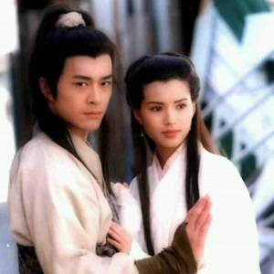

  - `齐天大圣 1996`

    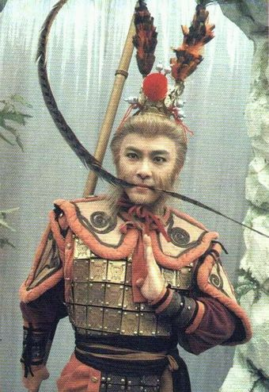

  - `西游记 1998`

    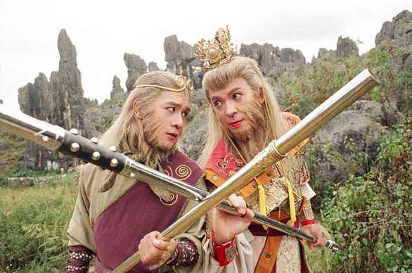
  
  - `水浒传 1998`

    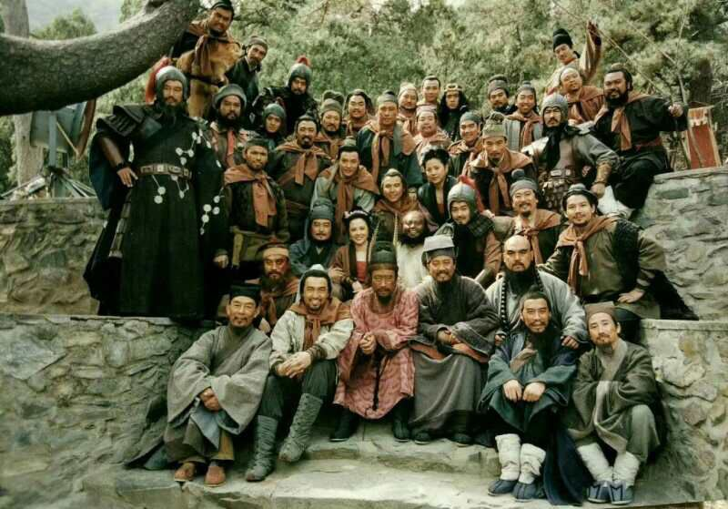

  - `上错花轿嫁对郎 2001`

    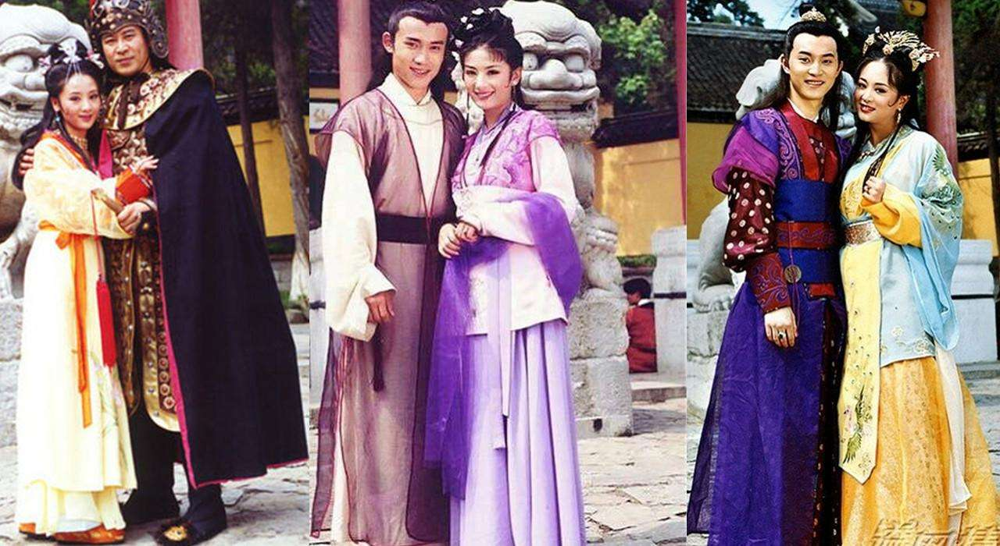

  - `寻秦记 2001`

    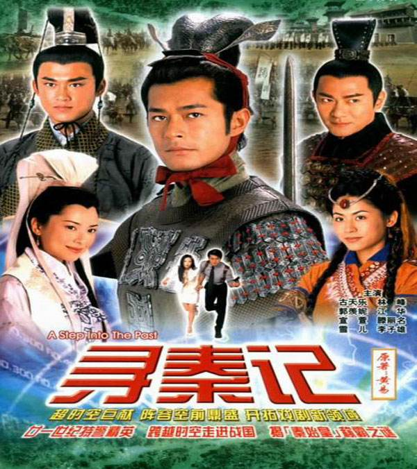

  - `天下第一 2005`

    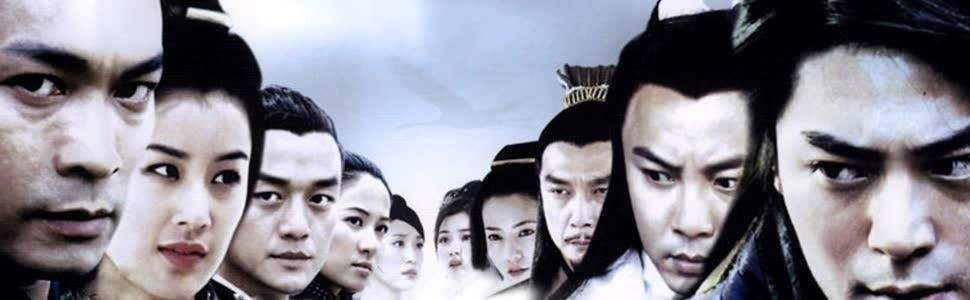

  - `亮剑 2005`

    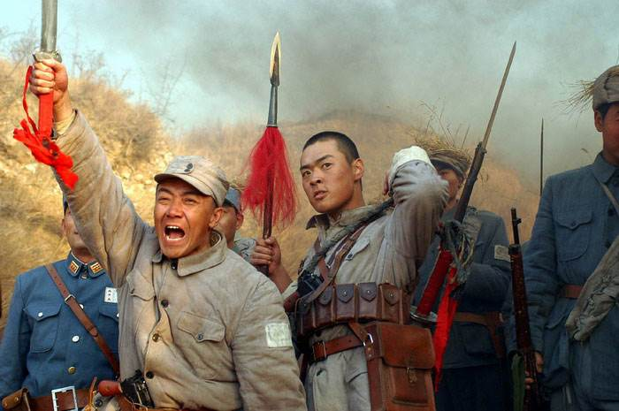

  - `闯关东 2008`

    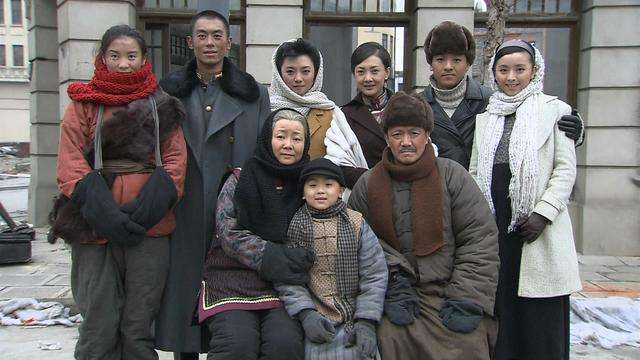

- **电影**

  - `A计划 1983`

    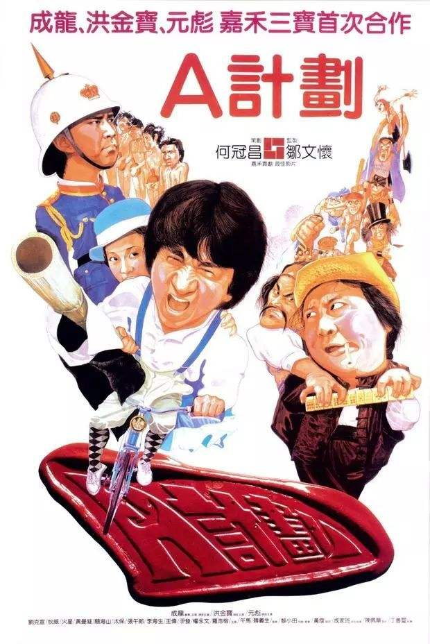

  - `警察故事系列 1985`

    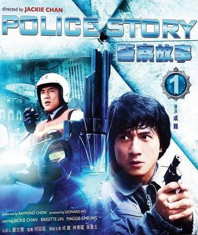

  - `英雄本色系列 1986`

    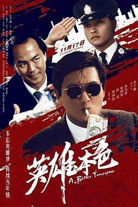

  - `倩女幽魂系列 1987`

    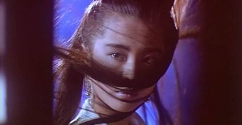

  - `黄飞鸿系列 1991`

    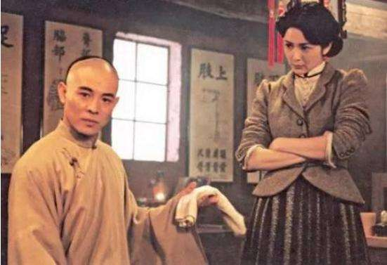

  - `都市情缘 1994`

    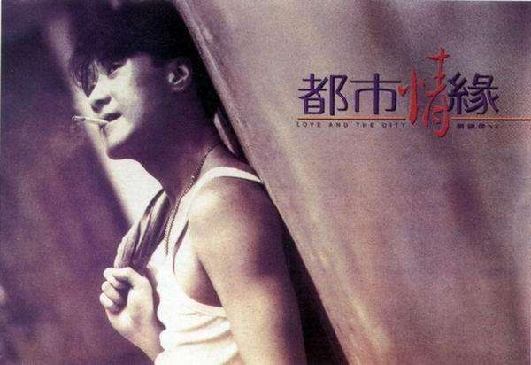

  - `大话西游 1995`

    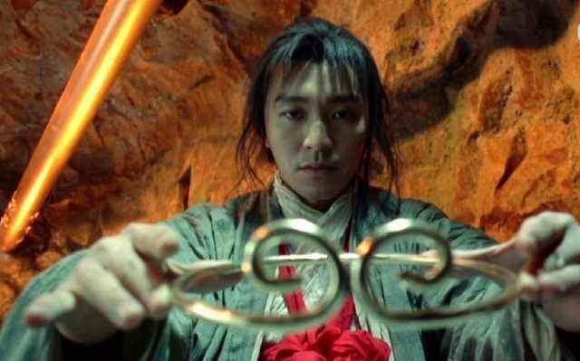

  - `蜀山传 2001`

    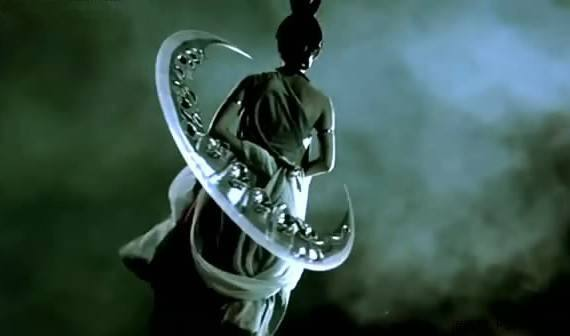

  - `无间道系列 2002`

    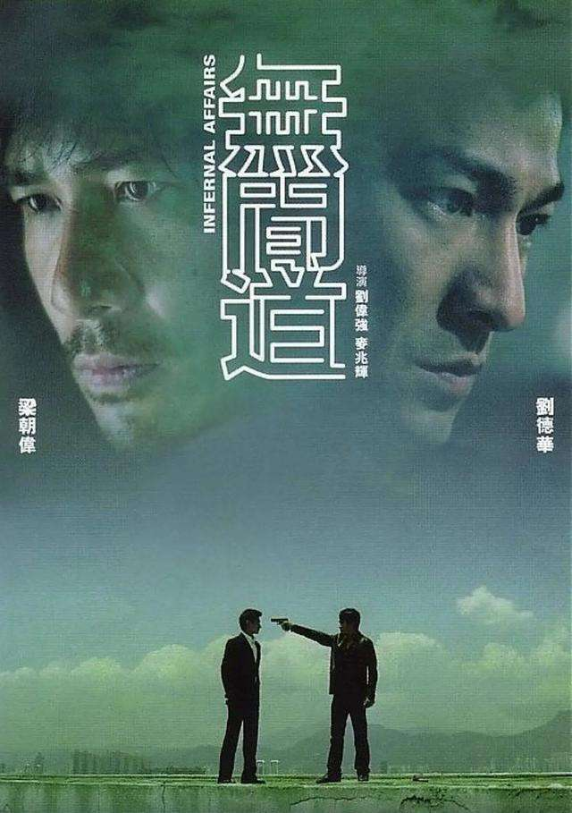

  - `天下无双 2002`

    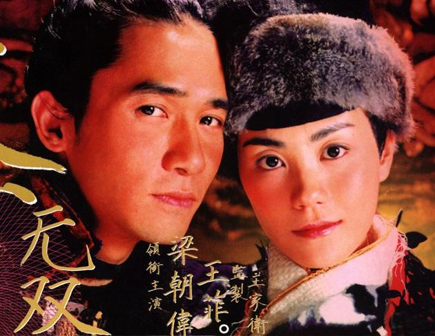

  - `寒战系列 2012`

    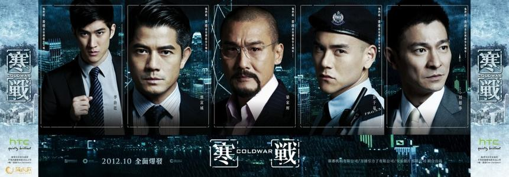

## 声

{:.table}
| **影视剧** | **年份** | **曲目** |
| --------- | ----- |----------- |
| `射雕英雄传` | 1983 | 《铁血丹心》《世间始终你好》《一生有意义》（罗文/甄妮） |
| `雪山飞狐` | 1985 | 《雪山飞狐》（吕方/关菊瑛） |
| `英雄本色` | 1986 | 《当年情》（张国荣） |
| `西游记` | 1986 | 《云宫迅音》（许镜清）；《敢问路在何方》（蒋大为）； 《女儿情》（吴静）；《通天大道宽又阔》（崔京浩）|
| `封神榜` | 1990 | 《神的传说》（谭咏麟）；《独占潇洒》（屠洪刚） |
| `雪山飞狐` | 1991 | 《追梦人》（凤飞飞） |
| `鹿鼎记` | 1992 | 《开心做出戏》（黄霑） |
| `壹号皇庭` | 1992 | 《壹号皇庭主题音乐》 |
| `太极张三丰` | 1993 | 《偷功》（胡伟立）；《随缘》（罗大佑） |
| `新白娘子传奇` | 1993 |《千年等一回》（高胜美）；《渡情》（左宏元/张慧清）|
| `三国演义` | 1994 |《滚滚长江东逝水》（杨洪基）；《历史的天空》（毛阿敏）|
| `大话西游` | 1995 |《小刀会序曲》（商易）；《西天取经路遥迢》（赵季平）|
| `神雕侠侣` | 1995 |《神话情话》（周华健/齐豫）；《归去来》（胡兵/希莉娜依）；《英雄的黎明》（横山菁儿）；《雨夜诀别》（赵季平）|
| `齐天大圣` | 1996 | 《西游记》《天外有天》《法术乌魔多》《把酒狂歌》（张卫健） |
| `笑傲江湖` | 1996 | 《活得潇洒》（谭咏麟/陈慧娴） |
| `康熙微服私访记` | 1997 |《江山无限》（屠洪刚）；《百姓的事儿牵着走》（戴娆） |
| `天龙八部` | 1997 |《难念的经》（周华健）|
| `太极宗师` | 1997 |《英雄谁属》（卞留念）|
| `中华小当家` | 1997 |《空》（大黒摩季）；《万里长城》|
| `苗翠花` | 1997 |《小小女子半边天》（李乐诗）|
| `东游记` | 1998 |《逍遥游》（吴佳明）|
| `鹿鼎记` | 1998 |《叱咤红人》（陈小春）|
| `西游记2` | 1998 | 《取一念》《遇强越强》（陈浩民）；《只爱西经》（洪健华） |
| `还珠格格` | 1998 | 《当》（动力火车）；《不能和你分手》《有一个姑娘》（赵薇）；《齿轮》（唢呐插曲，赵薇）；《雨蝶》（李翊君） |
| `人龙传说` | 1999 |《人龙传说》（陈浩民）|
| `西游记动画` | 1999 |《猴哥》《一个师傅三个徒弟》（张伟进）；《振奋的悟空》|
| `水浒传` | 1998 |《天时地利人和》（彭丽媛）；《好汉歌》（刘欢）；《王进打高俅》（赵季平） |
| `西游记后传` | 2000 | 《我欲成仙》（刘欢）；《相思》（毛阿敏） |
| `少年包青天` | 2000 | 《无愧于心》（孙楠）；《只要有你》（那英/孙楠） |
|`春光灿烂猪八戒`| 2000 |《好春光》（吴彤）；《卷睫盼》（吴彤/陈琳） |
| `侠客行` | 2001 | 《纵横江湖》（洪勇） |
| `上错花轿嫁对郎` | 2001 | 《巧解姻缘天作合》（陈倩倩）；《烟雨唱扬州》（李殊） |
| `封神榜` | 2001 |《封神》（陈浩民/刘玉翠）；《每一生都等你》（陈洁仪）|
| `寻秦记` | 2001 |《天命最高》《我愿爱》（古天乐）|
| `倚天屠龙记` | 2001 |《风起云涌》（吴启华）|
| `笑傲江湖` | 2001 | 《笑傲江湖》（刘欢/王菲） |
| `大汉天子` | 2002 |《守业更比创业难》（景岗山）|
| `孟丽君` | 2002 |《忘记时间》（林峯）；《再生花》（陈慧琳）|
| `倚天屠龙记` | 2003 |《心爱》（金学峰）|
| `至尊红颜` | 2003 | 《至尊红颜》（张克帆） |
| `孝庄秘史` | 2003 |《你》（屠洪刚）；《美人吟》（李玲玉） |
| `穿越时空的爱恋` | 2003 |《太多》《就让你走》（陈冠蒲） |
| `神探狄仁杰` | 2004 | 《长歌一曲》（腾格尔） |
| `天涯侠医` | 2004 | 《心呼吸》（林峯） |
| `大唐双龙传` | 2004 | 《双子龙》（林峯） |
| `连城诀` | 2004 | 《我们站在雨中》（韩磊） |
| `功夫` | 2004 | 《只要为你活一天》（刘家昌）；《闯将令》（于会咏/胡登跳） |
| `花姑子` | 2004 | 《舞飞飏》（含笑）|
| `天下第一` | 2005 | 《天下第一》（麦振鸿） |
| `家有儿女` | 2005 | 《阳光男孩阳光女孩》（TG4） |
| `快乐星球` | 2005 | 《快乐小神仙》（天唱组合）；《月亮船》（王英姿） |
| `神雕侠侣` | 2006 | 《天下无双》（张靓颖） |
| `笑傲江湖` | 2006 | 《江湖笑》（周华健） |
| `金枝欲孽` | 2006 | 《儿女》（林保怡） |
| `贞观长歌` | 2007 | 《贞观长歌》（张澜澜） |
| `闯关东` | 2008 | 《家园》（刘欢/宋祖英） |
| `仙剑奇侠传三` | 2009 | 《生生世世爱》（吴雨霏）；《忘记时间》（胡歌）；《此生不换》（青鸟飞鱼）；《偏爱》（张芸京）；《落入凡尘》（麦振鸿） |

## 音

> 配音演员也是幕后英雄

{:.table}
| **国配（男）** | **演员** |
| ------------ |----------- |
| `张佩山` | 李小龙 |
| `张佩儒` | 成龙（醉拳，蛇形刁手，奇迹），洪金宝（福星系列），黄日华（射雕英雄传） |
| `张济平` | 周润发（英雄本色），成龙（A计划）|
| `冯雪锐` | 狄龙（英雄本色），周润发（纵横四海），元彪（A计划），李修贤（喋血双雄），李连杰（黄飞鸿之壮志凌云）|
| `叶清` | 刘德华（无间道），陈冠希（无间道），陈浩民（天龙八部，人龙传说），tvb西游记旁白 |
| `张艺` | 梁朝伟（无间道），古天乐（寻秦记），陈锦鸿（创世纪，搜神传，雪山飞狐），林峯（谈情说案，使徒行者），陈浩民（西游记2，tvb封神榜）|
| `姜小亮` | 成龙（双龙会），李连杰（倚天屠龙记），周星驰（新精武门），张国荣（金玉满堂）|
| `黄河` | 黄日华（天龙八部），吴镇宇（倚天屠龙记），刘德华（新上海滩），郭政鸿（tvb西游记）|
| `杜燕歌` | 古天乐（神雕侠侣，圆月弯刀），江华（苗翠花），樊少皇（天龙八部），吕颂贤（笑傲江湖），tvb封神榜旁白|
| `杜德勋` | 周润发（监狱风云，和平饭店，大丈夫日记，精装追女仔）|
| `黎泓和` | 黎耀祥（tvb西游记），郭晋安（古灵精探），刘德华（决战紫禁之巅），梁朝伟（天下无双），古天乐（宝贝计划），林峯（少年四大名捕），李国麟（天龙八部）|
| `赵恩余` | 罗家英（大话西游），曾志伟（无间道）|
| `李自学` | 李连杰（黄飞鸿之狮王争霸），梁家辉（新龙门客栈）|
| `胡立成` | 吴孟达（赌侠，鹿鼎记，大话西游，武状元苏乞儿）|
| `石班瑜` | 周星驰（赌侠，鹿鼎记，大话西游，武状元苏乞儿）|
| `李香生` | 郑伊健（暗战，古惑仔），何家劲（包青天），邹兆龙（九品芝麻官），蟹老板（海绵宝宝）|
| `孙大川` | 刘德华（天下无贼，十面埋伏，未来警察，狄仁杰，新少林寺，寒战，盲探，富春山居图）|
| `齐炎` | 梁朝伟（鹿鼎记，杨家将）|
| `徐健春` | 刘德华（赌神，赌侠，整蛊专家），吴启华（九品芝麻官），梁家仁（唐伯虎点秋香）|
| `孙德成` | 周润发（赌神），九品芝麻官旁白，黄百鸣（开心鬼系列），成龙（飞龙猛将），张国荣（倩女幽魂）|
| `卢琨` | 林峯（寻秦记，孟丽君，大唐双龙传，覆雨翻云，布衣神相），古天乐（天地男儿），陈小春（鹿鼎记）|
| `刘印生` | 欧阳震华（醉打金枝，洗冤录），刘家辉（95神雕侠侣）|
| `孙烟超` | 黎耀祥（神雕侠侣），元华（寻秦记）|
| `许秉珩` | 马国明（古灵精探，回到三国，飞虎）|
| `刘一飞` | 麦长青（天龙八部，tvb西游记）|
| `徐敏` | 古天乐（蜀山传），成龙（新警察故事，宝贝计划），张国荣（枪王，东邪西毒），黎明（赌神3）|
| `郭如舜` | 刘德华（雷洛传，与龙共舞，赌城大亨，战神传说），李连杰（方世玉），苏有朋（还珠格格，无敌县令）|
| `张秋冰` | 成龙（警察故事，福星系列，龙的心），张国荣（英雄本色），钟镇涛（富贵列车）|
| `屈中恒` | 李连杰（中南海保镖，精武英雄，新少林五祖，鼠胆龙威）|

{:.table}
| **国配（女）** | **演员** |
| ------------ |----------- |
| `韩冬青` | 张曼玉（双龙会），邱淑贞（倚天屠龙记），张敏（天龙八部）|
| `廖静妮` | 翁美玲（射雕英雄传），林青霞（东方不败，刀马旦），关之琳（黄飞鸿）|
| `苏柏丽` | 温碧霞（tvb封神榜），佘诗曼（金枝欲孽），宣萱（寻秦记）|
| `邢金沙` | 叶璇（tvb封神榜），朱茵（射雕英雄传），黎姿（金枝欲孽），刘玉翠（天龙八部）|
| `晏晓陶` | 唐宁（大唐双龙传），李莫愁（95神雕侠侣），张可颐（金枝欲孽）|
| `小小` | 苑琼丹（tvb封神榜），陈松伶（金装四大才子，天地男儿），李绮红（95神雕侠侣）|
| `潘宁` | 郭羡妮（寻秦记），傅明宪（95神雕侠侣），李若彤（天龙八部）|
| `邵凯丽` | 钟嘉欣（溏心风暴之家好月圆，搜神传），徐子珊（少年四大名捕）|
| `刘小芸` | 张敏（武状元苏乞儿），巩俐（唐伯虎点秋香），周慧敏（伦文叙老点柳先开），袁咏仪（国产凌凌漆）|
| `于小华` | 李若彤（95神雕侠侣）|
| `周莹` | 杨怡（大唐双龙传），滕丽名（寻秦记）|

## 央视

- `我爱你，中国（弦乐版）`

  瞿琮，郑秋枫

- `春节序曲`，`步步高`

  央视春晚背景音乐

- `舌尖上的中国`

- `航拍中国`